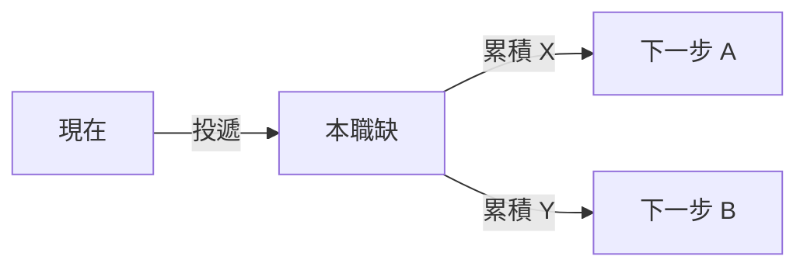

# JD 檔案樣板 (JD File Template)

欄位列舉值以 [jd/README.md](../../pkg/resume/jd/README.md) 的 `資料欄位 (Schema)` 為準, 以下僅示範結構.
樣板內的相對連結 (如 `../../Resume.md`) 是以 `jd/<company>/` 下的 JD 檔為基準.

````markdown
---
company: "公司名"
title: "職稱原文"
department: "部門原文"
role_type: staff_ic
role_facing: internal
domain: data_ai
job_post_id: null
url: "原始連結"
source: direct
posted: null
expiry: null
fetched: YYYY-MM-DD
created: YYYY-MM-DD
min_years: 12
education: null
score: 52
status: not_applied
status_updated: YYYY-MM-DD
---
# 公司 - 職稱

> ## 評估摘要 (Evaluation Summary)
>
> `評估日期`: YYYY-MM-DD, 對照 [Resume.md](../../Resume.md)
>
> `匹配度 (Profile Matching Score)`: `NN / 100`
>
> `結論`: 一到三句. 這個職缺的性質, 以及履歷對它的相對位置.
>
> `符合的部分`:
>
> - `JD 原文的要求片段`: 履歷中的對應事實.
>
> `不符合的部分`:
>
> - 缺什麼, 以及為什麼這個缺口會被追問.
>
> `投遞前必問`:
>
> - 送出履歷前需要向對方或內推人確認的事項.

## 基本資訊 (Basics)

| 項目 | 內容 |
| --- | --- |
| 公司 (Company) | |
| 職稱 (Title) | |
| 部門 (Department) | |
| 角色類型 (Role Type) | `role_type` · `role_facing` · `domain` |
| 地點 (Location) | |
| 職缺編號 (Job Post ID) | |
| 原始連結 (Original Link) | |
| 薪酬 (Package) | 未公開 |
| 最低年資 (Min Experience) | |
| 學歷要求 (Min Qualification) | |
| 投遞狀態 (Status) | `not_applied` (更新於 YYYY-MM-DD) |
| 抓取日期 (Fetched) | |
| 建立日期 (Created) | |

## 團隊背景 (Team Context)

選備. JD 有描述團隊定位, 產品線或組織命題時才寫.

## 崗位職責 (Responsibilities)

JD 原文的職責條目. 原文只有要求沒有職責時, 註明`職責由要求反推`.

## 任職要求 (Requirements)

`硬性要求 (Must-have)` — 原文 `Minimum Qualifications`:

- 逐條保留原文語意, 關鍵名詞以 backtick 標出.

`加分要求 (Preferred)` — 原文 `Preferred Qualifications`:

- 同上.

`其他條件 (Other)`:

- 工作權, EEO, 地點, 語言等非技術條件.

## 缺口分析 (Gap Analysis)

選備. 觸發條件與四段結構見 SKILL.md.

`缺什麼`:

| 缺口 | 類型 | 補法 | 可補期 |
| --- | --- | --- | --- |

`缺了會怎樣`:

`怎麼補`:

`值不值得轉向`:

## 角色評估 (Role Assessment)

`評估日期`: YYYY-MM-DD

| 面向 | 判斷 | 依據 |
| --- | --- | --- |
| 真實職級 | | `原文` / `推論` / `外部` + 說明 |
| 影響範圍 (Scope) | | |
| 組織位置 | | |
| 業務壓力 | | |
| 成長天花板 | | |
| 風險與紅旗 | | |

`角色本質`: 一句話.

## 機會 (Opportunities)

- `能力資產`:
- `軌道轉換`:
- `市場訊號`:
- `槓桿與網絡`:

## 路線圖 (Roadmap)

`投遞前 (0-2 週)`:

| 動作 | 時間窗 | 驗收 |
| --- | --- | --- |

`面試 (2-6 週)`:

| 動作 | 時間窗 | 驗收 |
| --- | --- | --- |

`到職 90 天`:

| 階段 | 可交付成果 | 對準的業務壓力 |
| --- | --- | --- |
| 30 天 | | |
| 60 天 | | |
| 90 天 | | |

`1-3 年`:



到達下一步所需的證據:

-

## 我的對位敘事 (Positioning Angle)

面試與履歷的敘事順序, 以及必須主動處理的弱點.
````
