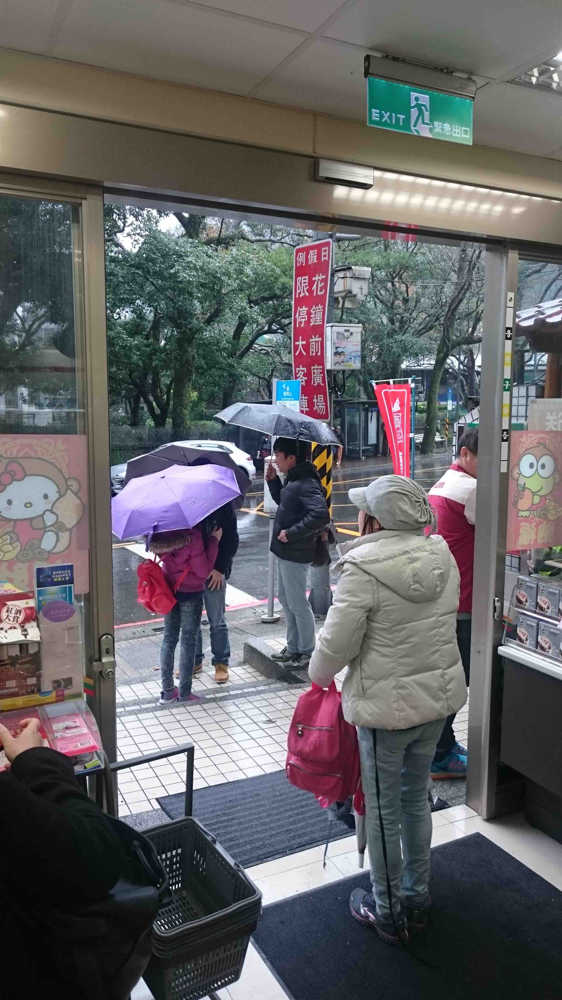
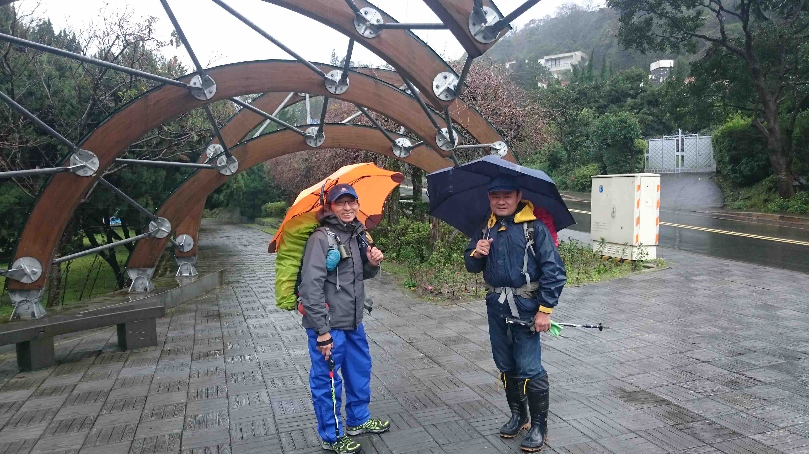
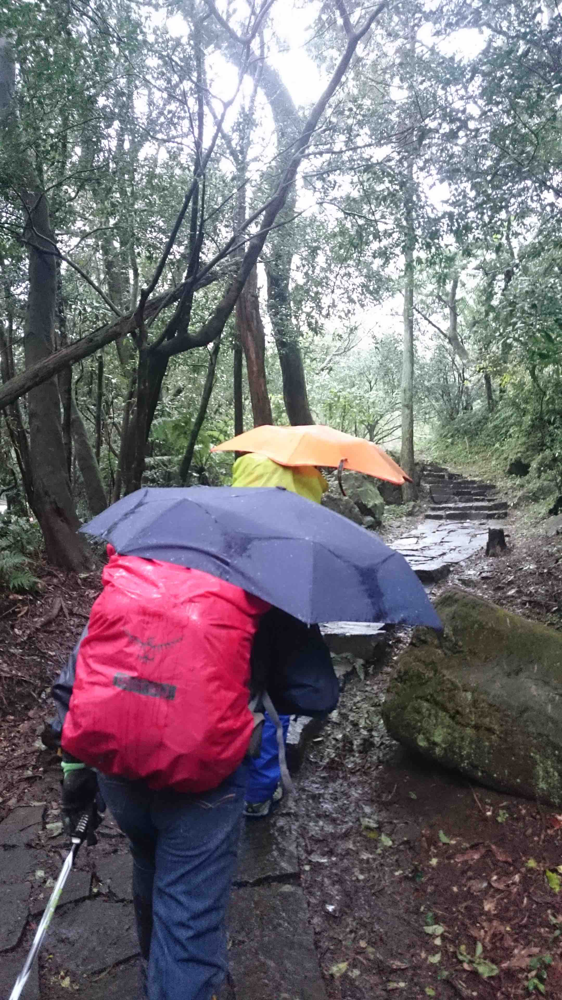
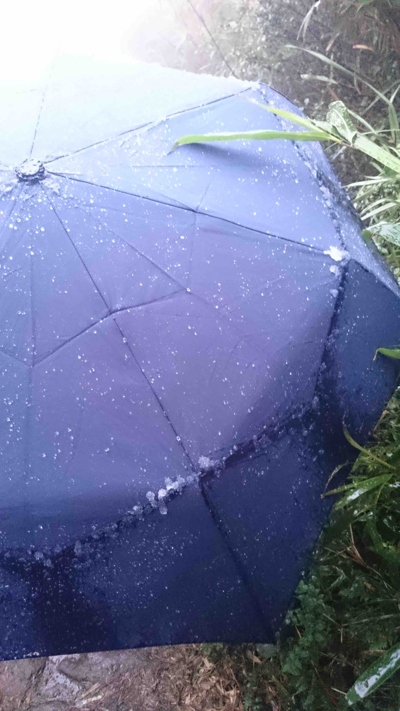

# 2016/1/23 七星山主峰

此次原本要去北插,北插號稱是百岳的入門山,卻因為北極震盪的雪作罷改至七星山主峰等待降雪,降雪前溫度還不夠飄雨連連,讓爬山的寒意驟增,完全無法停下來與休息,10分鐘會完全冷掉,沿路上遇到很多人說山上看到冰霰.

到了山頂後,強風配上低溫高濕讓久待變成非常不容易,傘也因為強風而折斷,續戰力不足的狀況下轉戰東峰與七星公園,下東峰的時候氣溫有感慢慢回升

### 環境
接近0度,高濕度,飄小雨,七星山頂風超大,中間有一段階梯非常抖且不平

### 裝備
- 兩件褲子（外防風防潑水）
- 無袖Ｔ,長袖高領,透氣針織,羽絨外套,機車雨衣雨鞋
- [x]頭燈

### 備糧
1. 熱湯杯
2. 熱水1.5+L
3. 主餐（健哥的的粽子 兩個滷蛋 七七乳加xN 總匯三明治）
4.  

