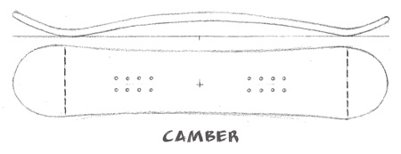
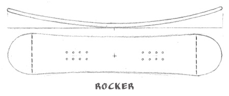
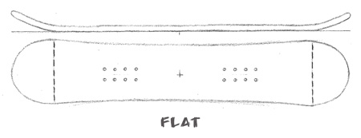
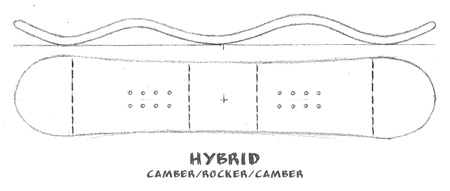
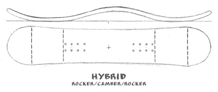
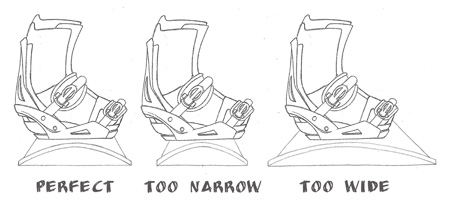
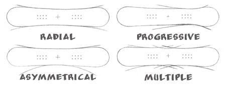
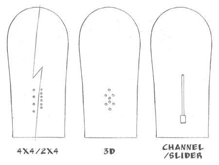

below content refers to [http://www.the-house.com/helpdesk/snowboard-sizing/](http://www.the-house.com/helpdesk/snowboard-sizing/)

 名詞:
### snow condition:
- Power , 鬆雪
- Park
- halfpipe
- box
- groomers , 壓雪

##### Skills:
- butter , 單腳重心旋轉 像抹奶油一般
- ollie , 重心往後,拉前腳跳(板跳起後,前高後低)
- Nollie , 重心往前,拉後腳往前甩 (板跳起後,前低後高)
- bail , 摔倒

### About board:

##### Categories
- All-Mountain , 通包
- Freestyle , park halfpipe tricks
- Freeride , 野山
- Splitboarding

##### Snowboard Profile Shape
- camber 

- rocker

- flat

- camber-rocker-camber

- rocker-camber-rocker

##### Length
|Riders Height||Snowboard Sizes|
|---|---|---|
|Height||Board Size|
|Ft/In|Cm|Cm|
|3’7″|109cm|90-105|
|4’1″|124cm|110-120|
|4’6″|137cm|115-130|
|4’10”|147cm|125-135|
|5’1″|155cm|130-140|
|5’3″|160cm|135-145|
|5’4″|163cm|140-150|
|5’5″|165cm|145-152|
|5’6″|168cm|148-153|
|5’7″|170cm|150-155|
|5’8″|173cm|152-155|
|5’9″|175cm|153-157|
|5’10”|178cm|154-159|
|5’11”|180cm|155-160|
|6′|183cm|156-162|
|6’1″|185cm|157-163|
|6’2″|188cm|158-166|
|6’3″|191cm|159-167|
|6’4″|193cm|160-170|
##### Width

##### Board Shape
- Directional
- Directional Twins
- True Twins

##### Flex
- longitudinal flex 板長彈性
- tosional flex 板寬彈性

- Stiff Flex boards ,
- Medium Flex boards ,
- Soft Flex boards , made for freestyle , easily control at lower speed , ideal for  tweaking tricks in the park or street , 
good for beginners and lighter weight riders  easy for linking turns

halfpipi rider need a stiff board for stability at high speed
=> more stiffer more stable
heavier rider need more stiff than usual to prevent board wash-out or uncontrollable bails

##### Sidecut and Effective Edge

- Radial Sidecut
- Progressive Sidecut
- Asymmetrical Sidecut
- Multiple Sidecuts

- Effective Edge
- Contact Point
- Edges

##### Hole Pattern

-  4 X 4
-  2 X 4
-  Burton 3D
-  Sliders

##### Bindings
##### Boots
