# 2016.1.26 上海卓易之夜

### Day 1
這次公司來四天上海行程,扣掉搭機的時間大約三天吧,主要的重頭戲是上海總公司的卓易之夜, 其實就是台灣的尾牙（他們叫做年會）,剛北極震盪完的上海還是冷的打哆嗦,換上西裝外套寒風灌進來讓我一直不斷地靠北,
但進入主會場有暖氣就好很多了,主會場很特別是一棟1933年建屠宰廠,卻改變成很現代的風格,配上燈光的渲染水泥牆的單變成一種質感,主舞台的屏幕畫質我看應該是至少HD 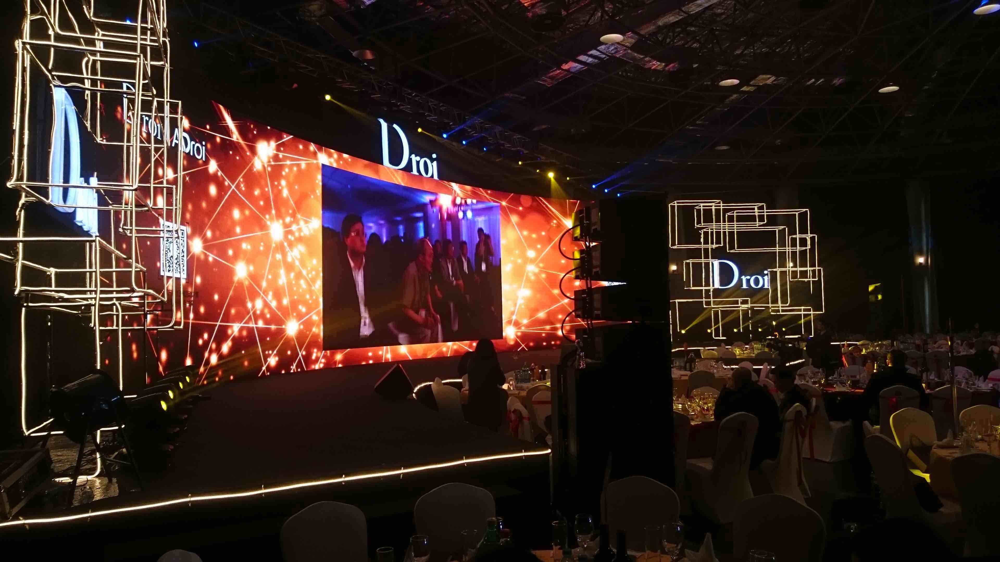,文藝的特色上請了漫畫家為大家畫上一幅簡易的漫畫人物大頭,彩繪師在手部上著繪美麗的圖案.

活動一開始三位總裁各自上台講話,卻被個主持人（安徽衛視主持人張亞群）噹個不會說話沒有激勵人心:p,說要開個課教教如何鼓勵員工做事讓我合不攏嘴XDDD,她是第二個大陸主持人也是安徽衛視的主持人被我特別注意的（第一個是超級演說家的余聲）,其動靜得宜的風範與是個正妹讓我心動不已>///<,

年會行程跟台灣尾牙略微不同,下午4:30開始致詞與活動,然後一直到6:30開桌中間不斷穿插活動,包含有**維多莉亞的秘密秀**（穿內衣後面會背大翅膀那種）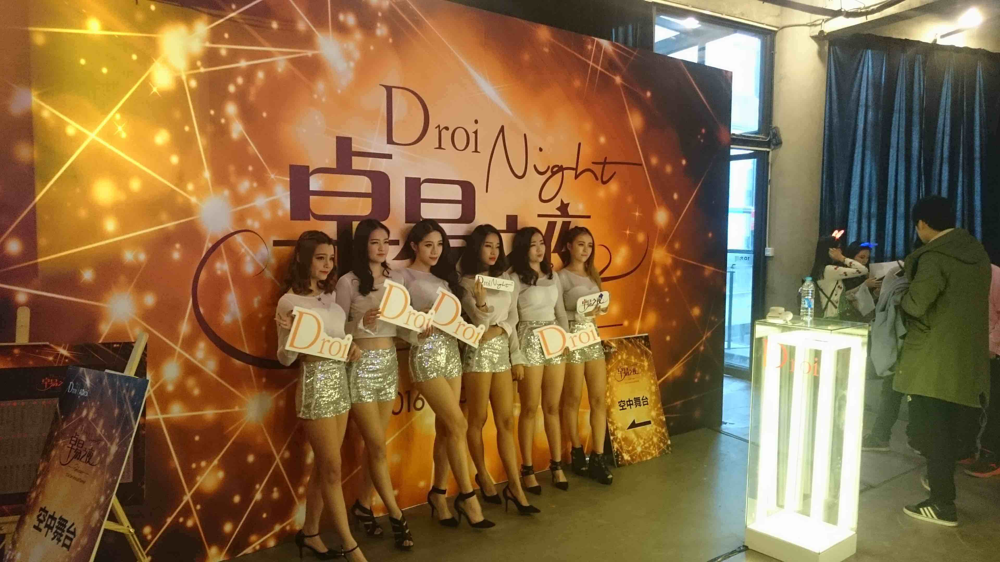,**專業鋼管舞**,**越南選美冠軍獻歌**,卓易寶寶串場...等等,抽獎大概是部分員工很詬病的,手環編號有四位數字的,結果電腦選號抽獎只有三位數,整個WTF啊(Wechat有工程師再跪求抽獎源碼XDDD), 怪不得同桌深圳智能的同事很阿莎力地跟我同事換手環,大概已經預想到不會中了吧:(

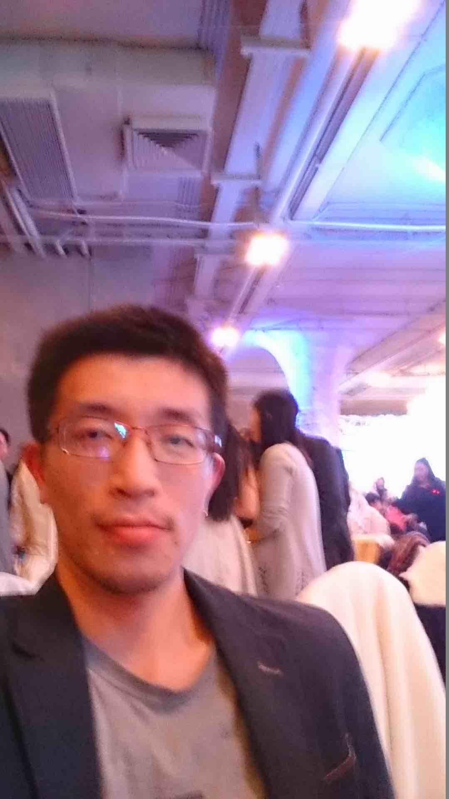
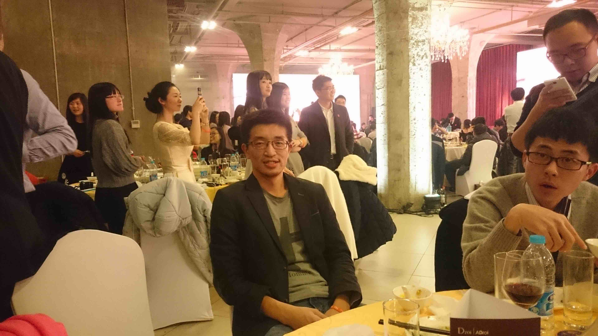

路繼續往前等待成熟的時刻

ps:這次來大部份的人來沒有穿著公司預定裝,但少數穿著爭豔的程度非常吸引目光,還有就是這天有感覺到這邊女生懷柔的作風應該跟日本有得比:p

### Day 2
第二天排了個自由行,讓大家到外灘,浦東,南京...等等觀光景點走走,之前與復旦大學交流的時候已經被帶去走過一輪興致缺缺,結果就跑到公司去坐坐,跟可能會有接觸的人聊聊天了解這邊工作的模式,詳細工作上的互動其實沒有很深刻的體會,比較特別的是他們每天都有公司配給的牛奶,乾糧與水果

### Day 3
公司集體招待去西塘,上海古蹟景點,母公司的CTO表示現在去的時節不對,然後去過就不想去了因為東西都是新的.從吳子虛建造的虛塘到慢慢演變成西塘這詞,穿越的是個外皮古內在商業化的街道,搭船遊覽的價位在150元/8人稍嫌貴了,跟蘇杭比還是便宜很多（180元/6人）,酒文化館,磚瓦文化館,聖堂(關公當財神拜 觀音保平安),季節不對人少卻清幽,但污染就......
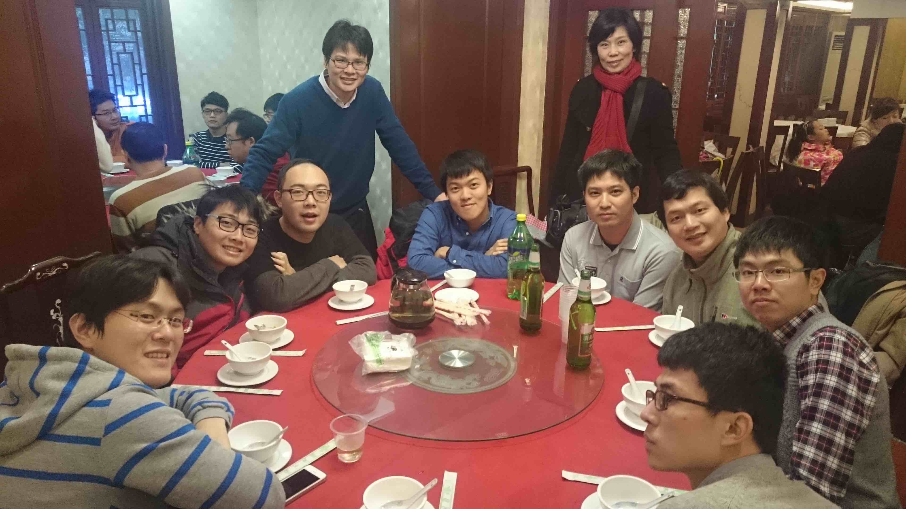
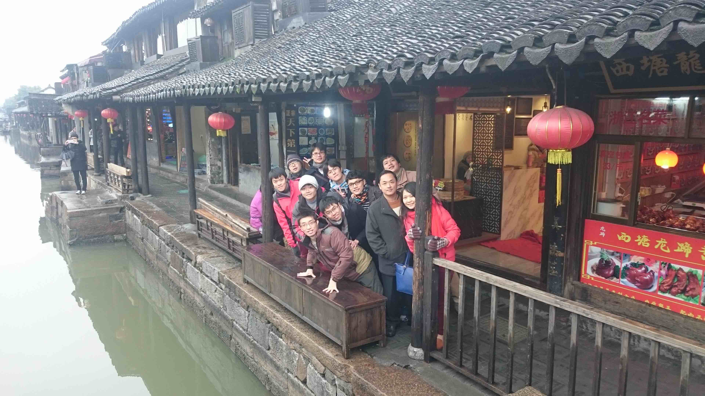
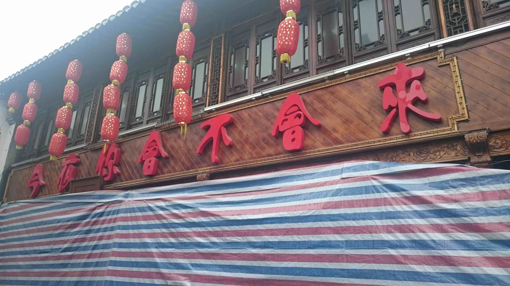
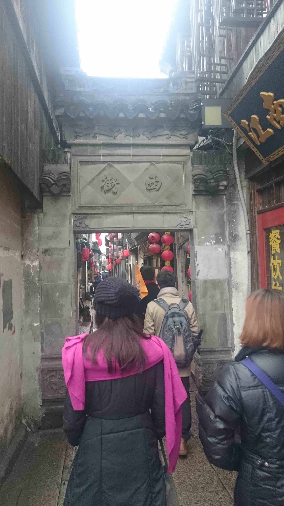
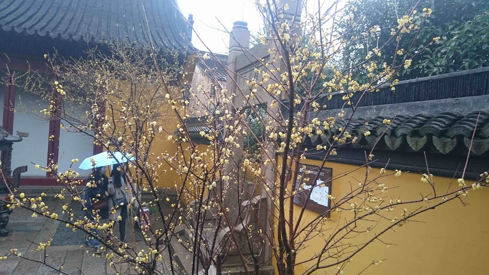
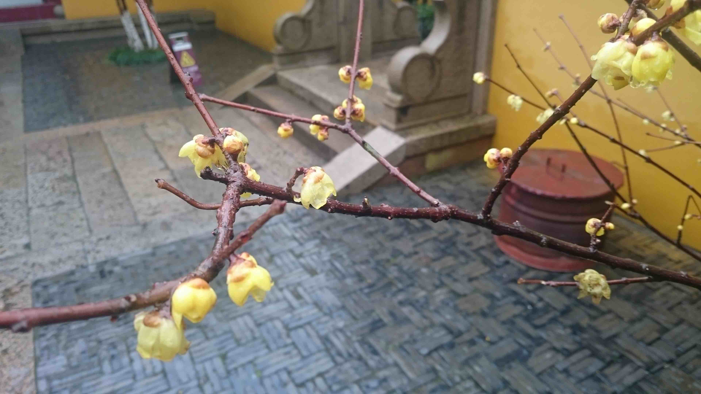

### Day 4
睡覺自然行 坐車搭機回家...... end

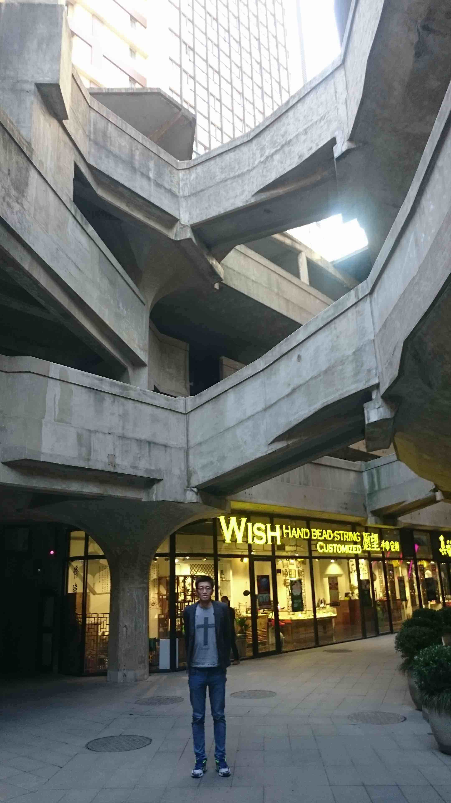

### 食記
餐飲單價20~50幾元為正常價位,100多左右大概吃到飽的價位,還有更高的.

### note
支付寶整合銀行卡自動儲值,需要電話簡訊驗證,電話實名制每個月8元月租
