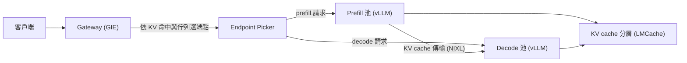
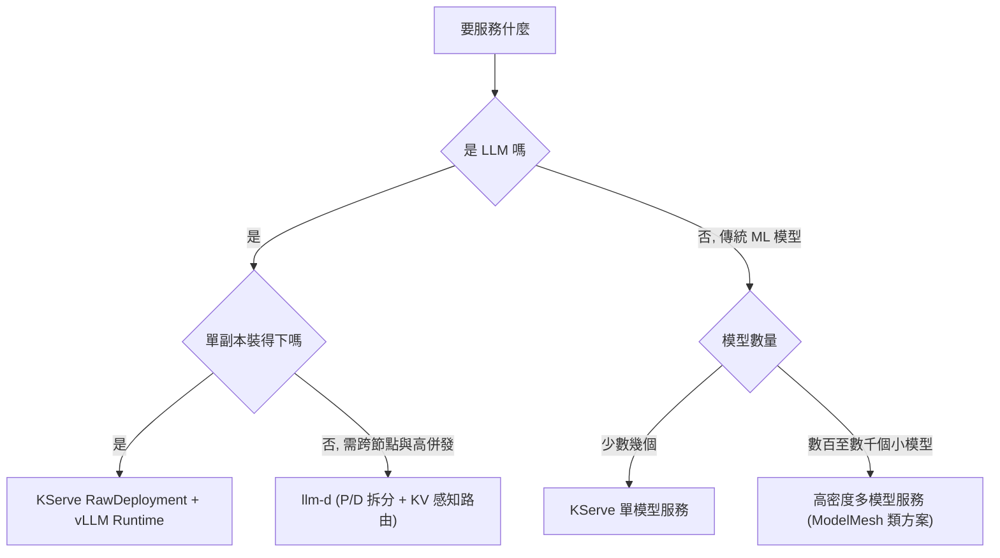
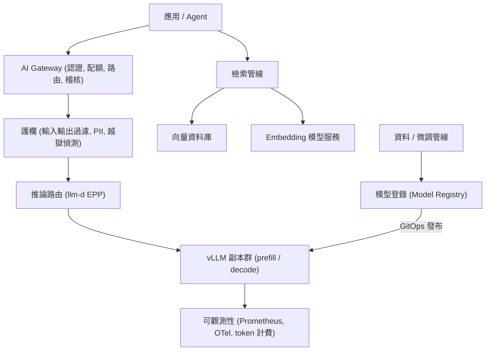

# AI 推論服務與執行期 (AI Serving and Runtimes)

本文是為 [Red Hat AI Specialist Solution Architect](../../jd/redhat/ai_specialist_solution_architect.apac_technology_sales.md)
一類職缺所需的`推論層 (inference layer)` 知識整理, 目標是能在客戶白板前把
`為什麼慢`, `旋鈕在哪`, `跨加速器怎麼一致` 三件事講清楚, 而不只是背產品名.

`適用對象`: 已熟 Kubernetes 與分散式系統, 但沒有自架過 LLM 推論服務的架構師.

`前置條件`:

- 熟悉 Kubernetes Deployment, Operator, HPA 與 GitOps.
- 知道 Transformer 的 attention 大致在算什麼, 不需要會推導.

`版本提醒`: 推論生態 2024 - 2026 年變動極快, 產品行為與 deprecation 狀態
請在對客戶說明前以當期官方文件複核, 本文負責的是`不隨版本改變的判斷框架`.

## 術語 (Terminology)

| 名詞 | 定義 |
| --- | --- |
| `Prefill` | 一次把整段 prompt 餵進模型, 產生第一個 token 前的階段. 平行度高, 屬 `compute-bound` |
| `Decode` | 逐 token 自迴歸生成的階段. 每步只算一個 token, 屬 `memory-bandwidth-bound` |
| `KV cache` | 已算過的 token 之 Key / Value 張量快取, 避免每步重算整段歷史. 佔用視訊記憶體, 是容量瓶頸主角 |
| `TTFT` | Time To First Token, 首 token 延遲. 由 prefill 長度與排隊決定, 對話式體驗的關鍵 |
| `TPOT` / `ITL` | Time Per Output Token / Inter-Token Latency, 生成期每 token 間隔. 決定`打字速度`感受 |
| `Throughput` | 單位時間輸出 token 數 (整體吞吐), 決定每百萬 token 成本 |
| `Goodput` | 只計算`滿足 SLO 的請求`所貢獻的吞吐. 這才是容量規劃該用的指標 |
| `Batching` | 把多個請求合併成一次 GPU 運算, 是把 memory-bound 的 decode 拉回高使用率的唯一手段 |

`一句話的核心矛盾`: 加大 batch 提升 throughput, 但拉長 TTFT 與 TPOT.
推論調校的全部工作, 就是在這條 `latency - throughput 帕累托曲線 (Pareto curve)` 上,
挑一個符合客戶 SLO 的點.

## 第一部分 (Part 1): vLLM 的推論最佳化

vLLM 是目前開源推論引擎的事實標準, 也是 `Red Hat AI Inference Server` 的產品核心
(Red Hat 於 2024 年併購 Neural Magic 後, 把 vLLM 加上 LLM Compressor 與驗證過的
量化模型庫包裝成商用產品).

### 1.1 PagedAttention: 把 KV cache 當虛擬記憶體管

`問題`: 傳統作法為每個請求預留`最大長度`的連續 KV 記憶體. 一個 max_model_len = 8192
的請求就算只生成 100 token, 也佔住 8192 token 的空間, 實測浪費常達 `60% - 80%`.

`解法`: 借作業系統的分頁 (paging) 概念, 把 KV cache 切成固定大小的 `block` (預設 16 token),
以 `block table` 做邏輯到實體的映射. 記憶體按需配置, 外部碎片趨近零,
相同 prefix 的請求還能直接`共享同一批 block` (copy-on-write).

`架構師怎麼用這件事`: 這是 vLLM 相對於樸素實作能多塞 `2 - 4 倍` 併發的根因,
也是 `prefix caching` 與 `KV cache 卸載` 得以成立的前提.

### 1.2 Continuous batching: 迭代級排程

靜態批次要等整批中最慢的請求生成完才能換下一批, GPU 在尾端大量閒置.
`continuous batching` 改為`每一個 decode 迭代`都重新排程: 完成的請求立刻離開,
排隊中的請求立刻補位. 這是吞吐提升最大的單一機制.

`副作用`: 記憶體吃緊時會發生 `preemption` (搶佔). vLLM 兩種策略是
`recompute` (丟棄 KV 重算, 短序列較划算) 與 `swap` (換出到主機記憶體).
日誌出現大量 preemption 就是 `gpu_memory_utilization` 或併發設定過激的訊號.

### 1.3 Chunked prefill: 讓長 prompt 不阻塞生成

一個 32k token 的 prefill 會佔住 GPU 數百毫秒, 期間所有正在生成的請求都卡住,
表現為 `TPOT 抖動`. `chunked prefill` 把長 prefill 切片, 與 decode 交錯執行,
以`略微拉長該請求的 TTFT`換取`全體 TPOT 穩定`.

`取捨說法`: RAG 類負載 (長 context, 短輸出) 幾乎一定要開; 純聊天短 prompt 則收益有限.

### 1.4 Prefix caching: 重複的開頭不要算兩次

系統提示詞, few-shot 範例, RAG 的固定指令模板, 多輪對話的歷史,
這些在請求之間高度重複. `automatic prefix caching` 以 block 的雜湊比對命中,
命中部分直接跳過 prefill.

`業務語言`: 一個 2000 token 的系統提示詞, 在高命中率下等於`每個請求省下 2000 token 的 prefill 成本`,
這是 agentic 與 RAG 場景最容易拿到的一次性勝利.

### 1.5 Speculative decoding: 用小模型賭大模型的答案

由 `draft model` (小模型), n-gram 比對, 或 `EAGLE` / `Medusa` 這類額外預測頭,
一次猜測數個 token, 再由目標模型`一次平行驗證`. 猜對就直接採用, 猜錯就回退.

`關鍵取捨`: 它降低的是 `TPOT`, 代價是額外算力. 在`低併發, 延遲敏感`場景收益顯著;
在`高併發, 吞吐優先`場景, GPU 本來就吃滿, 投機解碼反而會拖慢整體. 這題是面試常考的分辨點.

### 1.6 Quantization: 用精度換記憶體與頻寬

| 方案 | 位元 | 典型用途 |
| --- | --- | --- |
| `FP8 (W8A8)` | 權重 8 / 啟動 8 | Hopper, MI300 以上原生支援, 品質損失極小, 首選 |
| `INT8 (W8A8)` | 8 / 8 | 較舊硬體的等價選項 |
| `INT4 (AWQ, GPTQ, W4A16)` | 權重 4 | 記憶體受限或單卡塞大模型, 低併發下延遲最好 |
| `KV cache FP8` | - | 直接把 KV cache 減半, 等於加倍併發, 對長 context 效益最大 |

`架構師的正確講法`: 量化不是`免費加速`, 而是`用可量測的品質損失換取容量`.
正確流程是先以 `lm-evaluation-harness` 之類工具測基準任務分數,
確認退化在客戶可接受範圍, 再談吞吐. Red Hat 的賣點正是`已驗證過的量化模型庫`,
把這段驗證成本吸收掉.

### 1.7 平行化 (Parallelism)

- `Tensor Parallel (TP)`: 單層切開跨 GPU, 每步都要 all-reduce, 需高速互連 (NVLink).
  單機內擴大模型的預設手段.
- `Pipeline Parallel (PP)`: 按層切開跨節點, 通訊量小但有 bubble, 用於跨節點.
- `Expert Parallel (EP)`: MoE 模型的專家分散.
- `Data Parallel (DP)`: 整份模型複製多份, 純粹擴吞吐, 由上層路由分流.

`經驗法則`: 能單卡就單卡 (量化優先), 放不下才 TP, TP 不要跨節點, 跨節點用 PP 或直接複製多副本.

### 1.8 關鍵旋鈕 (Key Knobs)

| 參數 | 影響 |
| --- | --- |
| `gpu_memory_utilization` | 給 KV cache 的顯存比例, 調高增加併發, 過高導致 OOM 與 preemption |
| `max_model_len` | 單請求最大 context, 直接決定最壞情況的 KV 佔用 |
| `max_num_seqs` | 併發序列數上限, 控 batch 寬度 |
| `max_num_batched_tokens` | 單次迭代 token 預算, 與 chunked prefill 共同決定 TTFT / TPOT 平衡 |
| `enable_prefix_caching` | 開啟前綴快取 |
| `tensor_parallel_size` | TP 度數 |
| `quantization` / `kv_cache_dtype` | 權重與 KV 的精度 |

### 1.9 容量計算 (Capacity Math)

這段是白板上最有說服力的內容, 因為它把`要幾張卡`變成算術而非猜測.

```text
每 token 的 KV cache 位元組數
  = 2 (K 與 V) x 層數 x KV head 數 x head 維度 x 每元素位元組數
```

以 `Llama 3.1 8B` (32 層, GQA 8 個 KV head, head_dim 128, FP16) 為例:

```text
2 x 32 x 8 x 128 x 2 = 131,072 bytes = 128 KiB / token
```

一張 80 GB 的卡, 權重 FP16 約 16 GB, 保留活化與框架開銷後約剩 60 GB 給 KV:

```text
60 GiB / 128 KiB = 約 491,520 tokens
若平均 context 8k, 併發上限約 60 個序列
若 KV cache 走 FP8, 併發上限約 120 個序列
```

`這個算式的三個用途`: 回答`一張卡能服務多少人`, 說明`為什麼長 context 這麼貴`,
以及論證`KV cache 量化與卸載的商業價值`.

## 第二部分 (Part 2): llm-d 與跨加速器的分散式推論

### 2.1 單機 vLLM 會撞到的三面牆

1. `路由無知`: 一般 Kubernetes Service 做 round-robin, 完全不知道哪個副本已經快取了這個
   對話的前綴, 也不知道誰的佇列比較長. 結果是 prefix cache 命中率崩潰, 尾延遲爆炸.
2. `prefill 與 decode 互相干擾`: 兩者的資源特性相反 (前者吃算力, 後者吃頻寬),
   混在同一副本上必然互相拖累.
3. `擴縮盲目`: 以 CPU 使用率做 HPA 對 GPU 推論毫無意義.

### 2.2 llm-d 是什麼

`llm-d` 是 Red Hat 主導, 與 Google, IBM, NVIDIA 等共同發起的
`Kubernetes 原生分散式推論框架`, 定位是`把單機 vLLM 變成叢集級服務`.
它不取代 vLLM, 而是在其上補齊路由, 拆分與擴縮.

核心組件:

- `推論感知路由 (Inference-aware routing)`: 建立在 Kubernetes `Gateway API Inference Extension`
  之上, 以 `Endpoint Picker (EPP)` 依照 `KV cache 命中率`, `佇列深度`, `負載` 與 `SLO`
  選擇端點, 而非盲目輪詢.
- `P/D 拆分 (Prefill / Decode Disaggregation)`: 把 prefill 與 decode 部署成獨立可各自擴縮的池,
  中間以 `NIXL` 這類傳輸層透過 RDMA / InfiniBand / NVLink 搬移 KV cache.
  好處是兩種工作各自跑在最適合的硬體與批次策略上.
- `KV cache 分層與卸載`: 搭配 `LMCache` 把 KV 卸載到主機記憶體或遠端儲存,
  讓快取容量脫離單卡顯存限制, 跨請求與跨副本重用.
- `變體自動擴縮 (Variant Autoscaling)`: 依 SLO 與實際流量形狀, 對不同硬體上的不同模型變體
  做差異化擴縮.
- `Well-lit paths`: 官方預先驗證過的參考部署路徑, 讓客戶不必從零調參.



### 2.3 跨加速器的一致性 (NVIDIA, AMD, Intel, TPU)

vLLM 以`硬體平台外掛 (platform plugin)` 架構把裝置相關邏輯隔離,
上層 API, 排程器與 OpenAI 相容端點維持不變:

| 加速器 | 後端 | 實務注意事項 |
| --- | --- | --- |
| NVIDIA | CUDA | 功能最完整, FlashAttention / FlashInfer, CUDA graph, FP8 (Hopper 起) |
| AMD | ROCm | MI300X / MI355X 記憶體大, 適合單卡塞大模型; 部分 kernel 與量化格式支援落後 |
| Intel | Gaudi (HPU), XPU | 需對應 operator 與執行期, 量化路徑較窄 |
| Google TPU | PyTorch/XLA | 編譯式執行, 形狀變動會觸發重編譯, 需注意 bucket 設定 |
| AWS | Neuron | Inferentia / Trainium, 需 Neuron 編譯器 |
| CPU | - | 開發與極小模型可用, 生產不建議 |

`Open Hybrid Cloud 的價值主張怎麼講`: 不是`到處都跑得一樣快`,
而是`到處都用同一套 API, 同一套 Kubernetes 營運模型, 同一套可觀測性`.
硬體換了, 換的只是節點池與量化格式, 應用層與 MLOps 流程零改動.
這正是客戶用來`避免單一加速器供應商鎖定`與`吃下不同雲的 GPU 配額`的槓桿.

`誠實的但書`: 跨加速器的功能矩陣並不對齊 (量化格式, 投機解碼, attention kernel 都有差異).
負責任的 SSA 會在 PoC 前先確認`客戶要用的功能組合在目標硬體上是否已支援`.

### 2.4 Bake-off 該怎麼做才公平

客戶叫你去跟競品比效能時, 常見陷阱是拿到一個沒有可比性的數字. 正確作法:

1. 固定`資料集`與請求形狀 (輸入 / 輸出長度分布), 用真實流量取樣勝過合成資料.
2. 固定`模型與量化格式`, 不要一邊 FP8 一邊 FP16.
3. 固定 `max_model_len` 與 SLO 定義 (例: TTFT p95 < 500ms, TPOT p95 < 50ms).
4. 掃描`併發度`, 畫出完整的 latency - throughput 曲線, 不要只報單點峰值.
5. 報告 `goodput` 與 `每百萬 token 成本`, 這兩個才是客戶簽字的依據.
6. 工具用 `vllm bench serve`, `guidellm` 或 `inference-perf`, 並公開設定檔.

## 第三部分 (Part 3): KServe 與 ModelMesh 的定位差異

這兩者常被並列, 但解的其實是`兩個不同的問題`, 說清楚差異本身就是專業度的展示.

### 3.1 KServe: 一個模型一個服務

`KServe` 是 Kubernetes 上的模型服務標準 (已進入 CNCF), 也是 OpenShift AI 的
`單模型服務平台 (single-model serving)`. 核心抽象:

- `InferenceService (ISVC)`: 使用者面對的 CRD, 描述`要服務哪個模型`,
  可含 `predictor` (推論), `transformer` (前後處理), `explainer` (可解釋性).
- `ServingRuntime` / `ClusterServingRuntime`: 描述`用什麼容器來跑`,
  vLLM 就是以一個 ServingRuntime 的形式掛進來的. 這是 RHOAI 把 vLLM 產品化的接點.
- `Storage initializer`: 從 S3, PVC, OCI artifact 或模型登錄拉取權重的 init container.
- `Open Inference Protocol (v2)`: 統一的推論 API 契約; LLM 場景則另外提供 OpenAI 相容端點.
- `Canary rollout`: 以流量百分比做模型版本灰度.

`兩種部署模式的選擇`, 這題在 LLM 場景幾乎必問:

| 模式 | 機制 | 適用 |
| --- | --- | --- |
| `Serverless` | Knative + Service Mesh, 可 scale-to-zero, 依請求數擴縮 | 流量稀疏的傳統模型; LLM 冷啟動 (拉數十 GB 權重) 太慢, 通常不適用 |
| `RawDeployment` | 原生 Deployment + HPA / KEDA | LLM 的預設選擇, 少一層網路, 便於用自訂 GPU 指標擴縮 |

`LLM 的正確擴縮指標`不是 CPU, 而是 vLLM 匯出的佇列與快取指標
(例如等待中的請求數與 KV cache 使用率), 以 KEDA 接 Prometheus 觸發.

### 3.2 ModelMesh: 很多模型擠一組 Pod

`ModelMesh` 解的是完全不同的題目: `高密度多模型服務 (multi-model serving)`.
場景是客戶有`幾百到幾千個小模型` (每客戶一個詐欺偵測模型, 每商品一個推薦模型),
若一個模型開一個 Deployment, 光是閒置 Pod 就吃光叢集.

作法是一組共用的服務 Pod, 內部維護模型的`記憶體快取與 LRU 淘汰`,
請求進來時由 mesh 路由到`已載入該模型`的 Pod, 未載入則即時拉取並淘汰冷模型.
本質是`用載入延遲換取密度`.

`現況判斷`: ModelMesh 適合傳統 ML 的小模型 (scikit-learn, XGBoost, 小型 ONNX),
`完全不適合 LLM` (權重太大, 換入換出成本無法接受).
在 Red Hat OpenShift AI 中, 基於 ModelMesh 的多模型服務平台已被標記為
`deprecated`, 方向是收斂到 KServe. 對客戶的說法應該是
`既有的傳統模型可續用, 新建案一律走 KServe`, 並在具體版本上以當期文件為準.

### 3.3 選型決策



## 第四部分 (Part 4): 部署生成式 AI 服務

把上面的零件組成一個可以交付給企業客戶的服務, 需要的不只是模型端點.

### 4.1 參考架構 (Reference Architecture)



### 4.2 上線檢查清單 (Production Checklist)

`容量與效能`:

- 以第 1.9 節的算式推得卡數, 再以 bake-off 方法驗證, 不要只信算式.
- 定義 SLO (TTFT, TPOT, 錯誤率), 以 goodput 而非峰值吞吐做容量基準.
- 預留 `20% - 30%` 的餘裕給流量尖峰, 因為推論的延遲曲線在飽和點附近是`懸崖式`惡化.

`擴縮與排程`:

- 以 KEDA 依 vLLM 佇列指標擴縮, 不要用 CPU.
- 節點層以 GPU Operator, Node Feature Discovery 與 taint / toleration 管理加速器節點池.
- 小模型可用 MIG 或 time-slicing 提升利用率, 大模型不要共享.
- 預熱: 權重拉取與 CUDA graph 編譯讓冷啟動達分鐘級, 用`最小副本數大於零`避開.

`資料與檢索`:

- RAG 的品質瓶頸幾乎都在`切塊與檢索`, 不在模型. 先做檢索評估再換模型.
- 向量庫選型看`更新頻率`與`過濾需求`, 而非只看 ANN 效能.

`治理與安全`:

- 模型供應鏈: 來源可信, 簽章驗證, 以 OCI artifact 或模型登錄集中版本, 走 GitOps 發布.
- 護欄: 輸入輸出過濾, PII 遮罩, 越獄偵測; 公共部門客戶通常另有資料落地與稽核要求.
- 租戶隔離: namespace, network policy, 以及`不同客戶不共用 prefix cache` 的隱私考量,
  這是前綴共享機制常被忽略的側信道風險.

`可觀測性與成本`:

- 必收指標: TTFT, TPOT, 佇列深度, KV cache 使用率, preemption 次數, 每請求 token 數.
- 以 token 計量做`成本歸屬 (chargeback)`, 這通常是客戶內部推廣 AI 平台的關鍵.
- 分流分級: 互動式流量走低延遲設定, 批次流量走高吞吐設定, 兩者用不同副本池.

`模型演進`:

- 先 prompt, 再 RAG, 最後才 fine-tune. 這個順序是成本與維運複雜度的順序.
- 若要微調, `InstructLab` 的路徑是`taxonomy 貢獻知識與技能, 合成資料生成 (SDG),
  多階段訓練, 再自動評估`, 賣點在於`不需要資料科學家也能持續灌入企業知識`.
- 上線一律灰度: KServe canary 或 llm-d 的流量分配, 搭配線上評估.

### 4.3 面試會被問到的兩個取捨題

`為什麼今天講 LLM 還要問 CNN / RNN / LSTM`:
因為它們是解釋 Transformer 存在理由的對照組. 可用的答法是
`CNN 的歸納偏置是局部性與平移不變, 參數共享讓它在影像與短序列上樣本效率高;
RNN / LSTM 以隱藏狀態順序處理, 記憶體隨序列長度常數, 但無法平行化訓練, 且長程依賴仍衰減;
Transformer 用注意力換來全域依賴與完全平行的訓練, 代價是序列長度的平方複雜度,
而這個代價正是今天推論層所有工程 (KV cache, paged attention, 前綴快取) 要解的問題`.
把歷史講成`今日瓶頸的來源`, 比背架構圖有說服力.

`RAG, fine-tune 還是換 prompt`:

| 客戶症狀 | 該做的事 |
| --- | --- |
| 答案事實錯誤, 或需要最新 / 私有資料 | RAG |
| 格式, 語氣, 領域術語不對 | fine-tune (或先試 few-shot) |
| 只是指令不清 | prompt 工程 |
| 太貴或太慢 | 量化, 前綴快取, 換小模型, 而非微調 |

## 動手路徑 (Hands-on Path)

補這塊缺口的最短路徑, 每一步都會產出可展示的成果:

1. 單機跑通 vLLM 的 OpenAI 相容端點, 用 `vllm bench serve` 掃併發, 畫出自己的
   latency - throughput 曲線.
2. 開關 `prefix caching` 與 `chunked prefill`, 量測 TTFT 與 TPOT 的變化, 記錄下來,
   這份數據本身就是面試材料.
3. 以 KServe RawDeployment 加 vLLM ServingRuntime 部署同一個模型, 接上 Prometheus 指標,
   用 KEDA 依佇列深度擴縮.
4. 用 OpenShift 開發者沙箱體驗 RHOAI 的 workbench 與模型服務介面, 對照上面的原生元件.
5. 讀 llm-d 的 well-lit paths 文件, 至少把 P/D 拆分的資料流講得出來.
6. 本機裝 InstructLab, 跑一次 taxonomy 到合成資料的流程, 理解 LAB 方法論.
