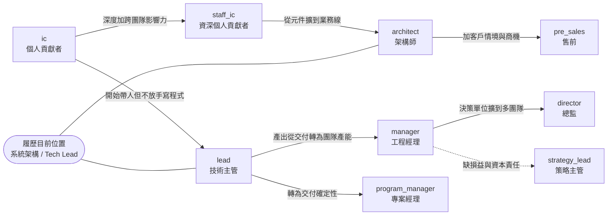

# 職缺術語與角色地圖 (JD Terminology and Role Maps)

本文教你怎麼讀 `pkg/resume/jd/` 這個`職缺庫 (JD Library)`: 先建立共用術語,
再用`角色地圖 (Role Map)` 判斷一份職缺與履歷的距離是`近`, 是`遠`, 還是`根本不在同一條軌道上`.

`適用對象`: 要新增一份 JD, 要重新評分, 或要決定下一步往哪個角色移動的人.

`前置條件`:

- 已讀過 [pkg/resume/Resume.md](../../Resume.md), 知道履歷上有哪些事實.
- 已讀過 [pkg/resume/jd/README.md](../../jd/README.md) 的排序總表與評分基準.
- 手邊有終端機, 以下指令一律在 `pkg/resume/jd/` 目錄執行.

## 術語解釋 (Terminology)

以下名詞的定義以 [pkg/resume/docs/terminology.md](../terminology.md) 的`職缺庫`章節為準, 本文只做用法說明,
不重新定義. 首次閱讀請先開該表對照:

`職缺庫`, `排序總表`, `角色類型 (role_type)`, `角色面向 (role_facing)`, `領域 (domain)`,
`匹配度 (score)`, `硬性要求 (Must-have)`, `加分要求 (Preferred)`, `其他條件 (Other)`,
`缺口分析 (Gap Analysis)`, `門檻級缺口 (Blocking Gap)`, `角色地圖 (Role Map)`,
`中間站 (Intermediate Role)`, `對位敘事 (Positioning Angle)`, `語彙轉換 (Vocabulary Translation)`,
`判重 (Duplicate Posting)`, `覆蓋註記 (Coverage Notes)`.

`本文額外使用的兩個描述詞`:

- `軌道 (Track)`: 一組共享產出物與成功衡量的角色集合. 同軌道內移動只需補技能, 跨軌道移動需補年資類型.
- `相鄰度 (Adjacency)`: 兩個 `domain` 之間的距離. 相鄰者可用一次專案補上, 不相鄰者需要一段任職經歷.

## 步驟 1 (Step 1): 讀懂一份 JD 的資料結構

`執行目的`: 知道哪些資訊在 front matter (機器讀), 哪些在本文 (人讀), 避免把事實寫錯地方.

`操作`:

```bash
cd pkg/resume/jd
sed -n '1,20p' okx/application_architect.java_platform.md   # front matter
grep -n '^## ' okx/application_architect.java_platform.md    # 本文區塊順序
```

`預期結果`: front matter 是`單一事實來源`, 排序總表由它產生; 本文區塊順序固定為
`評估摘要` → `基本資訊` → `團隊背景` (選備) → `崗位職責` → `任職要求` → `缺口分析` (選備) → `我的對位敘事`.

`判準`: 任何可列舉, 可排序, 可篩選的資訊 (公司, 職級, 領域, 分數, 狀態, 日期) 一律進 front matter;
需要論證的判斷 (為什麼是這個分數, 缺口怎麼補) 一律進本文. 兩邊不重複寫同一件事.

## 步驟 2 (Step 2): 判別 `role_type`

`執行目的`: 職稱會騙人. 同樣叫 `Lead`, 有的要帶人, 有的只是資深 IC; 同樣叫 `Architect`,
有的在畫圖評審, 有的每天寫程式. 判別要看`產出物`與`決策單位`.

`操作`: 讀 `崗位職責` 區塊的第一句與 `任職要求` 中的年資條款, 對照下表:

| `role_type` | 決定性訊號 (Deciding Signal) | 反例訊號 (Not This) |
| --- | --- | --- |
| `ic` | 要求聚焦語言, 系統與除錯能力, 無帶人年資條款 | 出現 `X+ years managing` |
| `staff_ic` | 跨團隊影響力, 共用元件, 技術標準, 但仍無帶人要求 | 出現人員績效與招募職責 |
| `architect` | 要求`架構設計方法論`, 為新業務線提出優化建議 | 職責只到單一服務的實作 |
| `lead` | 同時出現 `hands-on` 與 `mentor / lead a team`, 且明說不會 post-technical | 職責無任何動手成分 |
| `manager` | 出現人員成長, 招募, 跨團隊對齊, 交付節奏 | 要求逐行審查程式碼品質 |
| `director` | 決策單位是多個團隊, 組織設計與預算 | 只帶一個團隊 |
| `program_manager` | 產出是里程碑, 相依與風險; 出現 `Scrum of Scrums`, `Jira` | 要求擁有系統的技術決策權 |
| `pre_sales` | 成功衡量掛在商機與客戶方案, 出現出差比例 | 有 on-call 或系統可用性責任 |
| `strategy_lead` | 出現損益, 資本投資 business case, 定價政策 | 有任何程式碼交付物 |

`預期結果`: 每份 JD 只落在一個 `role_type`. 若判不定, 以`成功衡量`為最終判準 --
問一句`這個人年底被考核的數字是什麼`, 答案是程式與系統就往 IC 側, 是團隊與交付就往 Manager 側,
是營收與損益就是 `strategy_lead` 或 `pre_sales`.

`實例`: Airwallex 的 `Engineering Lead` 與 `Engineering Manager` 兩檔 Financial Platform,
崗位職責幾乎逐字相同, 差別只在 Lead 版多列了溝通與資料驅動決策的軟性條款.
遇到這種情況`不要`硬分, 應直接套用`判重 (Duplicate Posting)`的判準.

## 步驟 3 (Step 3): 判別 `role_facing` 與 `domain`

`執行目的`: `role_facing` 決定面試題型, `domain` 決定要不要惡補業務語彙.

`操作`:

```bash
grep -l 'role_facing: customer_facing' */*.md   # 客戶面向的職缺清單
grep -h '^domain:' */*.md | sort | uniq -c      # 領域分佈
```

`預期結果`: 目前全庫 `29 檔 internal` 對 `9 檔 customer_facing`.

`判準`:

- `internal`: 面試考系統設計, 故障排除與技術取捨. 履歷的工程深度直接可用.
- `customer_facing`: 面試考客戶情境, discovery 與方案簡報. 工程深度只是門票, 缺的是`把技術翻譯成商業結果`的實績.

`domain` 的相鄰度判讀 -- 決定領域缺口值不值得補:

| 目前領域 | 相鄰 (一次專案可補) | 不相鄰 (需一段任職經歷) |
| --- | --- | --- |
| `cloud_platform` | `ml_infra`, `crypto` 的基礎設施側 | `payments` 的會計正確性 |
| `data_ai` | `ml_infra`, `cloud_platform` | `low_latency_trading` |
| `payments` | `crypto`, `security` | `low_latency_trading` |
| `low_latency_trading` | 無 | 幾乎全部. 入口只有基礎設施支援與平台維運 |

## 步驟 4 (Step 4): 讀懂分數, 別把它當錄取率

`執行目的`: `score` 是`履歷對硬性要求的覆蓋率`, 用途是排投遞順序, 不是預測結果.

`操作`:

```bash
for f in */*.md; do
  printf '%s %s %s\n' \
    "$(grep -m1 '^role_type:' "$f" | cut -d' ' -f2)" \
    "$(grep -m1 '^score:' "$f" | cut -d' ' -f2)" "$f"
done | sort -k1,1 -k2,2nr
```

`預期結果`: 分數按 `role_type` 聚集, 呈現出`哪一條軌道最貼近履歷`:

| `role_type` | 檔數 | 分數區間 | 中位數 | 讀法 |
| --- | ---: | --- | ---: | --- |
| `architect` | 5 | 48 - 82 | `79` | 內部架構師是最貼合的軌道, 低分那兩檔全是客戶面向 |
| `manager` | 12 | 35 - 84 | `69` | 樣本最多, 分數散得最開, 差異來自領域而非職級 |
| `lead` | 5 | 55 - 78 | `73` | 穩定高分, 因為 hands-on 加帶人正是履歷形狀 |
| `staff_ic` | 3 | 66 - 76 | `68` | 穩定但天花板低, 年資已超出這一級 |
| `ic` | 9 | 25 - 80 | `45` | 中位數最低, 因為低延遲交易的 C++ 職缺全落在這裡 |
| `program_manager` | 1 | 74 | `74` | 單一樣本, 但顯示交付軌道是可行的側門 |
| `director` | 1 | 55 | `55` | 管理幅度不足, 屬拉伸型 |
| `pre_sales` | 1 | 45 | `45` | 跨軌道 |
| `strategy_lead` | 1 | 40 | `40` | 跨軌道, 且為門檻級缺口 |

`關鍵判讀`: 同一份履歷在 `architect` 拿 79, 在 `strategy_lead` 拿 40 --
差的不是能力而是`軌道`. 分數低於 50 時, 先確認缺口是`技能`還是`職涯類型`, 兩者的補法完全不同.

## 步驟 5 (Step 5): 畫出角色地圖

`執行目的`: 把`該不該投`轉成`該往哪走`. 角色地圖是缺口分析的收斂形式, 只在分數偏低但方向有價值時才畫.

`操作`: 先畫軌道全圖, 標出履歷目前的位置與各軌道的入口.



`預期結果`: 實線是`同軌道或相鄰軌道`的移動, 補技能即可; 虛線是`跨軌道`, 需要先取得新的責任類型.

接著針對單一職缺畫六面向距離表, 欄位固定為`這個角色要的`, `履歷目前位置`, `距離`:

| 面向 (Dimension) | 問題 (Question) |
| --- | --- |
| 產出物 | 這個角色年底交出什麼東西 |
| 決策單位 | 他簽字的最小單位是服務, 團隊, 業務線, 還是區域市場 |
| 對話對象 | 日常溝通的是工程師, PM, 高階主管, 還是客戶 |
| 技術深度 | 需要多深, 履歷是不足, 剛好, 還是超額 |
| 時間尺度 | 決策的回收週期是週, 季, 還是年 |
| 成功衡量 | 被考核的數字是什麼 |

`判準`: 六個面向中`遠`的數量決定結論 --

- `0 至 1 個遠`: 直接投, 缺的東西面試前補得完.
- `2 個遠`: 拉伸型, 值得投, 面試本身有情報價值.
- `3 個以上遠且集中在同一側 (商業側或技術側)`: 這不是下一步, 是下兩步, 應改找`中間站`.

`實例`: [google/geo_expansion_lead.google_cloud.md](../../jd/google/geo_expansion_lead.google_cloud.md)
六面向中三個`遠`且全在商業側, 因此結論是不投, 改找 `Infrastructure TPM`, `Capacity Planning`,
`Cloud FinOps Lead` 這三個中間站.

## 步驟 6 (Step 6): 用三問寫缺口分析

`執行目的`: 讓缺口從`我不會這個`變成`這值不值得補, 補多久`.

`操作`: 每個缺口固定回答三句, 不多也不少:

1. `缺什麼`: 對應 JD 的哪一句原文, 以及履歷上對應的事實是什麼 (可以是`零`).
2. `缺了會怎樣`: 落在`硬性要求`還是`加分要求`. 硬性且無 `or equivalent practical experience` 者標為`門檻級缺口`, 意味 recruiter screen 就被過濾.
3. `怎麼補`: 三選一 -- `可自學 (成本低)`, `可自學但需專案佐證 (成本中)`, `不能靠自學, 需先取得該類責任 (以年計)`.

`預期結果`: 每份缺口分析結尾都能回答`這一檔投或不投`, 且理由不是感覺而是缺口的類型.

`常見誤判`: 把`領域缺口`當成`門檻級缺口`. 領域語彙 (支付, 會計, 加密貨幣) 兩週可補到能面試;
真正的門檻級缺口是`責任類型` (損益, 管理幅度, 客戶面向實績), 那個補不了.

## 步驟 7 (Step 7): 新增一份 JD 時的檢查清單

`執行目的`: 確保新檔案能被排序總表與後續盤點指令正確吃到.

`操作`:

```bash
# 1. 建檔, 檔名為 <role_type_or_title>.<team>.md
# 2. 填完 front matter 後, 驗證欄位齊全
grep -c '^\(company\|title\|role_type\|role_facing\|domain\|score\|status\):' \
  <公司>/<新檔案>.md    # 應輸出 7

# 3. 驗證列舉值沒有拼錯
grep -h '^role_type:' */*.md | sort -u
grep -h '^domain:' */*.md | sort -u
```

`預期結果`: 第 2 步輸出 `7`; 第 3 步的列舉值全部落在 `pkg/resume/docs/terminology.md` 已定義的集合內,
沒有出現新的值. 若確實需要新值, `先`把定義補進術語表, `再`用於 JD, 順序不可顛倒.

`最後`: 更新 `jd/README.md` 排序總表, 並在 `_coverage_notes.md` 記錄該公司的抓取管道與已知落差.

## 常見錯誤 (Common Mistakes)

- 依職稱字面填 `role_type`. 應依`產出物與成功衡量`判定, 見步驟 2.
- 把 `score` 當錄取機率, 因此不敢投 65 分的職缺. 65 至 79 的意義是`有一項領域缺口`, 正是值得投的區間.
- 對每一份低分 JD 都寫角色地圖. 角色地圖只在`方向有價值`時才畫, 純粹能力不足的職缺直接不投即可.
- 在 JD 本文重複 front matter 已有的事實, 造成兩處不同步.
- 新增列舉值卻沒回填 `docs/terminology.md`, 使同一概念出現兩種說法.
