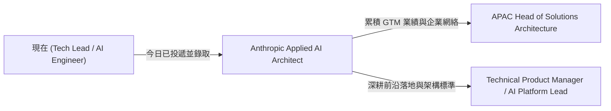

# Anthropic - Applied AI Architect (Singapore)

> ## 評估摘要 (Evaluation Summary)
>
> `評估日期`: 2026-09-17, 對照 [Resume.md](../../Resume.md)
>
> `匹配度 (Profile Matching Score)`: `48 / 100`
>
> `結論`: `Anthropic 新加坡目前唯一的技術職缺`, 隸屬 Go To Market / Technical Success 團隊. 硬性門檻 `10+ 年技術客戶面向角色 (Solutions Architect, Sales Engineer, Technical Account Manager)` 是履歷在職涯路徑上的結構性缺口; 但其雲端分散式系統架構、Python 能力及 2026 年多模型評估實作完全命中技術要求. 今日已完成投遞, 需全力以內部架構顧問經驗對位外部客戶諮詢.
>
> `符合的部分`:
>
> - 年資與學歷: 12+ 年經驗超過 10 年門檻, 資工碩士符合 Bachelor 學歷要求.
> - `設計可擴展雲端架構並整合企業系統`: 具備 AWS Solutions Architect 認證, ByteDance 跨機房錢包資料架構與 TSMC AI 平台整合皆為大規模系統.
> - `熟練使用 Python`: AI Engineer 階段多模型 SDK 與 Agent 編排主力語言, 以及 TSMC GPU 推論調度 MLOps.
> - `熟悉常見 LLM 框架或具備機器學習/資料科學背景`: 2026 年橫跨八家供應商之模型評估與 Agent SDK 實作.
> - `協助客戶建立評估框架以衡量 Claude 在特定場景的表現`: 具備真實的模型評估與基準測試經驗.
> - `跨受眾技術溝通`: 能向上對主管與利害關係人溝通商業價值, 向下對工程師進行架構深潛.
> - `辨識共通整合模式並把洞察回饋產品與工程`: ByteDance 與 Change Healthcare 階段多次將單案通用化為平台能力.
>
> `不符合的部分`:
>
> - `10+ 年 Solutions Architect, Sales Engineer 或 Technical Account Manager 等外部客戶面向角色`: 零, 過去 12 年皆為內部 Tech Lead / Architect / Engineer.
> - `與企業客戶合作, navigate 涉及多方利害關係人的複雜採購週期`: 零, 缺乏企業端 RFP、採購及商務談判實戰.
> - `外部 C-suite 關係經營`: 過去多為內部跨部門主管溝通, 缺乏外部客戶高階決策層的銷售說服實績.
>
> `投遞後跟進重點`:
>
> - 準備將 `內部跨部門技術推廣` 敘述為 `Internal Solutions Architecture` 的說法.
> - 準備可展示的 Claude 企業導入架構與模型 Evaluation 評估方法論.
> - 透過社群與 LinkedIn 尋找新加坡在地 Anthropic GTM 團隊成員建立非正式連結.

## 基本資訊 (Basics)

| 項目 | 內容 |
| --- | --- |
| 公司 (Company) | Anthropic |
| 職稱 (Title) | Applied AI Architect |
| 部門 (Department) | Go To Market / Technical Success |
| 角色類型 (Role Type) | `architect` · `customer_facing` · `data_ai` |
| 地點 (Location) | 新加坡 (Singapore), 服務新加坡在地企業客戶 |
| 職缺編號 (Job Post ID) | `5390742008` |
| 原始連結 (Original Link) | <https://job-boards.greenhouse.io/anthropic/jobs/5390742008> |
| 薪酬 (Package) | 未公開 |
| 最低年資 (Min Experience) | `10 年以上` (技術客戶面向角色) |
| 學歷要求 (Min Qualification) | `bachelor` (相關領域學士或同等實務經驗) |
| 投遞狀態 (Status) | `applied` (更新於 2026-09-17) |
| 抓取日期 (Fetched) | 2026-09-17 |
| 建立日期 (Created) | 2026-09-02 |

## 團隊背景 (Team Context)

隸屬於 Anthropic GTM (Go To Market) 底下的 Technical Success 團隊. 角色為 Pre-Sales 技術架構師, 與業務代表 (Account Executives) 搭檔, 擔任新加坡企業客戶採用 Claude 之主要技術信任對口.

## 崗位職責 (Responsibilities)

- 與新加坡的業務代表 (Account Executives) 深度合作, 釐清客戶需求並轉化為技術架構方案, 確保商業目標與技術實作對齊; 跨多個內部團隊協調以推動客戶成功.
- 擔任新加坡企業客戶在 Claude 採用旅程中的主要技術顧問, 從探索, 初期評估到部署全程引導.
- 支援同時使用 Claude API 與 Claude for Work 的企業客戶.
- 製作並交付針對新加坡多元受眾的技術內容, 涵蓋對工程開發團隊的技術深入, 到對高階主管 (C-suite) 的商業價值溝通.
- 引導技術架構決策, 協助新加坡企業客戶將 Claude 有效整合進既有技術棧.
- 協助客戶建立評估框架 (evaluation frameworks), 衡量 Claude 在其特定使用場景的表現.
- 辨識共通整合模式, 把前線技術洞察回饋給 Product 與 Engineering 團隊.
- 不定期出差至客戶現場進行工作坊, 技術深入與關係建立.
- 維持對 LLM 最新能力與實作模式發展的掌握.

## 任職要求 (Requirements)

`硬性要求 (Must-have)` — 原文 `You may be a good fit if you have`:

- `10+ 年` 技術客戶面向角色經驗, 如 Solutions Architect, Sales Engineer 或 Technical Account Manager.
- 與企業客戶合作的經驗, 能 navigate 涉及多方利害關係人的複雜採購週期.
- 卓越的關係建立能力, 能對多元利害關係人 (含 C-suite, engineering, IT 等) 傳達技術概念.
- 強大的技術溝通能力, 能在技術與商業利害關係人間轉化需求.
- 具備設計可擴展雲端架構並整合企業系統的經驗.
- 熟練使用 `Python`.
- 熟悉常見 LLM 框架與工具, 或具備機器學習 / 資料科學背景.
- 樂於參與跨組織協作、處理技術折衷與權衡多方優先級.
- 熱愛教學、指導與協助他人成功.
- 優秀的溝通與人際互動能力, 能以易懂語言向多元內外部利害關係人解釋複雜技術主題.
- 樂於思考如何安全且有益地使用技術, 推動安全 AI 系統的發展.

`其他條件 (Other)` — 原文 `Logistics`:

- 學歷要求: 大學學士學位 (Bachelor's degree) 或同等專業培訓與實務經驗.
- 辦公模式: 混合辦公 (Location-based hybrid), 至少 25% 時間需進辦公室.
- 工作簽證: 提供工作簽證贊助 (Visa sponsorship available).

## 缺口分析 (Gap Analysis)

`缺什麼`:

| 缺口 | 類型 | 補法 | 可補期 |
| --- | --- | --- | --- |
| `10+ 年技術客戶面向經驗 (SA/SE/TAM)` | `規模 / 職級` | 將 12+ 年內部跨部門技術推廣、平台佈道對位成等價的顧問與諮詢溝通能力 | 無法短期補齊 (需透過敘事轉化) |
| `企業採購週期與商業談判實務` | `技能` | 研讀企業 B2B 採購流程, 釐清 RFP, PoC 驗收標準與商務卡關應對策略 | 2-4 週 |
| `Claude 企業 Evals 實例舉證` | `舉證` | 將 2026 年多模型評估成果提煉為針對 Claude API 的企業 Evals 案例架構 | 1-2 週 |
| `新加坡在地企業網絡` | `舉證` | 盤點新加坡科技圈人脈, 參與 Anthropic 在地社群活動與技術聚會 | 1-3 個月 |

`缺了會怎樣`:

履歷審查階段容易因未見 `Solutions Architect` 等傳統 GTM 職稱而被篩選; 進入面試後, 面試官將嚴格考驗應對客戶質疑、採購卡關與跨利害關係人推動的實戰故事, 若僅以純工程思維作答易被判定角色不符.

`怎麼補`:

最高槓桿的單一動作: `將 ByteDance 跨業務線平台推動與 TSMC AI 平台架構實戰, 包裝為內部技術諮詢與顧問案例, 並以具體的多模型評估方法論證明自身的技術信任建立能力.`

`值不值得轉向`:

值得. 這是 Anthropic 在新加坡極具戰略意義的技術崗位. 隨著大模型加速走向企業落地, 具備大型分散式架構底層技術又理解前沿 AI 推論與評估的架構師極其稀缺, 能在此角色中快速累積頂級 AI Lab 光環與企業決策者人脈.

## 角色評估 (Role Assessment)

`評估日期`: 2026-09-17

| 面向 | 判斷 | 依據 |
| --- | --- | --- |
| 真實職級 | Senior Pre-Sales Solutions Architect | `原文` 載明配合業務釐清需求、引導架構與促成採用; `推論` 雖掛 Architect, 本質為 GTM 售前架構師而非內部核心系統架構師 |
| 影響範圍 (Scope) | 新加坡在地企業客戶群之 Claude 落地 | `原文` 多次強調 `across Singapore`, 涵蓋 Singapore enterprise customers 之工程與 C-suite 決策層 |
| 組織位置 | 營收推動中心 (GTM / Technical Success) | `原文` 部門隸屬 Go To Market / Technical Success, 與 Sales 緊密綁定 |
| 業務壓力 | 亞太企業市場擴張與競品防禦 | `推論` 面對 OpenAI 及雲端巨頭在企業端之競爭, 需在地架構師快速將企業客戶由 PoC 推至生產上線以驅動用量 |
| 成長天花板 | 亞太 Solutions Architecture Lead 或跨區轉調 | `推論` 新加坡目前無大型工程研發編制, 向上發展為亞太區 GTM 技術負責人, 若轉回研發需依賴跨國轉調 |
| 風險與紅旗 | 業績壓力綁定與研發縱深受限 | `推論` GTM 角色承擔客戶採購與用量壓力; 長期若想維持純底層分散式系統研發, 在本地缺乏 Engineering 團隊環境下易被定型 |

`角色本質`: `以 Architect 為名、本質為 GTM 售前解決方案架構師, 核心職責是為新加坡企業掃除 Claude 導入的技術障礙以達成商業用量目標.`

## 機會 (Opportunities)

- `能力資產`: 掌握前沿大模型 (Claude 3.5 系列) 企業級生產落地架構、企業 Evals 框架、Tool Use 與 Agentic 流程實務資產.
- `軌道轉換`: 打開從內部架構師跨入頂級 AI Lab 客戶面向技術諮詢 (GTM Solutions Architecture) 的軌道, 建立跨產業的高階人脈.
- `市場訊號`: 頂尖 AI Lab (Anthropic, OpenAI) 正在大舉強化新加坡在地 GTM 技術團隊, 庫內同類職缺需求強勁.
- `槓桿與網絡`: Anthropic 的頂尖 AI 品牌光環, 第一線接觸新加坡頂級金融、科技與跨國企業技術決策層.

## 路線圖 (Roadmap)

`投遞後跟進 (0-2 週)`:

| 動作 | 時間窗 | 驗收 |
| --- | --- | --- |
| 提煉 Claude 企業 Evals 概念方案 | 3 天內 | 完成一份 2 頁企業評估架構筆記, 結合 2026 年多模型實作 |
| LinkedIn 建立在地 Anthropic 網絡 | 1 週內 | 與 1-2 位新加坡在地 Anthropic GTM / 招聘成員建立連結 |
| 完善對位故事與面試自述 | 2 週內 | 準備 3 個以內部顧問身分推動跨組織技術方案的成功故事 |

`面試 (2-6 週)`:

| 動作 | 時間窗 | 驗收 |
| --- | --- | --- |
| 演練企業級 AI 系統整合與安全性題型 | 第 3-4 週 | 完成包含 API 快取、速率限制、資料隱私與企業 SSO 的架構白板演練 |
| 模擬跨層級利害關係人對話 (Executive vs. Eng) | 第 4-5 週 | 形成針對業務主管講 ROI, 針對架構師講技術取捨的雙軌簡報說法 |
| 準備針對 Anthropic GTM 組織之反問清單 | 第 5-6 週 | 列出 5 個關於新加坡團隊組織目標、客戶畫像與產品反饋機制的深度提問 |

`到職 90 天`:

| 階段 | 可交付成果 | 對準的業務壓力 |
| --- | --- | --- |
| 30 天 | 掌握內部工具鏈、API 特性與 Claude for Work, 觀摩 5+ 場客戶技術會議 | 建立產品語境與客戶溝通標準 |
| 60 天 | 獨立帶領 2 家新加坡企業客戶完成技術 Discovery 與 Evals 設計, 產出可復用架構樣板 | 擴充在地技術顧問量能 |
| 90 天 | 促成至少 1 家企業客戶 Claude 方案上線, 並向總部產品團隊反饋 2 項在地整合痛點 | 推動商業用量增長與產品迭代 |

`1-3 年`:

到達下一步所需的證據:

- 主導多個百萬級或標竿企業客戶之 Claude 整合落地, 具備量化之商業用量與採用率成長實績.
- 建立起亞太區域適用的企業導入架構與最佳實踐樣板, 具備指導新進 SA 的領導力證明.
- 主導提出之客戶需求轉化為 Anthropic 核心產品或 API 之新功能.

## 我的對位敘事 (Positioning Angle)

面試與溝通的敘事主軸應為 `兼具大規模系統架構深度與前沿 AI 落地經驗的實戰型顧問`:

1. 先強調 `架構深度與技術信任`: 擁有 12+ 年分散式系統經驗與 AWS Solutions Architect 認證, 在 ByteDance 與 TSMC 解決過最複雜的跨機房與平台級挑戰, 能第一時間贏得企業客戶 Engineering 團隊的信任.
2. 再展現 `AI 評估與實作敏銳度`: 2026 年親自構建跨 8 家模型供應商的評估框架與 Agent SDK, 清楚理解模型在精確度、延遲、成本與安全性上的取捨, 能精準引導客戶建立 Evals 體系.
3. 主動轉化 `客戶面向弱點`: 坦白過去職稱為 Tech Lead, 但日常核心職責即是擔任跨部門與業務線的 `內部解決方案架構師`, 善於在模糊需求與技術實作間建立共識, 且更能設身處地理解企業內部工程師在導入外部技術時的阻力與痛點.
