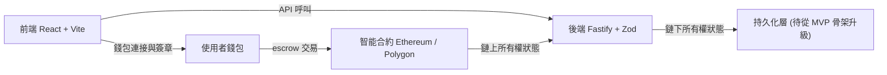

# CarHarbor - Technical Lead

> ## 評估摘要 (Evaluation Summary)
>
> `評估日期`: 2026-09-11, 對照 [Resume.md](../../Resume.md)
>
> `匹配度 (Profile Matching Score)`: `70 / 100`
>
> `結論`: 職級與職責形狀`完全對位` - 這是一個要同時擁有架構決策, 工程領導與交付對齊的 hands-on Tech Lead, 履歷有兩段同形狀的任職紀錄. 扣分全部集中在`技術棧的字面`: JD 把 `TypeScript` 寫進硬性要求而履歷從未出現過這個字, Web3 則是整個職缺庫的`第一條鏈上軌道`. 另有一組`分數之外`的風險 - 這是一家 MVP 階段, 未附公司連結與法人資訊的遠端新創, 盡職調查的重要性高於匹配度本身.
>
> `符合的部分`:
>
> - `6+ 年軟體工程經驗, 且曾有 Technical Lead 或 Staff 級別的 ownership`: 12+ 年; ByteDance 與 Change Healthcare 兩段皆為 Tech Lead 掛牌.
> - `設計並維運可擴展的分散式系統`: ByteDance 跨資料中心的錢包資料架構, 跨 DC 通道整併與交易資料備援; 履歷 Concept 欄明列 microservice, event-driven, HA, scalability.
> - `API 設計, 認證授權與資安最佳實務的紮實理解`: Change Healthcare 以 `JWT` 做 email 退訂簽章, Jenkins CI 導入 `KMS`, 處理 Fortify 靜態掃描發現; 自製 Spring Secret Manager plugin.
> - `動手做的 code review, mentoring 與跨職能執行`: 帶 5 人並主持 30+ 場面試; TSMC 設下`函數 30 行以內, 覆蓋率 90% 以上`的專案標準.
> - `把路線圖目標拆成可執行的技術里程碑`: TSMC 擔任技術專案經理, 拆任務並對目標設定排程.
> - `把商業需求翻譯成技術計畫, 早期識別風險並清楚溝通取捨`: ByteDance 的 EU 資料遷移是死線驅動專案, 且後續被推廣為跨業務線的通用能力.
> - 加分項 `Redis` 與 `生產環境可觀測性`: Redis 兩段任職皆使用; EFK, Prometheus, Grafana 為明列工具.
> - 加分項 `市集, 金融科技或高交易量產品`: ByteDance 錢包本身即交易密集系統, 三年皆在其資料架構上.
> - `持久化策略與從 MVP 骨架往生產資料架構遷移`: ByteDance 的資料 SDLC 正是把 residency 與 retention 從專案檢查表變成生命週期屬性.
>
> `不符合的部分`:
>
> - `TypeScript 的強生產經驗` 是硬性要求, 而 `TypeScript` 在履歷中`一次也沒有出現`. 履歷有 JavaScript, React, AngularJS, HTML5, 但近十年主力是 `Golang` 與 `Java`. 這是本檔最需要處理的缺口, 且因為 CarHarbor 前後端都是 TS, 無法用`語言概念可遷移`帶過.
> - `React 前端系統與 Node.js 後端服務的實證經驗`: React 只出現在 Change Healthcare 的技術棧列與 2015 年的個人網站; Node.js 只出現在 TSMC 那`五個月`. 是舉證缺口而非能力缺口, 但規模落差會被追問.
> - `Web3 經驗` (錢包整合, 合約互動模式, escrow 交易流程): 零覆蓋. 需特別留意一個`容易被誤讀成命中`的點 - 履歷的 ByteDance `wallet` 是支付錢包 (帳務與交易資料), 不是 `crypto wallet`; 若在面試中含混帶過, 被拆穿的代價高於直接承認.
> - `Polygon / Ethereum 生態的取捨` 與智能合約互動: 零覆蓋. JD 把 Web3 列為三條主軌之一, 即使它寫在 Preferred, 實際權重高於一般加分項.
> - `Fastify`: 未使用過. 加分要求原文已寫 `or similar`, Spring Boot 與 Node 生態的等價概念可折抵, 屬工具缺口.
> - `公司資訊完全缺失`: 無官網連結, 無職缺編號, 無法人註冊地, 無募資或營收狀態, 無團隊規模. 以本庫其他 65 檔的標準, 這是唯一一檔無法查證雇主存在的職缺.
>
> `投遞前必問`:
>
> - `幣別`: `$12,000 - $15,000/monthly` 未載明幣別. 若為 USD 約當 `SGD 16,000 - 20,000 / 月`, 高於本庫的 Lead 級行情; 若為 SGD 則屬中段. 這一題不問清楚, 後續談判沒有錨點.
> - `僱用形態`: 遠端加上`part time is ok`, 強烈指向 contractor 而非僱員. 需確認是否有 CPF, 保險, 股權 (equity / token), 以及付款幣別與頻率.
> - `法人與資金`: 公司註冊地, 目前資金水位與 runway. MVP 階段加上遠端 contractor, 拖欠與中止的風險必須先估.
> - `團隊現況`: JD 說要帶 frontend / backend / Web3 三類工程師, 但沒說各有幾人, 是全職僱員還是外包. 若實際是`一個人要自己寫完三條軌`, 那這是資深全端職而非 Tech Lead.
> - `Web3 的落地程度`: 現在是 mock / demo 流程還是已有 testnet 合約? 智能合約由誰撰寫與審計? Tech Lead 是否需要自己寫 Solidity, 還是只負責整合與審閱.
> - `資金託管責任`: escrow 式購車流程涉及真實資金託管. 誰持有私鑰? 有無法遵與監理意見? 這在車輛這種高單價標的上是實質法律曝險.
> - `TypeScript 的硬性程度`: Go 與 Java 的架構深度能否折抵, 或是否接受前兩個月以 TS 補齊.

## 基本資訊 (Basics)

| 項目 | 內容 |
| --- | --- |
| 公司 (Company) | CarHarbor (Web3 數位車輛交易市集, MVP 完成階段. `JD 未提供公司連結或法人資訊`) |
| 職稱 (Title) | Technical Lead |
| 部門 (Department) | 跨前端, 後端與 Web3 整合三條技術軌 (JD 未載明部門名) |
| 角色類型 (Role Type) | `lead` · `internal` · `crypto` |
| 地點 (Location) | 遠端 (Remote). 未載明時區重疊需求 |
| 職缺編號 (Job Post ID) | 無 |
| 原始連結 (Original Link) | 無. `來源為使用者人工貼入全文` |
| 薪酬 (Package) | `$12,000 - $15,000 / 月`, 可依經驗議價. `幣別未載明` |
| 最低年資 (Min Experience) | `6 年以上`, 且需有 Technical Lead 或 Staff 級 ownership |
| 學歷要求 (Min Qualification) | 未載明 |
| 工作型態 (Work Model) | 全職優先, 可接受兼職 |
| 投遞狀態 (Status) | `not_applied` (更新於 2026-09-11) |
| 抓取日期 (Fetched) | 2026-09-11 |

## 團隊背景 (Team Context)

CarHarbor 是一個 Web3 化的數位車輛交易市集, 目前處於 `MVP 完成階段`. 既有平台組成:

- `前端`: React + Vite + TypeScript + Tailwind + shadcn/ui
- `後端`: Fastify + TypeScript + JWT 認證 + Zod 驗證
- `Web3 方向`: 錢包連接, escrow 式購買流程, 代幣化的上架 metadata, 多網路支援 (Ethereum / Polygon / testnet 路徑)

協作對象為前端工程師 (UI 狀態, API 整合, 效能), 後端工程師 (服務設計, 資料層, 認證強化),
Web3 / 區塊鏈貢獻者 (錢包, escrow, 所有權一致性) 與產品 / 設計利害關係人.

## 崗位職責 (Responsibilities)

`架構與系統設計 (Architecture and System Design)`:

- 定義並演進 web app, API 層與 Web3 模組的端到端架構.
- 對齊 UI, API 與`鏈上 / 鏈下所有權狀態`之間的資料流.
- 主導可擴展性, 可維護性, 可觀測性與部署的技術決策.

`工程領導 (Engineering Leadership)`:

- 在規劃, 實作與審查各階段帶領並 mentor 前端 / 後端 / Web3 工程師.
- 訂定編碼標準, PR 品質期待與 release readiness 準則.
- 把路線圖目標拆解為可執行的技術里程碑.

`產品與交付對齊 (Product and Delivery Alignment)`:

- 與產品 / 設計協作, 把商業需求翻譯成技術計畫.
- 管理團隊間相依 (例如前端整合前的 API readiness).
- 早期識別並緩解技術風險, 清楚溝通取捨.

`平台強化 (Platform Hardening)`:

- 在認證, token 流程, 環境 / 設定處理與 API 邊界上改善資安態勢.
- 主導持久化策略, 從 MVP 骨架遷移到生產級資料架構.
- 確保測試策略涵蓋關鍵工作流與回歸風險.

`前 90 天的成功定義 (What Success Looks Like)`:

- 為 MVP 收尾建立明確的技術架構與執行計畫.
- 推動前後端整合為單一可靠的資料流.
- 定義從 mock / demo 流程走到生產級錢包與交易處理的路徑.
- 提升關鍵模組的程式品質與測試基準.
- 在可靠性, 資安與 release confidence 上交出可量測的進展.

## 任職要求 (Requirements)

`硬性要求 (Must-have)` — 原文 `Required Qualifications`:

- `6 年以上`軟體工程經驗, 且曾有 Technical Lead 或 Staff 級的 ownership.
- 紮實的 `TypeScript` 與現代 web 架構`生產環境`經驗.
- `React` 為基礎的前端系統與 `Node.js` 後端服務的實證經驗.
- 對 `API 設計`, `認證 / 授權` 與資安最佳實務有紮實理解.
- 設計並維運`可擴展分散式系統`的經驗.
- 動手做的 code review, mentoring 與跨職能執行.

`加分要求 (Preferred)` — 原文 `Preferred Qualifications`:

- `Web3` 經驗 (錢包整合, 智能合約互動模式, escrow / 交易流程).
- `Fastify` (或類似框架), `Redis`, 以及生產環境可觀測性工作流.
- 曾在`市集`, `金融科技`或`高交易量`產品工作的經驗.
- 熟悉 `Polygon / Ethereum` 生態的取捨.

`其他條件 (Other)`:

- 工作型態: 全職優先, 兼職亦可接受.
- 地點: 遠端. 未載明時區, 工作權或簽證要求.
- 面試重點: 基於現行 MVP 約束的架構案例討論, 程式品質與技術領導方式, 資安與可靠性決策, 跨團隊溝通與交付 ownership.

## 缺口分析 (Gap Analysis)

本檔是職缺庫的第一條 `Web3 / 鏈上` 軌道 - OKX 那五檔雖屬加密貨幣公司, 但職責都在 Java, Kubernetes 與平台穩定性,
`沒有一檔碰到合約, 錢包或鏈上狀態`. 因此即使分數落在 `65-79` 區間, 仍值得留下判斷依據.

`缺什麼`:

| 缺口 | 類型 | 補法 | 可補期 |
| --- | --- | --- | --- |
| `TypeScript` 生產經驗 | 舉證 | 把 2026 年起自建的 Agent SDK 其中一支對外介面以 TS 重寫並公開 repo | 2-4 週 |
| `React + Vite + Tailwind + shadcn/ui` 現代前端棧 | 工具 | 以 shadcn/ui 做一頁 listing 與錢包連接的 demo | 2-3 週 |
| 錢包連接與合約互動 (`wagmi` / `viem` / `ethers.js`) | 技能 | 在 testnet 跑通 connect 至 sign 至讀合約狀態的完整路徑 | 3-4 週 |
| `escrow` 合約與鏈上 / 鏈下所有權一致性 | 技能 | 在 Polygon testnet 部署一份最小 escrow, 並寫出所有失敗路徑與退款情境 | 6-8 週 |
| `Solidity` 撰寫與 gas / 安全審計 | 技能 | 本職缺有獨立的 Web3 貢獻者, Tech Lead 只需能審閱與提問, 不補到能獨立撰寫 | 界定為協作面 |

`缺了會怎樣`:

JD 明寫面試第一關是`基於現行 MVP 約束的架構案例討論`. 以這個產品的性質, 案例幾乎必然落在
`鏈上與鏈下所有權狀態如何保持一致` - 也就是缺口最深的那一格. 更麻煩的是這題與履歷最強的那段
(ByteDance 的跨資料中心`最終合規一致性`) 在`結構上高度同形`: 兩者都是多個權威來源之間的狀態收斂,
差別只在其中一個來源換成了區塊鏈. 若事前沒把這層對應想清楚, 會白白浪費履歷裡最有力的一段.

`TypeScript` 則是另一種性質的缺口: 它是每天的實作語言, 沒有概念等價可用, 只能靠可查證的產出補.

`怎麼補`:

最高槓桿的單一動作是 - 用 `TypeScript + React + Fastify` 在 `Polygon testnet` 上做一支最小的
escrow 車輛交易 demo. 這一件事同時補掉語言, 前端棧, 後端框架與鏈上流程`四項`,
而且它直接就是對方面試要討論的那個系統, 可以當作架構案例的共同語言.

`值不值得轉向`:

`技術上值得, 商業上待查證`. Web3 是本庫尚未觸及的軌道, 而這個職缺的職責形狀
(架構決策加工程領導加交付對齊) 與履歷的成長方向一致, 進入成本只是補一組現代 TS 棧,
不是換職涯類型. 但它與本庫其他 65 檔有一個決定性差異: `雇主無法查證`.
Apple, Meta, Stripe 這類職缺失敗的代價是被拒絕; MVP 階段, 遠端, 疑似 contractor 的職缺失敗的代價是`做了拿不到錢`.
因此本檔的正確順序是`先做盡職調查, 再談匹配度` - 若公司實體, 資金與僱用形態任一項說不清楚, 不論分數多少都不應投入.

## 我的對位敘事 (Positioning Angle)

`先講什麼`: 開場就用`跨資料中心的錢包資料架構`當主軸, 但要刻意把它講成`多權威來源的狀態一致性問題`,
而不是講成一個遷移專案. 這樣鋪陳之後, 對方問到鏈上 / 鏈下所有權狀態時, 銜接是自然的:
同一個問題, 只是其中一個來源換成了不可逆且有最終性延遲的區塊鏈.

`接著講什麼`: 平台強化那一段是履歷最能直接對位的職責.
把 `JWT` 簽章, Jenkins 的 `KMS`, Fortify 修補與 Spring Secret Manager plugin 串成一條線 -
這正好對應 JD 說的`認證, token 流程, 環境 / 設定處理`. 接著補上 TSMC 的品質標準
(函數 30 行以內, 覆蓋率 90% 以上) 對應`提升測試基準`, 以及帶 5 人與 30+ 場面試對應 mentoring.

`必須主動處理而非迴避的弱點`:

- `TypeScript`: 不要等對方問. 主動說明近十年主力是 Go 與 Java, 前端經驗停在 React 與 AngularJS 時代,
  並當場給出補齊的具體計畫與時程. 這個職缺的 Tech Lead 要訂編碼標準,
  一個自己不寫這個語言的人來訂標準, 對方一定會擔心, 要正面回應這個擔心.
- `wallet 的一詞兩義`: 主動點明 ByteDance 的 wallet 是支付錢包不是 crypto wallet.
  自己先說, 這會被讀成誠實與精確; 被對方拆穿, 會被讀成灌水.
- `Web3 零經驗`: 用`我不會假裝懂合約, 但我會把所有權一致性當成分散式狀態問題來設計`
  這個定位, 把自己放在`架構與整合`的位置, 而不是`合約作者`的位置 - 這也正是 JD 對這個角色的實際期待.

`不要說的`: 不要為了貼近 Web3 而把 ByteDance 那段包裝成區塊鏈相關. 這個領域的圈子小, 話術折損率高.
