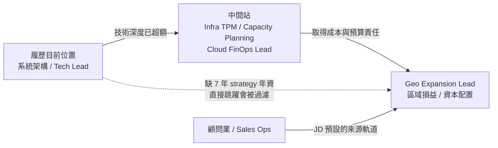

# Google - Geo Expansion Lead, Google Cloud

> ## 評估摘要 (Evaluation Summary)
>
> `評估日期`: 2026-09-03, 對照 [Resume.md](../../Resume.md)
>
> `匹配度 (Profile Matching Score)`: `40 / 100`
>
> `結論`: `這不是工程職缺, 是披著基礎設施外衣的商業策略職缺`. 三條 minimum qualifications 中最關鍵的一條 -- `7 年企業軟體的 strategy, sales operations, sales management 或 management consulting 經驗` -- 履歷是 `0 年`, 屬職涯類型缺口, 在 recruiter screen 階段就會被過濾. 反過來說, 五條 preferred qualifications 命中三條, 且 ByteDance 的跨資料中心經驗是多數 strategy 背景候選人`沒有`的東西. 因此本檔的價值不在投遞, 而在它揭示了一條`把資料中心經驗變現`的職涯路徑.
>
> `符合的部分`:
>
> - minimum `學士學位或同等實務經驗`: 中央大學資工碩士.
> - minimum `能與技術利害關係人及高階主管溝通並簡報`: ByteDance 推動區域合規遷移框架跨部門採用; TSMC 擔任技術專案經理, 拆解任務並對齊商業目標.
> - preferred `7 年技術角色 (program management, engineering, sales engineering)`: 12+ 年, 遠超門檻.
> - preferred `IT 基礎設施的規劃, 需求預測與庫存優化`: 部分命中. TSMC 的 GPU job scheduler 是運算資源調度與利用率; ByteDance 的全球資料中心冗餘設計`使實作與維護成本下降兩個 job grade`, 這是可直接改寫成商業語彙的成本影響.
> - preferred `能辨識輸入訊號, 保留並運用資料做高影響力決策`: Gamesofa 的資料工程, A/B testing 與用戶分群分析工具.
>
> `不符合的部分`:
>
> - minimum `7 年 strategy, sales operations, sales management 或 management consulting 經驗 (企業軟體業)`: `完全沒有`. 這是本檔的門檻級缺口.
> - 從未擁有損益 (P&L) 責任, 從未撰寫爭取資本投資的 business case, 沒有 `CUD (Committed Use Discount)` 這類定價與折扣政策的設計經驗.
> - preferred `資料中心規劃, 典型伺服器規格, layer 1-4 網路術語`: 履歷的資料中心經驗停在服務與資料通道層, 沒有機櫃, 電力, 散熱與實體網路的規格知識.
> - preferred `理解 Google Cloud 產品與平台的商業週期`: 無.
> - 職缺 `2026-09-16 截止`, 距今僅兩週, 且已重貼一次 (原始刊登 2026-07-23), 顯示招募方對候選人輪廓有明確且未被滿足的期待.
>
> `投遞前必問`:
>
> - `這個職缺實際歸屬哪個組織` -- Cloud GTM Strategy, Infrastructure, 還是 Finance? 三者的錄取輪廓完全不同.
> - minimum 的 7 年 strategy 經驗是`硬門檻`還是`可用同等技術經驗替代` (JD 未如其他 Google 職缺般寫 `or equivalent practical experience`).
> - `APAC Capacity and Yield Steering Council` 目前是否已存在, 這個角色是`接手`還是`從零建立`.
> - 薪幅 `SGD 15,500 - 31,000 / 月` 橫跨兩個職等, 實際對應 L5 還是 L6.

## 基本資訊 (Basics)

| 項目 | 內容 |
| --- | --- |
| 公司 (Company) | Google (GOOGLE ASIA PACIFIC PTE. LTD., UEN 200817984R) |
| 職稱 (Title) | Geo Expansion Lead, Google Cloud - Singapore |
| 部門 (Department) | Google Cloud / APAC Infrastructure Strategy (JD 未明列部門, 由職責推定) |
| 角色類型 (Role Type) | `strategy_lead` · `internal` · `cloud_platform` |
| 地點 (Location) | 新加坡 Mapletree Business City, 70 Pasir Panjang Road (117371) |
| 職缺編號 (Job Post ID) | `MCF-2026-1266916` |
| 原始連結 (Original Link) | <https://www.mycareersfuture.gov.sg/job/information-technology/geo-expansion-lead-google-cloud-singapore-google-asia-pacific-f005392ff557dc7d8546fe655889270c> |
| 刊登與截止 (Posted / Expiry) | 首發 2026-07-23, 重貼 2026-09-02, `2026-09-16 截止` |
| 僱用形式 (Employment Type) | Full Time, 1 個名額, 職級 `Professional` |
| 薪酬 (Package) | `SGD 15,500 - 31,000 / 月` (雇主公開). 區間跨度達兩倍, 顯示職等未定. |
| 最低年資 (Min Experience) | `7 年以上` |
| 學歷要求 (Min Qualification) | 學士或同等實務經驗 (SSEC EQA 70) |
| 投遞狀態 (Status) | `not_applied` (更新於 2026-09-03) |
| 抓取日期 (Fetched) | 2026-09-03, 來源 `api.mycareersfuture.gov.sg/v2/jobs/<uuid>` |

## 團隊背景 (About the Team)

Google Cloud 為 200 多個國家與地區的客戶提供企業級解決方案. 本職缺負責 Google Cloud `APAC 資料中心足跡`
的長期商業健康度, 基礎設施產出效益 (infrastructure yield) 與`區域損益 (regional P&L)`.

這是一個`把資料中心從成本中心轉為可測量商業資產`的角色: 一端連接 GTM 的需求管線,
另一端連接全球資本投資的優先排序.

## 崗位職責 (Responsibilities)

- 推動 APAC 資料中心的區域損益與長期商業健康度, 追蹤並確保各次區域達成當地業務目標.
- 實施程式化的 `CUD (Committed Use Discount)` 政策與自動化的跨區資產交換, 以最大化基礎設施效用.
- 共同撰寫多年期的資料中心與電力擴張 business case, 以 GTM 需求管線為佐證, 爭取全球資本投資的優先配置.
- 擔任 APAC 容量工具的策略業務發起人 (business sponsor), 與工程團隊合作建立預測模型與儀表板.
- 建立並主持 `APAC Capacity and Yield Steering Council`, 將季度高階對齊與結構化的需求重導策略制度化.

## 任職要求 (Requirements)

`硬性要求 (Must-have)` — 原文 `Minimum qualifications`:

- 學士學位或同等實務經驗.
- `7 年` 企業軟體公司的 `strategy 或 sales operations 角色, sales management 職能, 或 management consulting` 經驗.
- 具備與技術利害關係人及高階主管互動並簡報的經驗.

`加分要求 (Preferred)` — 原文 `Preferred qualifications`:

- `7 年` 技術角色經驗, 如 program management, engineering 或 sales engineering.
- 具備 IT 基礎設施的規劃, 需求預測 (demand forecasting) 與庫存優化 (inventory optimization) 經驗, 例如設定目標與定義庫存.
- 具備資料中心規劃, 典型伺服器規格, `layer 1-4` 網路術語的知識.
- 理解 Google Cloud 產品與平台的商業週期.
- 能辨識輸入訊號, 保留並運用資料來規劃高影響力決策.

`其他條件 (Other)` — 原文 `MCF 標記技能`:

Inventory Planning, Collaborate With Engineers, Planning, Technology Expertise, Infrastructure Planning,
Google Cloud Platform, Capital Management, Regional Sales, Sales Engineering, Product Management,
Business Alignment, Sales Forecasting, Data-Driven Decision Making, Leading Stakeholders, Corporate Strategy.

## 缺口分析 (Gap Analysis)

### 先確認手上已有的槓桿 (Transferable Assets)

| 履歷事實 | 對應到 JD 的哪一句 | 強度 |
| --- | --- | --- |
| ByteDance `設計全球資料中心冗餘, 使實作與維護成本下降兩個 job grade` | `infrastructure yield`, `long-term commercial health` | `高`. 這是成本影響, 已經是商業語彙 |
| ByteDance 跨資料中心資料通道與服務對齊新資料中心 | `data center planning`, `inter-regional asset exchanges` | `中高`. 是資產調度的技術原型 |
| TSMC GPU job scheduler 與 AI 平台架構 | `capacity tooling`, `infrastructure utility` | `中`. 運算資源利用率, 但尺度是叢集非區域 |
| TSMC 技術專案經理: 拆任務, 訂排程, 對齊商業需求 | preferred `program management` | `中` |
| Gamesofa 資料工程, A/B testing, 用戶分群分析 | `predictive models and dashboards`, `data-driven decision making` | `中` |
| Change Healthcare 帶 5 人, 30+ 輪面試, 跨團隊協調 | `presenting to technical stakeholders and executive leaders` | `中低`. 對象是工程與 PM, 不是 executive |
| AWS Solutions Architect – Associate | 雲端商業模式與定價的基礎語彙 | `低`. 是入場券不是差異化 |

`關鍵判讀`: 履歷在 `preferred` 欄位的覆蓋率遠高於 `minimum` 欄位. 這正是`職涯類型錯位`的典型訊號 --
不是能力不足, 是`職能軌道不同`.

### 缺口一: 損益責任與資本論證 (門檻級)

`缺什麼`: 從未擁有區域或產品線的 P&L, 從未撰寫過爭取資本投資的 business case,
沒有 `CUD` 這類定價與折扣政策的設計經驗. JD 的第一項職責就是 `drive the regional profit and loss`.

`缺了會怎樣`: 這對應 minimum qualification 的第二條, 而該條`沒有` 寫上 Google 其他職缺慣用的
`or equivalent practical experience`. 意味著這是硬門檻, 履歷會在 recruiter screen 被過濾,
不是面試表現能補的.

`怎麼補`: `不能靠自學`. 唯一路徑是在現職或下一份工作中先取得預算或成本責任
(例如成為基礎設施成本優化的 owner), 累積可量化的財務影響, 再橫向轉入.
時間尺度以`年`計, 不是月.

### 缺口二: 需求預測與容量規劃的商業側

`缺什麼`: 履歷有容量與冗餘的`技術側`設計, 沒有 demand forecasting, inventory optimization
與 GTM 需求管線對接的經驗. ByteDance 的容量工作是`被動滿足`合規與穩定,
不是`主動預測`市場需求以驅動資本配置.

`缺了會怎樣`: 這是 preferred 不是 minimum, 不會直接淘汰. 但面試必然追問
`你如何決定要蓋多少`, 而履歷目前只能回答 `我如何蓋得更省`. 這兩個問題的層級差一整級.

`怎麼補`: `可自學, 成本中等`. 讀 cloud capacity planning 與 `CUD / RI (Reserved Instance)`
的定價模型, 用 AWS 或 GCP 的 committed use 折扣結構做一次成本模擬,
再把 ByteDance 的冗餘設計反推成一份完整的 business case 作為面試素材.

### 缺口三: 資料中心實體層與電力

`缺什麼`: JD 要求資料中心規劃, 典型伺服器規格與 `layer 1-4` 網路術語.
履歷的資料中心經驗停在服務與資料通道層, 沒有機櫃世代, 電力密度, 散熱與實體網路的規格知識.

`缺了會怎樣`: JD 明說要 `partnering with engineering teams to build predictive models`.
缺這一層會導致無法與基礎設施工程團隊平等對話, 淪為傳話者.

`怎麼補`: `可自學, 成本低`. `layer 1-4` 對有 Nginx, Linux, Kubernetes 底子的人是複習;
機櫃與電力則需補課. 巧的是本 repository 的 [pkg/dc_energy](../../../../pkg/dc_energy/) 研究子專案
`正好就是這個領域`, 材料已在手上.

### 角色地圖 (Role Map)

| 面向 | 這個角色要的 | 履歷目前位置 | 距離 |
| --- | --- | --- | --- |
| 產出物 | 區域損益, 資本投資決策 | 系統設計與交付 | `遠` |
| 決策單位 | 次區域市場, 資料中心園區 | 服務, 叢集, 資料通道 | `遠` |
| 對話對象 | 高階主管, GTM, 財務 | 工程師, PM, 跨部門 owner | `中` |
| 技術深度 | 足以與基礎設施團隊對話 | 超額 | `近 (這是優勢)` |
| 時間尺度 | 多年期資本週期 | 季度交付 | `遠` |
| 成功衡量 | 產出效益, 利用率, 毛利 | 可用性, 交付速度, 成本下降 | `中` |

`判讀`: 六個面向中有三個是 `遠`, 且都集中在`商業側`. 技術側反而是唯一的 `近`.
這說明這個角色不是履歷的下一步, 而是`下兩步`.

## 我的對位敘事 (Positioning Angle)

`不建議投遞`, 但這一檔應該`留檔並列為方向標`, 理由有三:

`一, 它標定了一條變現路徑`. 履歷中最稀有的資產是 ByteDance 的跨資料中心與全球冗餘設計 --
在純工程職缺裡, 這只是 `分散式系統經驗` 的一個註腳; 在這一檔裡, 它是 `infrastructure yield`
的核心資格. 同一段經歷, 在不同軌道上的定價差距極大, 值得記住.

`二, 中間站比終點更該投`. 若要走這條路, 正確的下一步是 `Infrastructure TPM`,
`Capacity Planning Engineer` 或 `Cloud FinOps Lead` -- 這些職缺同時接受工程背景,
又能累積成本與預算責任. 應在下一輪蒐集中主動搜尋這三個關鍵字.

`三, 語彙可以立刻回收`. 無論投不投這一檔, `成本影響` 的敘事方式應該立即套用到其他職缺的
cover letter: 把 `設計全球資料中心冗餘` 改寫成 `使實作與維護成本下降兩個 job grade`,
後者對任何 hiring manager 都更有力. 這是本檔最即時的產出.

`若仍要投`: 唯一的角度是主張 preferred 欄位的覆蓋率 (技術角色, 基礎設施規劃, 資料驅動決策)
足以抵銷 minimum 欄位的 strategy 年資, 並用一份自製的 APAC 容量 business case 作為附件證明.
成功率低, 但這份 business case 本身就是缺口二的學習產出, 做了不虧.
