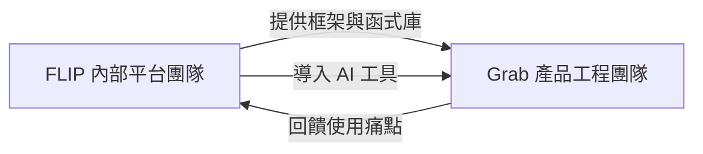

# Grab - Lead Software Engineer, Backend (新加坡)

> ## 評估摘要 (Evaluation Summary)
>
> `評估日期`: 2026-09-08, 對照 [Resume.md](../../Resume.md)
>
> `匹配度 (Profile Matching Score)`: `80 / 100`
>
> `結論`: `建議主投`. 這是目前庫內`唯一一檔把 AI 工具化明列為第一條職責的內部平台職`, 而 2026/06 起的 Agent SDK 資歷正好對位. 五項硬性要求 (7+ 年資, Go, 微服務與資料庫, K8s / Istio / 可觀測性, Git / GitLab) 在履歷上`全數有據`, 唯一實質缺口是 `Go 的可證明深度`: 履歷只在 Language 欄列出 Golang 而未標年資, 明確標註年資與框架作品的是 Java (4.5 年, EventBus 框架). 對一個`交付物就是 Go 框架本身`的團隊, 這個舉證落差會直接反映在履歷篩選, 屬`可用公開作品在數週內補齊`的類型, 而非職涯軌道缺口.
>
> `符合的部分`:
>
> - `7+ 年軟體開發並跨團隊交付`: 12+ 年, 且 ByteDance 與 Change Healthcare 皆為跨團隊協作的角色.
> - `框架與函式庫作者身分`: EventBus 共用框架, Spring Secret Manager plugin, Lambda 與 event annotation 共用框架, 加上 ByteDance 的高階任務編排框架, 是本職缺最核心的能力證明.
> - `推動框架被別的團隊採用`: ByteDance 跨部門推動區域合規遷移框架, 對位 FLIP 團隊`東西要有人用`的本質難題.
> - `AI 驅動的工程生產力工具`: 跨八家模型供應商的 Agent SDK, 個人基礎設施編排, 是 JD 第一條職責的直接經驗.
> - `微服務與 HTTP, MySQL, Redis`: 履歷含 RDB, Redis, MongoDB, Elasticsearch 與長期微服務實作.
> - `Kubernetes, Istio, 可觀測性`: TSMC 的 K8s (Istio, EFK, Prometheus, Grafana) 與 Argo CD, 對位 JD 的 Kibana / Grafana 要求.
> - `Git 與 CI/CD 協作`: GitLab, Azure DevOps, Jenkins, GitOps 皆在履歷上.
> - `Mentoring 與 code review 文化`: 帶過 5 人, 30+ 輪面試, 並設過`函式 30 行, 覆蓋率 90%` 的專案標準.
> - `新加坡 on-site`: 已是新加坡 PR, 且前一份工作即在新加坡.
>
> `不符合的部分`:
>
> - `Go 的可證明深度`: 履歷未標 Golang 年資, 亦無公開的 Go 作品連結. 這是本檔的主要扣分項.
> - `gRPC`: 履歷未提. ByteDance 的內部服務極可能用過, 但紙面上沒有.
> - `DataDog`: 零. 可觀測性經驗集中在 EFK 與 Grafana, 屬同類工具的替換.
> - `Go 生態的韌性函式庫與相依管理`: circuit breaker, retry, rate limit 的函式庫化, 以及 Go module 層級的相依治理, 履歷無對應敘述.
> - `萬人規模的內部平台使用者`: 既有框架作品的受眾是部門到公司層級, 不是`數千名後端工程師每日依賴`的量級.
>
> `投遞前必問`:
>
> - Lead 的定位: 是`帶人的 tech lead` 還是`不帶人的資深 IC`, JD 只寫 mentor 而未提 direct report.
> - ByteDance 背景在 Grab 是否觸發競業或資料敏感審查, 兩家在東南亞為直接競爭關係.
> - JD 的 `Life at Grab` 段落寫的是 `benefits we offer our Interns` (實習生), 明顯是貼錯段落, 需在流程中確認正職的實際福利與 FlexWork 條件.
> - `Responses managed off LinkedIn`: 投遞需走 Grab 官方網站, 不要只按 LinkedIn 的 Apply.

## 基本資訊 (Basics)

| 項目 | 內容 |
| --- | --- |
| 公司 (Company) | Grab |
| 職稱 (Title) | Lead Software Engineer, Backend |
| 部門 (Department) | Frameworks, Libraries, Primitives (FLIP) |
| 角色類型 (Role Type) | `lead` · `internal` · `cloud_platform` |
| 地點 (Location) | 新加坡 (Singapore), `on-site`, 全職 |
| 職缺編號 (Job Post ID) | 未載明 |
| 原始連結 (Original Link) | 未附連結, 來源為使用者提供的 LinkedIn 職缺全文 |
| 薪酬 (Package) | 未公開 |
| 最低年資 (Min Experience) | `7 年` 軟體開發 |
| 匯報對象 (Reports To) | Senior Engineering Manager (同樣位於新加坡辦公室) |
| 投遞狀態 (Status) | `not_applied` (更新於 2026-09-08) |
| 抓取日期 (Fetched) | 2026-09-08 |

## 團隊背景 (Team Context)

FLIP (Frameworks, Libraries, Primitives) 是 Grab 的`內部平台團隊 (internal platform team)`,
產出被全公司數千名後端工程師每日使用的框架, 函式庫與基礎元件.
產品組合包含`微服務框架`, `韌性函式庫 (resiliency libraries)` 與`相依管理方案`,
並將自研元件與經過整合的第三方技術組合起來, 加速全公司的開發, 測試與自動化.

團隊橫跨東南亞三個據點, 本職缺位於新加坡辦公室, 直接匯報給同地點的 Senior Engineering Manager.
團隊自述的使命是`讓每位後端工程師的日常工作變得愉快與卓越`, 屬典型的
`開發者體驗 (Developer Experience) 軌道`, 與面向外部客戶的架構師職務是不同性質.

## 崗位職責 (Responsibilities)

- `AI 工具化`: 識別, 規劃並實作 AI 驅動的工具, 降低工程負擔並提升 Grab 各團隊的生產力.
- `框架開發`: 以 Go 開發框架與函式庫, 讓產品工程師不必重造輪子即可更快交付.
- `架構決策`: 參與架構決策與技術路線圖的制定.
- `人才培育`: 指導資淺工程師, 培養持續學習, 知識共享與工程卓越的文化.
- `品質把關`: 透過嚴謹的 code review 與具建設性的回饋, 維持高程式碼品質.
- `SDLC 最佳化`: 找出軟體開發生命週期的最佳化機會, 主導技術專案, 形塑 Grab 下一代微服務樣貌.

## 任職要求 (Requirements)

`硬性要求 (Must-have)` — 原文 `What Essential Skills You Will Need`:

- `年資`: 7+ 年軟體開發經驗, 並有跨團隊交付成功方案的歷程.
- `語言`: 精通 Go, 能寫出符合慣例 (idiomatic), 可測試且易維護的程式碼.
- `後端微服務`: 具備撰寫與維運後端微服務的實作經驗, 熟悉 HTTP / gRPC, 關聯式資料庫 (MySQL) 與 NoSQL (Redis).
- `基礎設施`: 對容器編排 (Kubernetes), 服務網格 (Istio) 與可觀測性 (DataDog, Kibana, Grafana) 具備可用程度的知識.
- `協作流程`: 理解開發者如何以版本控管與 CI/CD 協作並交付軟體 (Git, GitLab).

`加分要求 (Preferred)`:

- 未另列. JD 的 `Qualifications` 只有 `Essential Skills` 一塊.

`其他條件 (Other)` — 原文 `Additional Information`:

- 工作型態: 新加坡辦公室 `on-site`, 全職; 另有 FlexWork 差異化工時安排.
- 福利: 醫療保險, 年假 / 病假 / 住院假, 社區服務 (Love-all-Serve-all) 參與.
- `文件瑕疵`: 福利段落原文寫的是 `benefits we offer our Interns`, 與正職 Lead 職缺不符, 應為貼錯段落.
- 公司文化: `4H` 原則 (Heart, Hunger, Honour, Humility), 以及 The Grab Way 的營運準則.

## 缺口分析 (Gap Analysis)

`缺什麼`: 只有一個實質缺口, 且是`舉證缺口`而非`能力缺口`.

| 缺口 | 類型 | 補法 | 可補期 |
| --- | --- | --- | --- |
| Go 的可證明深度 | 舉證 | 履歷標註 Golang 年資, 並附一個公開的 Go 函式庫作品 | 短期 |
| gRPC | 技能 | 既有微服務地基上補 protobuf 與 streaming 的實作 | 短期 |
| Go 韌性函式庫與相依治理 | 技能 | 自建 circuit breaker / retry 中介層, 讀通 Go module 的 MVS 選版 | 短期 |
| DataDog | 工具 | 同類工具替換, 面試說明 EFK / Grafana 的等價概念即可 | 極短期 |
| 萬人規模平台受眾 | 規模 | 無法自造, 以`跨部門框架推動`的實績代償 | - |

`缺了會怎樣`: 履歷會被讀成`Java 出身的架構師順帶會 Go`, 而本職缺篩的是
`能決定全公司 Go 微服務長什麼樣的人`. 語言標籤在這一檔不是裝飾, 是入場券.

`怎麼補`: 最高槓桿的動作是`把既有 Agent SDK 的 Go 實作或等價作品公開`,
一次同時解決 `Go 深度`, `函式庫設計品味` 與 `AI 工具化` 三項要求的舉證.
其次是在履歷的 Language 欄比照 Java 的寫法標出 Golang 年資與代表作.

`值不值得轉向`: 不需要轉向. 這條軌道 (`內部開發者平台`) 與履歷的既有重心
(框架作者 + K8s 平台 + 跨團隊推動) `幾乎完全重疊`, 是目前庫內距離最短的高分職缺之一,
且不像 [Red Hat](../redhat/ai_specialist_solution_architect.apac_technology_sales.md) 或
[AWS](../amazon/senior_solution_architect.ai_engineering_asean_tech.md) 那樣需要客戶面向的職涯類型轉換.

## 我的對位敘事 (Positioning Angle)

敘事主軸應該是`我一直在做別人拿去用的東西`, 而不是列舉做過哪些服務:

- `框架作者身分`: EventBus 共用框架與 Spring Secret Manager plugin 是`函式庫設計`的直接證據,
  重點放在 API 表面設計, 版本相容與讓其他團隊願意接的取捨, 這正是 FLIP 的日常.
- `推動採用的能力`: ByteDance 兩次跨部門推動框架採用. 內部平台團隊最大的失敗模式是
  `做出來沒人用`, 這段經歷回答的就是這個問題.
- `AI 工具化的先行者`: 2026/06 起的 Agent SDK 與多供應商抽象層, 對位 JD 第一條職責,
  且時間點早於多數候選人, 是可拉開差距的一段.
- `平台落地可信度`: TSMC 的 K8s 平台與 GitOps 交付, 對位 JD 的 K8s / Istio / 可觀測性要求.
- `品質標準`: `函式 30 行, 覆蓋率 90%` 的專案紀律, 直接對位 `champion high code quality`.
- `區域理解`: ByteDance 的東南亞經驗與新加坡 PR 身分, 對 Grab 的區域業務脈絡是加分.

不應該碰的說法: 不要在 Go 的年資上含糊帶過或誇大.
面對 `你寫過哪些 Go 函式庫` 這題, 誠實答`框架設計的經驗在 Java, Go 是近年的主力語言`,
並當場拿出可讀的 Go 程式碼, 比任何年資宣稱都有效.
