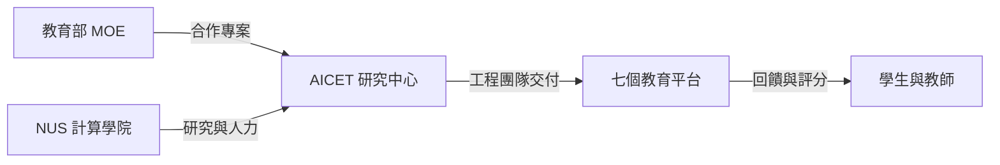
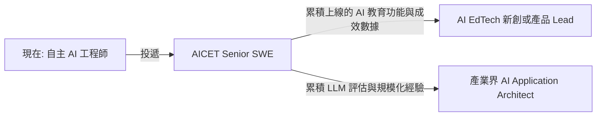

# National University of Singapore - Senior Software Engineer, AICET (新加坡, 1 年約可續)

> ## 評估摘要 (Evaluation Summary)
>
> `評估日期`: 2026-09-17, 對照 [Resume.md](../../Resume.md)
>
> `匹配度 (Profile Matching Score)`: `80 / 100`
>
> `結論`: `覆蓋率高但職級明顯偏低的拉低型職缺`. 四項硬性要求 (學歷加 3 年, 溝通, 跨層級協作, 現代 web 技術棧) 全數達標, 缺口只在 `Ruby on Rails` 與 `TypeScript` 的紙面舉證, 屬工具層. 加分項 `AI and/or EdTech` 由 2026/06 起的 Agent SDK 與 `tutor voice agent` 原型直接對位. 但 12+ 年資歷對 3 年門檻, 加上 `1 年合約` 與大學薪資帶, 使它的`角色價值`遠低於分數, 投不投取決於是否想轉入 AI 教育應用, 而不是夠不夠格.
>
> `符合的部分`:
>
> - `graduate or postgraduate degree, at least 3 years`: 資工碩士, 12+ 年.
> - `Familiarity with web development ... nodejs, Golang, React, JavaScript`: Node.js (TSMC), Golang 與 React (Change Healthcare), JavaScript 與 HTML5, 早年 LAMP 與 AngularJS.
> - `Team player ... collaborative working relationship with people at all levels`: ByteDance 跨團隊對齊資料中心與跨業務線推動, Change Healthcare 帶 5 人與 30+ 輪面試.
> - `Experience with AI ... platforms` (加分): 跨八家模型供應商的 Agent SDK, 以及 `tutor` 與客服兩個 voice agent 原型.
> - `EdTech` (加分, 部分): `tutor voice agent` 原型是唯一的教育場景作品; 另有 NCU 校內 e-book 搜尋系統的大學 IT 經驗.
>
> `不符合的部分`:
>
> - `Ruby on Rails`: 履歷完全沒有. JD 列在第一個, 且 Coursemology 等既有系統很可能以 Rails 為主 (見 `角色評估`), 被分到舊系統時是實際上手成本.
> - `TypeScript`: 履歷只寫 JavaScript, 未標 TypeScript.
> - `EdTech 生產系統`: tutor 原型是個人專案, 沒有面對真實學生或課程的上線規模, 屬`舉證缺口`.
> - `職級錯位`: 12+ 年與 Tech Lead 經歷投 3 年門檻的 Senior IC, 會被追問`為什麼要往下走`與`會不會很快離開`.
>
> `投遞前必問`:
>
> - 會被分到哪一個專案: JD 明說 `exact responsibilities and project ... subject to AICET's needs`, 需確認是新建的 AI 功能還是維運既有 Rails 系統.
> - 薪資帶與職級: 是否有 `Lead` 或 `Principal Software Engineer` 等較高職級可對應 12+ 年資歷.
> - 合約續約的實際比例, 以及經費來源 (MOE 專案或校內預算) 的剩餘年限.
> - LLM 使用政策: 學生資料能否送到外部模型供應商, 還是限定自架或特定雲端.
>
> `進度備註 (Progress Notes)`:
>
> - 2026-09-17: 獵頭 (HH) 接洽，已回覆並提出先決條件：業務上手且運作穩定後減少進辦公室頻率 (`join office less after smooth and stable` / 爭取彈性遠端).

## 基本資訊 (Basics)

| 項目 | 內容 |
| --- | --- |
| 公司 (Company) | National University of Singapore (NUS) |
| 職稱 (Title) | Senior Software Engineer, AICET NUS (1-year Contract Renewable) |
| 部門 (Department) | School of Computing, Department of Computer Science - AI Centre for Educational Technologies (AICET) |
| 角色類型 (Role Type) | `ic` · `internal` · `data_ai` |
| 地點 (Location) | Kent Ridge Campus, 新加坡 |
| 職缺編號 (Job Post ID) | 32215 |
| 原始連結 (Original Link) | [NUS Careers](https://careers.nus.edu.sg/job/Senior-Software-Engineer%2C-AICET-NUS-%281-year-Contract-Renewable%29/32215-en_GB) |
| 薪酬 (Package) | 未公開 |
| 合約 (Contract) | `1 年約, 可續 (renewable)` |
| 最低年資 (Min Experience) | `3 年` |
| 學歷要求 (Min Qualification) | 相關領域學士或以上 (`graduate or postgraduate degree in relevant discipline`) |
| 投遞狀態 (Status) | `screening` (更新於 2026-09-17, 獵頭接洽中: 已回覆提出上手穩定後減少進辦公室之條件) |
| 抓取日期 (Fetched) | 2026-09-17 |
| 建立日期 (Created) | 2026-09-17 |

## 團隊背景 (Team Context)

AICET 是 NUS 計算學院下的`研究中心`, 與新加坡教育部 (Ministry of Education, MOE) 及 NUS 合作,
開發能給學生即時個人化回饋, 依表現調整內容, 以及提升評量與評分效率的系統.
本職缺加入負責`下一代教育平台`的工程團隊, 目前專案組合:

| 專案 | 定位 (原文) |
| --- | --- |
| Codaveri | 程式作業自動回饋系統 (auto-feedback programming system) |
| Coursemology | 遊戲化線上學習平台 (gamified e-learning platform) |
| Softmark | 線上評分工具 (online grading tool) |
| Cikgo | 個人化學習平台 (personalised learning platform) |
| ScholAIstic | 對話式互動模擬平台 (conversational-based simulation platform) |
| Koditsu | 科技業求職測驗與面試練習平台 |
| SSID | 抄襲與異常相似度偵測, 維護學術誠信 |

## 崗位職責 (Responsibilities)

- 為 AICET 旗下專案之一開發軟體 (`To build software ... under one of the AICET's projects`).
- 參與團隊打造 AICET 的下一代教育平台.
- 實際職責與指派專案`依錄取者適配度與 AICET 需求再議`, JD 未列更細的職責條目.

## 任職要求 (Requirements)

`硬性要求 (Must-have)` — 原文 `Qualifications`:

- 相關領域學士或研究所學位, 且具備`至少 3 年`工作經驗.
- 團隊合作, 具備優秀的溝通與人際能力.
- 能與各層級人員建立協作關係.
- 熟悉現代技術棧的 web 開發, 例如 `Ruby on Rails`, `nodejs`, `Golang`, `React`, `JavaScript/TypeScript`.

`加分要求 (Preferred)` — 原文 `Qualifications` 末條:

- 具備 `AI` 和/或 `EdTech` 平台與系統的經驗.

`其他條件 (Other)` — 原文 `More Information`:

- 地點: Kent Ridge Campus.
- 合約: 1 年約可續.
- 只通知入選者 (`Only shortlisted applicants will be notified`).
- 員工推薦資格 (`Employee Referral Eligible`) 欄位在頁面上為空.

## 缺口分析 (Gap Analysis)

觸發原因: 本庫第一檔`大學研究中心 / EdTech` 職缺, 屬新軌道.

`缺什麼`:

| 缺口 | 類型 | 補法 | 可補期 |
| --- | --- | --- | --- |
| Ruby on Rails | 工具 | 在 Coursemology 開源 repo 跑起本地環境並送一個小 PR | 短期 |
| TypeScript | 舉證 | 履歷 Language 欄補上, Agent SDK 或 iOS 以外的 web 作品若有 TS 則點名 | 極短期 |
| EdTech 上線經驗 | 舉證 | 把 tutor voice agent 原型整理成可展示的 demo 與一頁設計說明 | 短期 |
| 職級錯位 | 規模 / 職級 | 無法補, 只能用敘事處理動機, 並詢問較高職級 | - |

`缺了會怎樣`: 技術缺口不會擋住篩選, 真正的風險是`過度資格 (overqualified)`被直接略過,
或錄取後以 3 年門檻的薪資帶起算.

`怎麼補`: 最高槓桿的單一動作是`對 Coursemology 送一個 PR`, 同時解決 Rails 舉證,
EdTech 領域熟悉度, 以及`我是真的想做這件事`的動機證明.

`值不值得轉向`: `有條件值得`. 若目標是`在 AI 應用層累積有真實使用者的產品作品`, 這是低競爭,
高使用者密度 (新加坡學生) 的入口; 若目標是薪資或職級延續 ByteDance 軌道, 則不值得.

## 角色評估 (Role Assessment)

`評估日期`: 2026-09-17

| 面向 | 判斷 | 依據 |
| --- | --- | --- |
| 真實職級 | 3-5 年等級的全端 IC, 標題 Senior 是大學職級體系下的中階 | `原文`: 門檻 3 年, 無帶人或架構職責 |
| 影響範圍 (Scope) | 單一專案的功能開發, 但該專案使用者為新加坡大專與中小學學生 | `原文`: `under one of the AICET's projects`; `推論`: MOE 合作代表跨校使用 |
| 組織位置 | 成本中心, 研究經費驅動; 七個平台並行, 屬維運既有系統加新 AI 功能的混合型 | `原文`: 專案清單; `外部`: [Coursemology 開源 repo](https://github.com/Coursemology/coursemology2) 顯示既有系統已運作多年 |
| 業務壓力 | 生成式 AI 讓自動回饋, 評分與對話模擬成為可交付功能, 中心需要擴充工程產能 | `推論`: ScholAIstic, Cikgo 等 AI 型專案名稱與 `next generation` 用詞 |
| 成長天花板 | 低. 研究中心工程團隊通常只有 Lead 一層往上, 再往上是研究人員或教職軌道 | `推論`: JD 無任何職涯路徑描述 |
| 風險與紅旗 | `1 年合約`; 專案指派未定; 經費依賴外部專案; 薪資帶與 12+ 年資歷落差大 | `原文`: 合約與 `subject to AICET's needs`; `推論`: 經費與薪資 |

`角色本質`: `大學研究中心的 AI 教育產品工程師, 用職級與穩定性換取真實學生使用者與 LLM 應用場景`.

## 機會 (Opportunities)

- `能力資產`: LLM 自動回饋與評分系統在`真實課堂規模`的上線與評估經驗, 補上履歷目前 AI 經歷全是自主專案的舉證缺口.
- `軌道轉換`: 打開 `AI 教育應用 (AI EdTech)` 軌道; 本庫同為 AI 應用層的相鄰職缺是 [OKX AI Application Architect](../okx/ai_application_architect.ai_platform.md) 與 [Meta Business Support Engineer](../meta/business_support_engineer.business_agents.md), 但兩者皆無教育場景.
- `市場訊號`: 本庫 `data_ai` 領域 16 檔中, 此為唯一教育或公部門場景; 屬低競爭的利基, 而非擴張中的主流職缺類型.
- `槓桿與網絡`: NUS 雇主品牌, 與 MOE 專案的接觸, 以及 AICET 專案轉為新創時的早期參與機會 (`推論`, 需面試確認是否有此前例).

## 路線圖 (Roadmap)

`投遞前 (0-2 週)`:

| 動作 | 時間窗 | 驗收 |
| --- | --- | --- |
| 本地跑起 Coursemology 並送一個小 PR (文件, 測試或 bug fix) | 第 1-2 週 | PR 連結可放進履歷 |
| 履歷 Language 欄補 `TypeScript`, Work Experience 的 AI 條目點名 tutor agent | 第 1 週 | Resume.md 更新 |
| 準備一段 60 秒動機說明: 為何從 ByteDance Tech Lead 轉向 AI 教育 | 第 1 週 | 能不看稿講完 |
| 透過 LinkedIn 找 AICET 現職工程師確認專案指派與職級彈性 | 第 2 週 | 取得`投遞前必問`至少兩題答案 |

`面試 (2-6 週)`:

| 動作 | 時間窗 | 驗收 |
| --- | --- | --- |
| 準備`LLM 自動回饋的品質評估`設計題: 幻覺, 評分一致性, 教師覆核 | 第 3 週 | 有一頁架構圖 |
| 準備 ByteDance 跨資料中心合規故事, 對應學生資料隱私與資料駐留 | 第 3 週 | STAR 格式兩段 |
| 反問: 專案指派, 續約率, LLM 資料政策, 工程團隊人數與 Lead 人選 | 第 4 週 | 問題清單定稿 |
| 談職級與薪資時以`Lead 職責`而非`Senior 職稱`為錨點 | offer 階段 | 薪資帶高於 3 年門檻起算 |

`到職 90 天`:

| 階段 | 可交付成果 | 對準的業務壓力 |
| --- | --- | --- |
| 30 天 | 熟悉被指派平台的程式碼與部署流程, 修掉一個影響學生的實際問題 | 擴充工程產能 |
| 60 天 | 交付一個以 LLM 為核心的功能 (自動回饋或評分輔助) 到小範圍課程試用 | 生成式 AI 功能落地 |
| 90 天 | 建立該功能的品質指標 (與教師評分一致率, 延遲, 成本) 與監控面板 | 研究中心需要可報告的成效 |

`1-3 年`:

到達下一步所需的證據:

- 至少一個 LLM 功能在真實課程上線, 並有可公開的成效數字 (使用學生數, 評分一致率).
- 一套可重用的 LLM 回饋品質評估方法, 最好以論文, 部落格或開源形式留下.
- 若走新創路線: 參與過 AICET 專案從研究原型到對外商轉的過程.

## 我的對位敘事 (Positioning Angle)

敘事主軸應該是`我想把 AI 做到有真實使用者的地方`, 而不是`我什麼都做過`:

- `先講動機`: 2026/06 起的自主 AI 工作, 其中 tutor voice agent 原型就是教育場景, 這是轉向的起點而非偶然.
- `再講可轉移的系統能力`: ByteDance 的資料合規與跨資料中心設計, 對應學生資料隱私與 MOE 專案的合規要求.
- `接著講上手速度`: Node.js, Golang, React 已有生產經驗, Rails 以 Coursemology PR 證明可以快速補上.
- `主動處理的弱點`: `過度資格`. 不要等對方問, 先說明接受合約與職級的理由, 並同時詢問是否有更高職級可對應, 避免被當成過渡期跳板.
