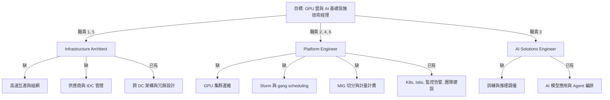

# 能力缺口分析與學習地圖 (Gap Analysis and Study Role Map)

對照 [xingyun_gpu_cloud_infra_manager.md](xingyun_gpu_cloud_infra_manager.md) 的
「不符合的部分」, 逐項說明`那是什麼`, `缺了會怎樣`, 以及`怎麼補`.

`評估日期`: 2026-09-02
`對照履歷`: `pkg/resume/index.html`
`稅務與居留面`: 見 `research/work/docs/cases/2026-09-02-xingyun-gpu-cloud-malaysia.md`

---

## 先確認手上已有的槓桿 (Transferable Assets)

補缺口之前要先知道哪些既有經驗可以直接折算, 否則會把已經有的東西重學一遍.

| 既有經驗 | 對應 JD 的哪一條 | 折算後的定位 |
| --- | --- | --- |
| ByteDance 跨資料中心資料通道與全球冗餘設計 | 職責 1 的資料中心配套, 職責 4 的可用性 | `直接可用`, 是履歷上最強的一塊 |
| TSMC GPU job scheduler 與 AI 平台架構 | 職責 2 的算力調度 | `可深化`, 已有接觸點但深度不足 |
| Kubernetes, Istio, EFK, Prometheus, Argo | 職責 2 的平台建設, 職責 4 的監控告警 | `直接可用` |
| 帶五人團隊, 30 場以上面試, 跨部門推動框架 | 職責 6 的團隊建設與規範沉澱 | `直接可用` |
| Change Healthcare 的合規與安全設計 | 職責 4 的 SLA 與故障響應 | `部分可用` |

結論: `平台層與組織層已經到位, 缺的全部集中在硬體層與 AI 負載層`.
這決定了學習順序 — 應該由下往上補, 而不是繼續加強已經強的部分.

---

## 缺口一: GPU 集群實操 (GPU Cluster Operations)

### 這是什麼

從裸機到可交付算力的一整條鏈, 與一般 Kubernetes 集群的差別在於 GPU 是`有狀態,
會壞, 且昂貴`的資源:

- 驅動與 CUDA toolkit 的版本矩陣管理, `NVIDIA GPU Operator` 自動化部署.
- `device plugin` 讓 Kubernetes 認得 GPU, `node feature discovery` 標記卡型與拓撲.
- `DCGM` 做健康檢查與遙測: ECC error, thermal throttle, XID error, 卡掉線偵測.
- 故障卡的自動 drain, cordon 與 RMA 送修流程.
- `topology-aware scheduling`: 同一個 job 的多張卡必須落在同一台或同一 rail.

### 缺了會怎樣

這是 JD 職責 1, 2, 4 的共同底座. 缺這塊的具體後果:

- 技術評審時無法判斷廠商方案的可運維性, 只能看規格表.
- PoC 期間客戶問「一張卡壞掉會怎樣, 訓練會不會中斷」時無法回答.
- SLA 制定沒有基準: 不知道實務上的卡故障率與 MTTR 是多少, 訂出的數字不是空談就是自殺.

### 怎麼補

最小可驗證成果: `在一台或兩台 GPU 機器上跑通 GPU Operator 加 DCGM,
刻意製造一次故障, 完成偵測到 drain 的完整循環`.

- 讀 NVIDIA GPU Operator 與 DCGM 文件, 理解 XID error 分類.
- 用雲端 spot GPU 實例降低成本, 重點是`跑通流程`而非規模.
- 產出一份故障處理 runbook, 這份文件本身就是面試素材.

---

## 缺口二: 高速互連與組網 (InfiniBand / RoCE / RDMA / NVLink)

### 這是什麼

`這是 GPU 雲與一般雲最本質的差別`, 也是履歷上最徹底的空白.

| 層級 | 技術 | 作用 |
| --- | --- | --- |
| 節點內 | `NVLink`, `NVSwitch` | 同一台機器內 GPU 之間的直連頻寬, 遠高於 PCIe |
| 節點間 | `InfiniBand`, `RoCEv2` | 跨機器的低延遲網路; IB 是專用網路, RoCE 跑在乙太網上 |
| 記憶體 | `RDMA`, `GPUDirect RDMA` | 網卡直接讀寫遠端記憶體, 繞過 CPU 與 kernel |
| 通訊庫 | `NCCL` | 集合通訊 (all-reduce, all-gather), 決定分散式訓練的實際效率 |
| 拓撲 | fat-tree, rail-optimized, over-subscription ratio | 決定大規模訓練能不能線性擴展 |

### 缺了會怎樣

JD 要求 4 直接點名這四個詞. 缺這塊的後果比前一項更嚴重:

- `無法做架構規劃`. 職責 1 的「高速網絡全鏈路技術評審」直接做不了.
- `無法審供應商方案`. 廠商報價裡的 over-subscription 比例, 交換機層數,
  網卡配置是否 rail-optimized, 這些決定數百萬成本, 但看不懂就只能照單全收.
- `無法解釋效能問題`. 客戶抱怨訓練慢時, 分不清是計算瓶頸還是通訊瓶頸.
- 過往的網路經驗`幫不上忙`: ByteDance 的跨 DC 資料通道是 L4/L7 應用層,
  與 RDMA fabric 是兩個世界, 面試時若混為一談會被立刻識破.

### 怎麼補

最小可驗證成果: `跑一次 nccl-tests 的 all_reduce_perf, 看懂 bus bandwidth 的數字,
並能解釋為什麼在不同拓撲下會有落差`.

- 概念先行: NCCL 的 ring 與 tree 演算法, 為什麼 all-reduce 的通訊量與卡數的關係.
- 工具面: `ibstat`, `ibping`, `perfquery`, subnet manager (`opensm`) 的角色.
- RoCE 側: 無損網路的 PFC 與 ECN 設定, 這是 RoCE 部署最常出事的地方.
- 讀 NVIDIA 的 DGX BasePOD 與 SuperPOD 參考架構, 那是業界共通的設計語言.

---

## 缺口三: AI 負載側調優 (Training, Fine-tuning, Inference)

### 這是什麼

現有的 AI 經驗是`模型應用與 Agent 編排` — 呼叫 API, 串接 provider, 設計流程.
JD 要的是`算力側` — 這些模型在硬體上怎麼跑, 為什麼慢, 要幾張卡.

| 面向 | 關鍵概念 |
| --- | --- |
| 訓練 | 並行策略 (data, tensor, pipeline parallel), `FSDP`, `ZeRO`, 通訊與計算重疊, checkpoint 與斷點續訓 |
| 微調 | `LoRA`, `QLoRA`, 需要的顯存與卡數估算 |
| 推理 | `vLLM`, `TensorRT-LLM`, PagedAttention, continuous batching, KV cache, 量化 (FP8, INT8) |
| 指標 | `MFU` (model flops utilization), tokens/s, `TTFT`, `TPOT`, GPU 利用率 |

### 缺了會怎樣

JD 職責 3 是售前與交付調優, 這是這個職位`最值錢的部分`, 也是 JD 亮點裡
「深度參與商業化全流程」的實質內容. 缺這塊會導致:

- 角色`退化成純運維`: 只能維持機器活著, 拿不到商業化那一段的價值.
- 客戶問「我要訓練一個 70B 模型要幾張卡, 多久」時無法報價.
- 無法判斷客戶的負載該配 HGX 還是單卡實例, 該用 IB 還是乙太網.

### 怎麼補

最小可驗證成果: `用 vLLM 部署一個開源模型, 壓測出 TTFT 與吞吐曲線,
並能說明 batch size 與 KV cache 如何互相擠壓`.

- 推理先做, 因為門檻低且是東南亞市場的主要需求.
- 訓練側至少跑通一次多卡 FSDP 或 DeepSpeed, 算出 MFU, 理解為什麼達不到理論值.
- 建立一張`負載到硬體`的對照表, 這張表就是售前工作的核心工具.

---

## 缺口四: 供應商與 IDC 管理 (Vendor and Data Centre Management)

### 這是什麼

不是技術而是`流程與談判`: RFP 與 RFQ, BOM 審核, PoC 驗收標準訂定,
SLA 與罰則條款, 交機驗收 (burn-in test, DOA 處理), 以及機房側的
rack density, 每櫃電力 (kW/rack), 冷卻方式 (氣冷或液冷 DLC), `PUE`, GPU 交期與配額.

### 缺了會怎樣

JD 職責 5. 這是全部六項職責中`最難靠自學補`的一項, 因為它需要實際的專案與對手.

- 落地期會被廠商牽著走, 無法判斷報價與交期承諾的合理性.
- 驗收標準若訂不出來, 交機後的問題會全部變成自己的問題.
- GPU 供應長期緊張, 沒有配額談判經驗會直接影響專案時程.

### 怎麼補

- 知識面可補: Uptime Institute 的 Tier 分級, PUE 的計算與陷阱,
  液冷與氣冷的取捨, 高密度機櫃的電力與承重限制.
- 語言面可補: 以 NVIDIA 參考架構作為驗收基準的共通語言.
- `經驗面補不了`. 面試時應誠實承認, 並以 ByteDance 跨 DC 專案中的
  跨團隊協調與交付管控作為最接近的替代證據.

---

## 缺口五: Slurm 與 HPC 排程 (Slurm and HPC Scheduling)

### 這是什麼

JD 職責 2 明寫 `Kubernetes / Slurm` 雙軌. 兩者的世界觀不同:

| 面向 | Kubernetes | Slurm |
| --- | --- | --- |
| 資源模型 | 長駐服務, 彈性伸縮 | 批次作業, 排隊等待 |
| 調度單位 | Pod | Job, 支援 `gang scheduling` |
| 公平性 | 靠 quota 與 priority class | `fairshare`, partition, QoS |
| 使用者 | 平台工程師 | 研究人員, 直接下 `sbatch` |
| 容器 | 原生 | 靠 `pyxis` 與 `enroot` 整合 |

### 缺了會怎樣

只會 Kubernetes 等於`只覆蓋一半的客戶`. HPC 與科研背景的客戶預期的是 Slurm 介面,
要求他們改用 K8s 是常見的失敗模式. 同時 K8s 側也需要補 gang scheduling
(`Volcano` 或 `Kueue`), 否則多卡訓練會發生資源死鎖.

### 怎麼補

最小可驗證成果: `搭一個雙節點 Slurm, 設定 gres.conf 讓它認得 GPU,
跑一個需要跨節點的 sbatch job`.

- Slurm 側: partition, QoS, fairshare 三個概念是與 K8s 差最多的部分.
- K8s 側: Volcano 或 Kueue 的 gang scheduling, 這是既有技能的直接延伸, 成本最低.

---

## 缺口六: 算力虛擬化與計量計費 (Virtualisation, Metering, Billing)

### 這是什麼

`這是「算力雲」與「機房托管」的分水嶺`, 也是 JD 職責 2 明寫的核心產品能力.

- 切分技術: `MIG` (硬體隔離, 最強), `time-slicing` (軟體輪替), `vGPU` (需授權).
  三者的隔離強度與適用場景完全不同.
- 計量: 從 DCGM 的 metrics 產生可稽核的 usage record.
- 計費: 按卡時, 按 token, on-demand 與 reserved 的定價結構.
- 多租戶隔離: namespace, network policy, 儲存配額, 以及`卡層級的隔離保證`.

### 缺了會怎樣

沒有這一層, 平台就只能整卡出租, 無法做小規格實例, 也無法支撐商業化運營.
JD 把它列為職責也列為加分項, 代表這是公司目前的痛點.

### 怎麼補

最小可驗證成果: `在一張支援 MIG 的卡上切出多個 instance, 用 DCGM 加 Prometheus
產出每個 instance 的用量, 並寫出一份計費模型`.

---

## 缺口七: 認證與時效 (Certifications)

| 項目 | 現況 | 動作 |
| --- | --- | --- |
| AWS SAA | 2018/08 取得, `三年效期已過期` | 履歷上標註年份或移除, 避免被視為誇大 |
| CKA / CKAD | 無 | JD 明列加分項, 且與既有 K8s 能力高度重疊, `投報率最高` |
| NVIDIA 相關認證 | 無 | 次要, 但可作為缺口一與二的學習驗收 |

---

## 學習角色地圖 (Study Role Map)

這個職位實際上是`三個角色`的合體. 把缺口按角色歸類後, 該補什麼就清楚了.

`三個角色的完成度`:

| 角色 | 現況 | 缺口密度 | 補起來的難度 |
| --- | --- | --- | --- |
| Platform Engineer | `約八成` | 低, 都是既有技能的延伸 | 低, 一到三個月可見成果 |
| AI Solutions Engineer | `約四成` | 中, 需要換一個思考層次 | 中, 推理側先行可快速見效 |
| Infrastructure Architect | `約三成` | 高, 且供應商經驗無法自學 | 高, 需要真實專案 |

---

## 學習順序 (Sequenced Plan)

順序的原則: `先補能證明的, 再補能講清楚的, 最後承認補不了的`.

### 第一階段 — 四週內, 目標是產出可展示的證據

- [ ] 用雲端 spot GPU 跑通 NVIDIA GPU Operator 加 DCGM, 完成一次故障 drain 循環
- [ ] 用 vLLM 部署開源模型, 壓測 TTFT 與吞吐, 產出一張效能曲線
- [ ] 報名 CKA, 這是與既有能力重疊度最高的加分項

### 第二階段 — 一到三個月, 目標是能在技術面試中對答

- [ ] 跑 nccl-tests 並能解釋不同拓撲下的 bus bandwidth 差異
- [ ] 搭雙節點 Slurm 並跑通跨節點 sbatch job, 對照 K8s 的 Volcano
- [ ] 在支援 MIG 的卡上完成切分與用量計量, 寫出一份計費模型
- [ ] 讀完 DGX BasePOD 參考架構, 能用它的語言描述一套集群

### 第三階段 — 三到六個月, 目標是補上敘事斷點

- [ ] 跑通一次多卡 FSDP 訓練並算出 MFU, 能解釋與理論值的落差來源
- [ ] 建立一張「負載到硬體」的對照表, 作為售前工具
- [ ] 補 IDC 基礎知識 (Tier 分級, PUE, 液冷與氣冷取捨)
- [ ] 把上述成果整理成一份公開的技術寫作, 取代履歷上缺少的 GPU 年資

### 明確補不了的部分

`供應商與 IDC 廠商管理的實戰經驗`無法自學, 也無法用側面專案偽裝.
面試時應直接承認, 並以跨 DC 專案的協調與交付管控作為最接近的替代證據.
把這一項講清楚, 比含糊帶過更能建立信任.

---

## 對投遞策略的結論

- `不要以 GPU 專家自居`. 履歷上的 GPU 年資撐不起這個定位, 會在技術面試被拆穿.
- `以資料中心與平台架構為主軸`, 把 GPU 與 AI 負載定位成`正在補的相鄰領域`,
  並用第一階段的實作成果證明補的速度.
- `把 Platform Engineer 那八成講滿`, 那是唯一能立刻交付的部分, 也是這個
  新業務初期最需要的能力.
- 若對方期待的是`即戰力的 GPU 集群專家`, 這份 offer 本來就不該接;
  若對方期待的是`能把新業務從零建起來的平台負責人`, 缺口是可談的.
