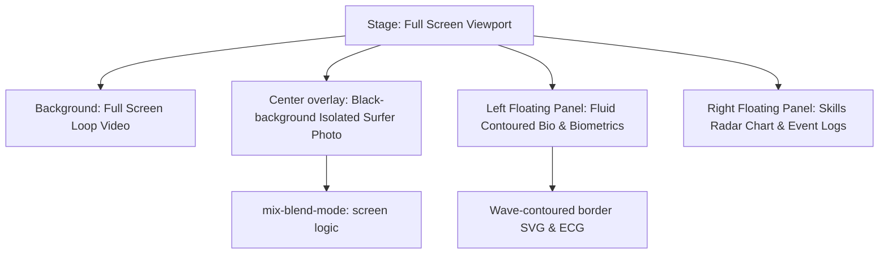

# Surfer Intro Page Design Spec v2

This specification outlines the technical design for the v2 full-screen, fluid tech HUD surfer introduction page implemented in `sample/intro.html`.

## Goal

Create a premium, fluidly designed full-page surfer profile. The interface features a full-screen background video player, an overlay of an isolated (transparent-blended) surfer character, and wave-contoured flowing glassmorphic panels.

## Architectural Changes

* `Background Video`: HTML5 `<video>` loops dynamically behind all panels.
* `Isolated Portrait`: A surfer image taken on a solid black background. Using `mix-blend-mode: screen` inside CSS, the black background is filtered out, making the surfer appear floating on top of the looping video.
* `Fluid Layout`: Panel cards use rounded contoured clip-paths (`border-radius: 40px 10px 40px 10px` or SVG masks) to simulate waves.
* `Simplified Right Panel`: The `PERFORMANCE.STATS` block is removed. The right panel now directly displays `SKILLS.RATING` and `STAGE.LOGS`.

## Design Details

### 1. Palette and Styling
* `Accent Cyan`: `#00f0ff` (active HUD grid lines).
* `Accent Neon Pink`: `#ff0055` (biometrics highlight).
* `Marker Gold`: `#ffd24a` (name highlighters).
* `Glass Panels`: `rgba(8, 14, 26, 0.45)` with `backdrop-filter: blur(12px)` and curved fluid borders.

### 2. Video Player Block
* Tag: `<video autoplay loop muted playsinline>`
* Source: High-quality royalty-free ocean swell looping video. fallback to dark marine gradient if failed.

### 3. Isolated Portrait Generation
* Generated via `generate_image`.
* Prompt: `A professional action studio shot of a male surfer carving in mid-air, dynamic pose, pure black background, dramatic side-lighting, high contrast, isolated, hyper-realistic`
* Saved to: `assets/images/personal/surfer_isolated.png`

## Implementation Plan Overview

1. Generate the isolated surfer visual asset.
2. Structure the HTML video player, placing it behind the HUD frame.
3. Update CSS panels to use large wave-like roundings and curves instead of rigid rectangles.
4. Replace center static duotone image frame with the black-screen isolated character, configuring the mix-blend filter.
5. Remove `PERFORMANCE.STATS` and move skills radar chart to the top of the right panel.
6. Verify layout and fallback.
