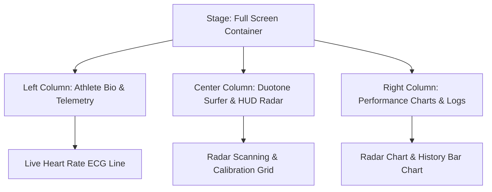

# Surfer Intro Page Design Spec

This specification outlines the technical design for a full-screen, tech HUD-themed surfer introduction page to be implemented in `sample/intro.html`.

## Goal

Create a high-impact, full-page surfer introduction interface designed for a professional surfing competition showcase. It utilizes a `three-column layout` styled with HUD (Head-Up Display) telemetry, custom SVG charts, biometrics, and dynamic grid overlays.

## Architectural Overview

The page will be structure-contained within a single full-screen stage without scrollbars. It leverages CSS Grid and Flexbox for responsiveness, utilizing custom CSS animations for entrance sequences.

## Design Details

### 1. Palette and Typography

* `Background`: `#040810` (deep sea navy) to `#081020` (tech slate) radial gradient.
* `Teal Accent`: `#00f0ff` (used for active HUD indicators and radar graphics).
* `Magenta Accent`: `#ff0055` (used for warning labels, live heart rate).
* `Yellow Marker`: `#ffd24a` (highlight color for names/roles).
* `Typography`: `Syne` and `Plus Jakarta Sans` for headers, `DM Mono` for tech readouts.

### 2. Layout Structure

#### Left Column (Bio & Telemetry)
* `Athlete Profile Card`: Notched corners via `clip-path`. Displays name (Koa Mercer), nickname (The Storm), world ranking (No.3), and origin (Maui, Hawaii).
* `Biometrics Module`: Live animated SVG ECG heart rate graph, current heart rate display (pulsing around `142 BPM`), and G-force peak sensor (`3.8 G`).

#### Center Column (Surfer Focus)
* `Hero Surfer Image`: Centered dynamic image of a surfer riding a large wave. Formatted with CSS filters for a duotone look.
* `HUD Grid Overlays`: Concentric SVG circle grids, a rotating radar angle finder, and a repeating vertical scanning bar.
* `Calibration Marks`: Corner HUD ticks indicating viewport telemetry.

#### Right Column (Performance & Ratings)
* `Key Metrics`:
  * Max Speed: `48.5 km/h`
  * Air Time: `3.2s`
  * Swell Height: `12.8m`
* `Skills Radar Chart`: Custom inline SVG polygon representing values across 5 axes (Speed, Power, Air, Flow, Tube).
* `Event History`: Vertical bar chart representing final scores of the last five competition stages.

#### Footer Control Bar
* `Replay System Button`: Triggers re-mounting of components to re-run entrance animations.
* `Enter Competition Link`: Button to transition to the main application.

## Implementation Details

### HTML Structure (`sample/intro.html`)
The HTML will use semantic layout tags (`<header>`, `<main>`, `<footer>`) wrapped in a `.stage` grid.

### CSS Styles (`sample/intro.html` style tag)
All styles will be self-contained in a single `<style>` block in the file to preserve the simplicity of the sample template.

### JavaScript Logic (`sample/intro.html` script tag)
* ECG simulation updates values dynamically.
* Replay logic recreates the stage DOM to trigger `@keyframes` animations.
* Keyboard listeners mapping `Enter` / `Space` for navigation and `R` for replay.

## Verification Plan

### Automated Verification
* Run standard HTML/CSS syntax validations.

### Manual Verification
* Render page in Chrome/Safari, checking layout at different screen sizes (minimum 375px width up to 4K resolution).
* Click `Replay` to verify animation timelines.
* Verify keyboard event listener responses.
