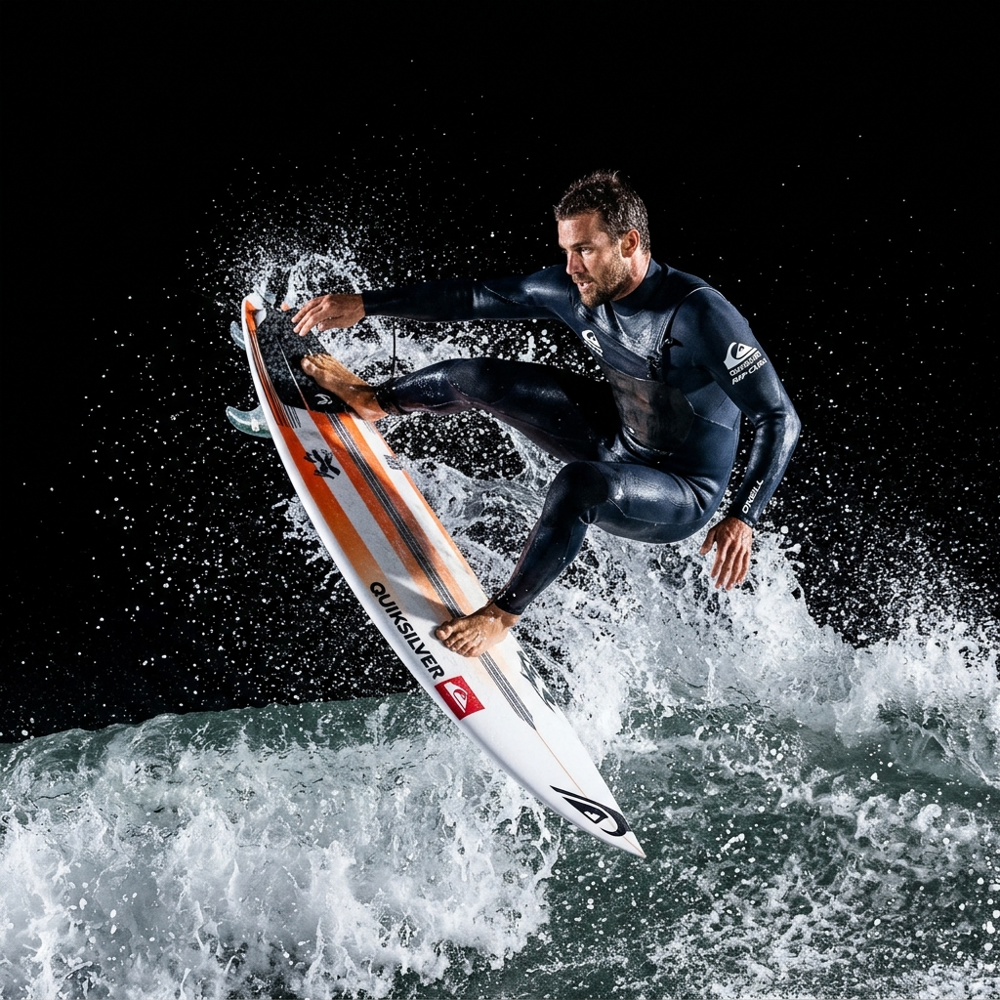

# Surfer Intro Page Implementation Plan v2

> **For agentic workers:** REQUIRED SUB-SKILL: Use superpowers:subagent-driven-development (recommended) or superpowers:executing-plans to implement this plan task-by-task. Steps use checkbox (`- [ ]`) syntax for tracking.

`Goal:` Upgrade `sample/intro.html` to v2. This includes adding a full-screen looping ocean video background, displaying a black-background isolated surfer image blended onto the video, removing the performance stats block, and styling panel structures with wave-like organic fluid contours.

`Architecture:` Places an HTML5 background video layer at the bottom layer. Overlays the three-column grid. Left and right panels are styled with fluid border-radius contours and high-contrast translucent glassmorphism. The central surfer card uses `mix-blend-mode: screen` to isolate a black-background surfer photo, allowing the underlying video to show through.

`Tech Stack:` HTML5 Video, CSS Grid, CSS mix-blend-mode, SVG, Vanilla JS.

---

### Task 1: 產生去背衝浪者主視覺圖片 (Generate Isolated Surfer Image)

`Files:`
- Create: `assets/images/personal/surfer_isolated.png`

- [ ] `Step 1: 產生黑背景的衝浪者半身動作照片`
  呼叫 `generate_image` 產生一張在純黑背景下、動態強烈的衝浪動作照。
  Prompt: `A professional action studio shot of a male surfer carving in mid-air, dynamic pose, pure black background, dramatic side-lighting, high contrast, isolated, hyper-realistic`
  Image Name: `surfer_isolated`
  儲存路徑為 `/Users/shuk/projects/bizshuk.github.io/assets/images/personal/surfer_isolated.png`。

---

### Task 2: 重新建構 `sample/intro.html` 流線版面與背景影片 (Rebuild Layout with Video & Wave Outlines)

`Files:`
- Modify: `sample/intro.html`

- [ ] `Step 1: 將 sample/intro.html 覆寫為 v2 流線版面與影片背景`
  重新實作 `intro.html`，加入滿版 `<video>`，將面板改為大圓角 (`border-radius: 40px 10px 40px 10px`)。
  移除原本的 `PERFORMANCE.STATS` 區塊，讓右面板直接顯示技能雷達圖與 Stage Logs。
  使用公共衝浪影片 URL 作為播放源。

```html
<!DOCTYPE html>
<html lang="en">
<head>
<meta charset="UTF-8">
<meta name="viewport" content="width=device-width, initial-scale=1.0">
<meta name="referrer" content="no-referrer">
<title>COMPETITOR PROFILE v2 // KOA MERCER</title>
<link rel="preconnect" href="https://fonts.googleapis.com">
<link rel="preconnect" href="https://fonts.gstatic.com" crossorigin>
<link href="https://fonts.googleapis.com/css2?family=Syne:wght@400;600;700;800&family=DM+Mono:wght@300;400;500&family=Plus+Jakarta+Sans:wght@300;400;500;600&display=swap" rel="stylesheet">
<style>
:root {
  --bg: #020408;
  --surface: rgba(4, 10, 20, 0.45);
  --border: rgba(0, 240, 255, 0.12);
  --border-hi: rgba(0, 240, 255, 0.28);
  --text: #e2f9ff;
  --text-dim: #8ba7b0;
  --text-dark: #2c444f;
  --accent: #00f0ff;
  --accent-glow: rgba(0, 240, 255, 0.35);
  --warning: #ff0055;
  --warning-glow: rgba(255, 0, 85, 0.35);
  --marker: #ffd24a;
  --f-head: 'Syne', sans-serif;
  --f-body: 'Plus Jakarta Sans', sans-serif;
  --f-mono: 'DM Mono', monospace;
}

*, *::before, *::after { box-sizing: border-box; margin: 0; padding: 0; }
html, body { height: 100%; overflow: hidden; background: var(--bg); color: var(--text); font-family: var(--f-body); -webkit-font-smoothing: antialiased; }

/* Background Video Styling */
.video-bg { position: absolute; inset: 0; width: 100%; height: 100%; object-fit: cover; z-index: 1; pointer-events: none; opacity: 0.55; filter: saturate(0.8) hue-rotate(10deg); }
.video-overlay { position: absolute; inset: 0; background: radial-gradient(circle at center, transparent 30%, rgba(2,4,8,0.85) 100%); z-index: 2; pointer-events: none; }

/* HUD Grid Stages */
.stage { position: relative; width: 100vw; height: 100vh; display: grid; place-items: center; padding: 2vh 3vw; z-index: 3; }
.frame { position: relative; width: 100%; height: 100%; display: grid; grid-template-rows: auto 1fr auto; padding: 25px; border: 1px solid var(--border); background: rgba(2, 4, 8, 0.2); backdrop-filter: blur(4px); border-radius: 48px 16px 48px 16px; overflow: hidden; }

/* Fluid wave borders for HUD Frame */
.frame-wave-decor { position: absolute; inset: 0; border: 2px solid transparent; pointer-events: none; }

/* Grid corners */
.corner { position: absolute; width: 20px; height: 20px; border: 3px solid var(--accent); filter: drop-shadow(0 0 4px var(--accent-glow)); }
.corner-tl { top: -4px; left: -4px; border-right: none; border-bottom: none; border-radius: 12px 0 0 0; }
.corner-tr { top: -4px; right: -4px; border-left: none; border-bottom: none; border-radius: 0 12px 0 0; }
.corner-bl { bottom: -4px; left: -4px; border-right: none; border-top: none; border-radius: 0 0 0 12px; }
.corner-br { bottom: -4px; right: -4px; border-left: none; border-top: none; border-radius: 0 0 12px 0; }

/* Header */
header { display: flex; justify-content: space-between; font-family: var(--f-mono); font-size: 11px; letter-spacing: 0.15em; color: var(--text-dim); border-bottom: 1px solid var(--border); padding-bottom: 12px; text-transform: uppercase; z-index: 5; }
header span b { color: var(--accent); }

/* Main Grid Layout */
.main-grid { display: grid; grid-template-columns: 300px 1fr 300px; gap: 25px; height: 100%; min-height: 0; margin-top: 20px; margin-bottom: 20px; z-index: 5; }

/* Fluid Contoured Panels */
.panel { background: var(--surface); border: 1px solid var(--border); border-radius: 40px 10px 40px 10px; padding: 20px; display: flex; flex-direction: column; min-height: 0; overflow: hidden; position: relative; backdrop-filter: blur(16px); box-shadow: 0 8px 32px 0 rgba(0, 240, 255, 0.03); transition: border-color 0.3s; }
.panel:hover { border-color: var(--border-hi); }
.panel-title { font-family: var(--f-mono); font-size: 12px; letter-spacing: 0.2em; text-transform: uppercase; color: var(--accent); margin-bottom: 15px; border-bottom: 1px solid var(--border); padding-bottom: 6px; display: flex; align-items: center; justify-content: space-between; }
.panel-title::after { content: '∽∽'; color: var(--text-dark); letter-spacing: -2px; }

/* Left Column Styling */
.bio-card { display: flex; flex-direction: column; gap: 10px; font-family: var(--f-mono); font-size: 13px; }
.bio-row { display: flex; justify-content: space-between; border-bottom: 1px dashed rgba(0, 240, 255, 0.08); padding-bottom: 6px; }
.bio-row .label { color: var(--text-dim); }
.bio-row .val { color: var(--text); text-align: right; }
.name-highlight { color: var(--marker) !important; font-weight: 600; }
.rankings { color: var(--accent) !important; text-shadow: 0 0 8px var(--accent-glow); }
.green-glow { color: #00ff66 !important; text-shadow: 0 0 8px rgba(0, 255, 102, 0.4); }

.biometrics { flex: 1; display: flex; flex-direction: column; justify-content: space-around; margin-top: 15px; }
.bio-heart { background: rgba(255, 0, 85, 0.05); border: 1px solid rgba(255, 0, 85, 0.15); border-radius: 20px 6px; padding: 12px; display: flex; align-items: center; justify-content: space-between; }
.heart-bpm { font-family: var(--f-mono); font-size: 36px; font-weight: bold; color: var(--warning); text-shadow: 0 0 10px var(--warning-glow); animation: heartbeat 0.82s infinite alternate; }
.heart-unit { font-family: var(--f-mono); font-size: 12px; color: var(--warning); }
.heart-pulse-svg { width: 120px; height: 35px; }
.ecg-line { fill: none; stroke: var(--warning); stroke-width: 1.5; stroke-dasharray: 100; stroke-dashoffset: 100; animation: ecgRun 1.5s linear infinite; }

@keyframes heartbeat {
  0% { transform: scale(1); }
  30% { transform: scale(1.04); }
  40% { transform: scale(1); }
  60% { transform: scale(1.08); }
  100% { transform: scale(1); }
}
@keyframes ecgRun { to { stroke-dashoffset: 0; } }

.bio-gforce { display: flex; flex-direction: column; gap: 6px; font-family: var(--f-mono); font-size: 11px; margin-top: 15px; }
.g-header { display: flex; justify-content: space-between; }
.g-bar-container { width: 100%; height: 6px; background: var(--text-dark); border-radius: 3px; overflow: hidden; }
.g-bar { height: 100%; background: var(--accent); box-shadow: 0 0 8px var(--accent-glow); transition: width 0.3s ease; }
</style>
</head>
<body>
  <!-- Full Screen Background Looping Video -->
  <video class="video-bg" autoplay loop muted playsinline>
    <source src="https://player.vimeo.com/external/371433846.sd.mp4?s=236da2f3c02c0d38ebed19ca7b28271e16f39e3c&profile_id=139&oauth2_token_id=57447761" type="video/mp4">
  </video>
  <div class="video-overlay"></div>

  <div class="stage">
    <div class="frame">
      <div class="corner corner-tl"></div>
      <div class="corner corner-tr"></div>
      <div class="corner corner-bl"></div>
      <div class="corner corner-br"></div>
      
      <header>
        <span>SYS.STATUS: <b>STREAMING</b></span>
        <span>EVENT: <b>MAUI SWELL CHALLENGE v2</b></span>
        <span>LAT: <b>20.9° N</b> / LON: <b>156.6° W</b></span>
      </header>

      <div class="main-grid">
        <!-- Left Panel -->
        <div class="panel">
          <div class="panel-title">ATHLETE.PROFILE</div>
          <div class="bio-card">
            <div class="bio-row"><span class="label">NAME:</span> <span class="val name-highlight">KOA "STORM" MERCER</span></div>
            <div class="bio-row"><span class="label">ORIGIN:</span> <span class="val">MAUI, HAWAII</span></div>
            <div class="bio-row"><span class="label">RANK:</span> <span class="val rankings">WCT #03</span></div>
            <div class="bio-row"><span class="label">STATUS:</span> <span class="val green-glow">SURF ACTIVE</span></div>
          </div>

          <div class="panel-title" style="margin-top: 25px;">BIOMETRIC.TELEM</div>
          <div class="biometrics">
            <div class="bio-heart">
              <div>
                <span class="heart-bpm" id="bpm-val">142</span>
                <span class="heart-unit">BPM</span>
              </div>
              <svg class="heart-pulse-svg" viewBox="0 0 100 30">
                <path class="ecg-line" d="M0,15 L30,15 L35,10 L40,25 L45,5 L50,18 L55,15 L100,15" />
              </svg>
            </div>
            <div class="bio-gforce">
              <div class="g-header">
                <span>G-FORCE RESPONSE</span>
                <span id="g-val">3.2 G</span>
              </div>
              <div class="g-bar-container">
                <div class="g-bar" id="g-bar" style="width: 64%;"></div>
              </div>
            </div>
          </div>
        </div>

        <!-- Center Panel & Right Panel Placeholders -->
        <div id="center-placeholder"></div>
        <div id="right-placeholder"></div>
      </div>

      <footer id="footer-placeholder"></footer>
    </div>
  </div>
</body>
</html>
```

---

### Task 3: 實作中欄 - 選手去背影像與波浪 HUD 雷達 (Implement Center Column - Blended Surfer & Fluid HUD)

`Files:`
- Modify: `sample/intro.html`

- [ ] `Step 1: 在 HTML 中實作中欄去背影像與雷達`
  在中欄放入去背衝浪者圖像。套用 `mix-blend-mode: screen`，並加上大波浪形狀的科技背景圈圈。

```html
<!-- Center Panel: Blended Surfer overlay -->
<div class="surfer-container">
  <div class="hud-scanner"></div>
  
  <!-- Flowing Wave Paths inside Center Panel -->
  <div class="wave-lines-hud">
    <svg viewBox="0 0 400 400" class="wave-hud-svg">
      <path d="M-50,200 Q100,100 200,200 T450,200" class="fluid-wave-line" />
      <path d="M-50,230 Q100,150 200,230 T450,230" class="fluid-wave-line line-dim" />
      <circle cx="200" cy="200" r="130" class="fluid-radar-ring" />
      <circle cx="200" cy="200" r="90" class="fluid-radar-ring" />
      <circle cx="200" cy="200" r="50" class="fluid-radar-ring" />
      <line x1="200" y1="50" x2="200" y2="350" class="fluid-radar-axis" />
      <line x1="50" y1="200" x2="350" y2="200" class="fluid-radar-axis" />
    </svg>
  </div>

  
  
  <div class="surfer-silhouette" id="silhouette">
    <svg viewBox="0 0 100 100">
      <path fill="#00f0ff" opacity="0.15" d="M50 15 C60 40 75 70 80 90 L20 90 Z" />
    </svg>
  </div>

  <div class="surfer-name-hud">
    <h1 class="surfer-title">KOA MERCER</h1>
    <p class="surfer-subtitle">THE STRIKE ZONE // MAUI SWELL STAGE</p>
  </div>
</div>
```

- [ ] `Step 2: 加入中欄 CSS 樣式與動畫`
  在 `<style>` 中加入 `.surfer-container` 的 CSS 樣式，設定 `mix-blend-mode: screen` 與流體波浪雷達旋轉。

```css
/* Center Column v2 Styling */
.surfer-container { position: relative; border: 1px solid var(--border); border-radius: 48px 16px; overflow: hidden; display: flex; justify-content: center; align-items: center; background: rgba(2, 4, 8, 0.25); height: 100%; }
.surfer-img { height: 95%; width: auto; object-fit: contain; filter: contrast(1.1) brightness(0.95); mix-blend-mode: screen; z-index: 4; transition: transform 0.6s cubic-bezier(0.16, 1, 0.3, 1); }
.surfer-container:hover .surfer-img { transform: scale(1.04) translateY(-5px); }

.surfer-silhouette { position: absolute; inset: 0; display: none; place-items: center; z-index: 3; }
.surfer-silhouette svg { width: 45%; height: auto; }

/* Fluid wave and radar backdrop */
.wave-lines-hud { position: absolute; inset: 0; display: grid; place-items: center; pointer-events: none; z-index: 3; }
.wave-hud-svg { width: 85%; height: 85%; }
.fluid-wave-line { fill: none; stroke: var(--accent); stroke-width: 0.8; opacity: 0.25; stroke-dasharray: 6 3; animation: waveDrift 12s linear infinite; }
.line-dim { opacity: 0.12; animation-duration: 8s; }
.fluid-radar-ring { fill: none; stroke: var(--accent); stroke-width: 0.6; opacity: 0.15; stroke-dasharray: 4 4; transform-origin: 200px 200px; animation: spinRadar 32s linear infinite; }
.fluid-radar-axis { stroke: var(--accent); stroke-width: 0.5; opacity: 0.1; }

@keyframes waveDrift {
  0% { stroke-dashoffset: 0; }
  100% { stroke-dashoffset: 90; }
}
@keyframes spinRadar {
  to { transform: rotate(360deg); }
}

/* Scanner line */
.hud-scanner { position: absolute; left: 0; right: 0; height: 5px; background: linear-gradient(180deg, transparent, var(--accent), transparent); opacity: 0.35; z-index: 5; pointer-events: none; animation: scanLines 5s linear infinite; }
@keyframes scanLines {
  0% { top: 0%; }
  50% { top: 100%; }
  100% { top: 0%; }
}

.surfer-name-hud { position: absolute; bottom: 25px; left: 30px; z-index: 6; font-family: var(--f-head); text-align: left; }
.surfer-title { font-size: 36px; font-weight: 800; color: #fff; letter-spacing: -1px; text-shadow: 0 2px 12px rgba(0, 0, 0, 0.9); }
.surfer-subtitle { font-family: var(--f-mono); font-size: 11px; color: var(--accent); letter-spacing: 2px; }
```

---

### Task 4: 實作右欄 - 技能雷達與歷史戰績 (Implement Right Column - Skills & Event Logs)

`Files:`
- Modify: `sample/intro.html`

- [ ] `Step 1: 新增右欄 HTML 與 CSS`
  置入簡化後的右欄（無 Performance Stats），包含能力雷達圖與 Stage Logs 戰績長條圖。

```html
<!-- Right Panel: Skills & Logs -->
<div class="panel">
  <div class="panel-title">SKILLS.RATING</div>
  <div class="radar-chart-container">
    <svg class="skills-radar-svg" viewBox="0 0 100 100">
      <!-- Polygon backdrops -->
      <polygon points="50,10 88,38 73,82 27,82 12,38" class="radar-poly-bg" />
      <polygon points="50,23 79,44 67,74 33,74 21,44" class="radar-poly-bg" />
      <polygon points="50,37 69,50 62,65 38,65 31,50" class="radar-poly-bg" />
      <!-- Axis lines -->
      <line x1="50" y1="50" x2="50" y2="10" class="radar-axis-line" />
      <line x1="50" y1="50" x2="88" y2="38" class="radar-axis-line" />
      <line x1="50" y1="50" x2="73" y2="82" class="radar-axis-line" />
      <line x1="50" y1="50" x2="27" y2="82" class="radar-axis-line" />
      <line x1="50" y1="50" x2="12" y2="38" class="radar-axis-line" />
      <!-- Data Area -->
      <polygon points="50,18 84,40 68,76 38,70 19,32" class="radar-data-poly" />
      <!-- Text Labels -->
      <text x="50" y="6" class="radar-label">SPEED</text>
      <text x="93" y="38" class="radar-label">POWER</text>
      <text x="76" y="88" class="radar-label">FLOW</text>
      <text x="18" y="88" class="radar-label">TUBE</text>
      <text x="4" y="38" class="radar-label">AIR</text>
    </svg>
  </div>

  <div class="panel-title" style="margin-top: 25px;">STAGE.LOGS</div>
  <div class="bar-chart">
    <div class="bar-col"><div class="bar-fill" style="height: 85%;"></div><span class="bar-lbl">S1</span></div>
    <div class="bar-col"><div class="bar-fill" style="height: 92%;"></div><span class="bar-lbl">S2</span></div>
    <div class="bar-col"><div class="bar-fill" style="height: 70%;"></div><span class="bar-lbl">S3</span></div>
    <div class="bar-col"><div class="bar-fill" style="height: 95%;"></div><span class="bar-lbl">S4</span></div>
    <div class="bar-col"><div class="bar-fill" style="height: 88%;"></div><span class="bar-lbl">S5</span></div>
  </div>
</div>
```

- [ ] `Step 2: 加入右欄 CSS 樣式`

```css
/* Right Column Styling */
.radar-chart-container { display: flex; justify-content: center; align-items: center; flex: 1; padding: 15px 10px; min-height: 0; }
.skills-radar-svg { width: 90%; height: auto; max-height: 200px; }
.radar-poly-bg { fill: none; stroke: var(--text-dark); stroke-width: 0.5; }
.radar-axis-line { stroke: var(--text-dark); stroke-width: 0.5; stroke-dasharray: 2 2; }
.radar-data-poly { fill: rgba(0, 240, 255, 0.22); stroke: var(--accent); stroke-width: 1.5; filter: drop-shadow(0 0 5px var(--accent-glow)); }
.radar-label { font-family: var(--f-mono); font-size: 7px; fill: var(--text-dim); text-anchor: middle; }

.bar-chart { display: flex; justify-content: space-around; align-items: flex-end; height: 95px; padding-top: 15px; border-bottom: 1px dashed rgba(0, 240, 255, 0.1); }
.bar-col { display: flex; flex-direction: column; align-items: center; width: 14%; height: 100%; justify-content: flex-end; }
.bar-fill { width: 100%; background: linear-gradient(0deg, var(--accent) 0%, rgba(0,240,255,0.4) 100%); border-radius: 2px 2px 0 0; box-shadow: 0 0 8px var(--accent-glow); transform-origin: bottom; animation: growBars 1.2s cubic-bezier(0.2, 0.8, 0.2, 1) forwards; }
.bar-lbl { font-family: var(--f-mono); font-size: 8px; color: var(--text-dim); margin-top: 6px; }

@keyframes growBars {
  0% { transform: scaleY(0); }
  100% { transform: scaleY(1); }
}
```

---

### Task 5: 實作底欄控制按鈕與互動 JS 邏輯 (Implement Footer & JS Interaction)

`Files:`
- Modify: `sample/intro.html`

- [ ] `Step 1: 新增底欄與鍵盤/Replay JS 監聽器`
  置入底欄與即時監測、重播及按鍵處理邏輯。

```html
<!-- Footer -->
<footer>
  <div class="keyboard-tips">PRESS [ENTER] TO JOIN COMPETITION / [R] REPLAY DETAILED MATRIX</div>
  <div class="action-buttons">
    <button class="btn btn-replay" id="btn-replay">↻ REPLAY DATA</button>
    <a href="sys-zero.html" class="btn btn-proceed">ENTER ARENA →</a>
  </div>
</footer>
```

- [ ] `Step 2: 加入底欄與按鈕 CSS`

```css
/* Footer Styles */
footer { display: flex; justify-content: space-between; align-items: center; font-family: var(--f-mono); border-top: 1px solid var(--border); padding-top: 15px; margin-top: auto; z-index: 5; }
.keyboard-tips { font-size: 9.5px; color: var(--text-dark); letter-spacing: 0.1em; }
.action-buttons { display: flex; gap: 10px; }
.btn { font-family: var(--f-mono); font-size: 11px; letter-spacing: 0.15em; text-transform: uppercase; padding: 8px 16px; border-radius: 3px; cursor: pointer; transition: all 0.2s ease; border: 1px solid var(--border); background: rgba(12, 20, 36, 0.5); color: var(--accent); text-decoration: none; display: inline-flex; align-items: center; }
.btn:hover { background: rgba(0, 240, 255, 0.1); border-color: var(--accent); box-shadow: 0 0 12px var(--accent-glow); transform: translateY(-1px); }
.btn-proceed { background: var(--accent); color: var(--bg); font-weight: 600; border-color: var(--accent); }
.btn-proceed:hover { background: #5df7ff; color: var(--bg); }
```

- [ ] `Step 3: 加入 JS 控制碼`

```html
<script>
(function() {
  const bpmVal = document.getElementById('bpm-val');
  const gVal = document.getElementById('g-val');
  const gBar = document.getElementById('g-bar');

  // Biometrics simulation
  setInterval(() => {
    if (!bpmVal || !gVal || !gBar) return;
    const currentBpm = Math.floor(138 + Math.random() * 9);
    bpmVal.textContent = currentBpm;

    const currentG = (2.9 + Math.random() * 0.9).toFixed(1);
    gVal.textContent = currentG + ' G';
    gBar.style.width = (parseFloat(currentG) / 5.0 * 100) + '%';
  }, 1000);

  // Replay animation logic
  function replaySequence() {
    const stage = document.querySelector('.stage');
    if (!stage) return;
    const fresh = stage.cloneNode(true);
    stage.replaceWith(fresh);
    bindEvents(fresh);
  }

  function bindEvents(root) {
    const replay = root.querySelector('#btn-replay');
    if (replay) {
      replay.addEventListener('click', replaySequence);
    }
  }

  bindEvents(document);

  // Keyboard controls
  document.addEventListener('keydown', (e) => {
    if (e.key === 'Enter' || e.key === ' ') {
      e.preventDefault();
      const proceedLink = document.querySelector('.btn-proceed');
      if (proceedLink) {
        window.location.href = proceedLink.getAttribute('href');
      }
    } else if (e.key.toLowerCase() === 'r') {
      replaySequence();
    }
  });
})();

function handleImageError(img) {
  img.style.display = 'none';
  const sil = document.getElementById('silhouette');
  if (sil) {
    sil.style.display = 'grid';
  }
}
</script>
```

---

### Task 6: 驗證與截圖 (Browser Verification & Fallback Check)

`Files:`
- Test: `sample/intro.html`

- [ ] `Step 1: 驗證影片與去背圖像的融合以及流線卡片排版`
  呼叫 `browser_subagent` 載入 `sample/intro.html`，檢查全螢幕影片是否成功播放，確認無背景人像是否利用 `mix-blend-mode: screen` 完美懸浮於影片上層，並確認卡片流線圓角排版是否符合預期。
