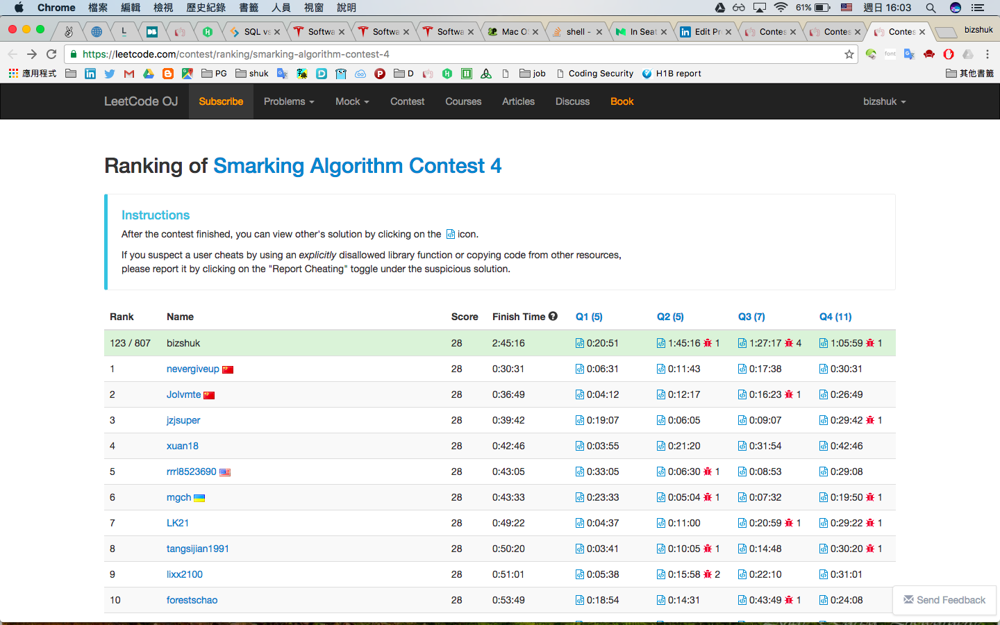

# Certificate

- [Online English testing result](線上英文檢測.pdf)
- [last TOEIC](toeic.jpg) 
- [Codility for Corvil](Codility_for_Corvil.pdf)
- [Codility for Pagefair](Codility_for_Pagefair.pdf)
- [Codility for Intewow](Codility_for_Intewow.pdf)

# LeeCode context
Failed submission will add 600s on Finish time.

- Smarking Algorithm Contest 4 (Rank 123/807) (Score 28/28)
    - Assign Cookies ( 5 )
    - Repeated Substring Pattern5 ( 7 )
    - 4Sum II ( 7 )
    - 132 Pattern ( 11 )

