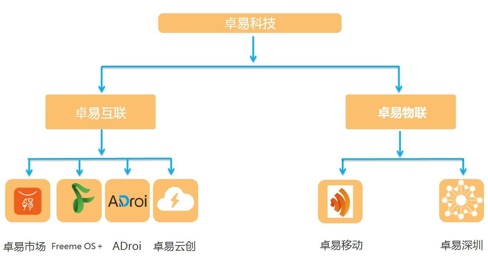
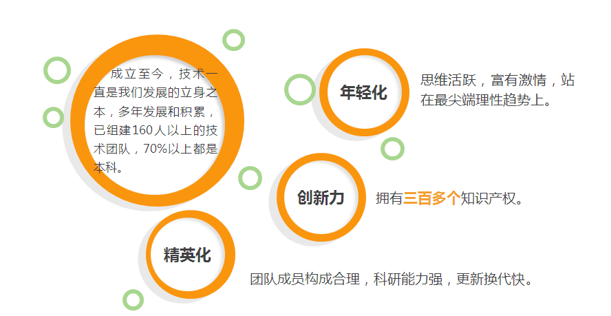
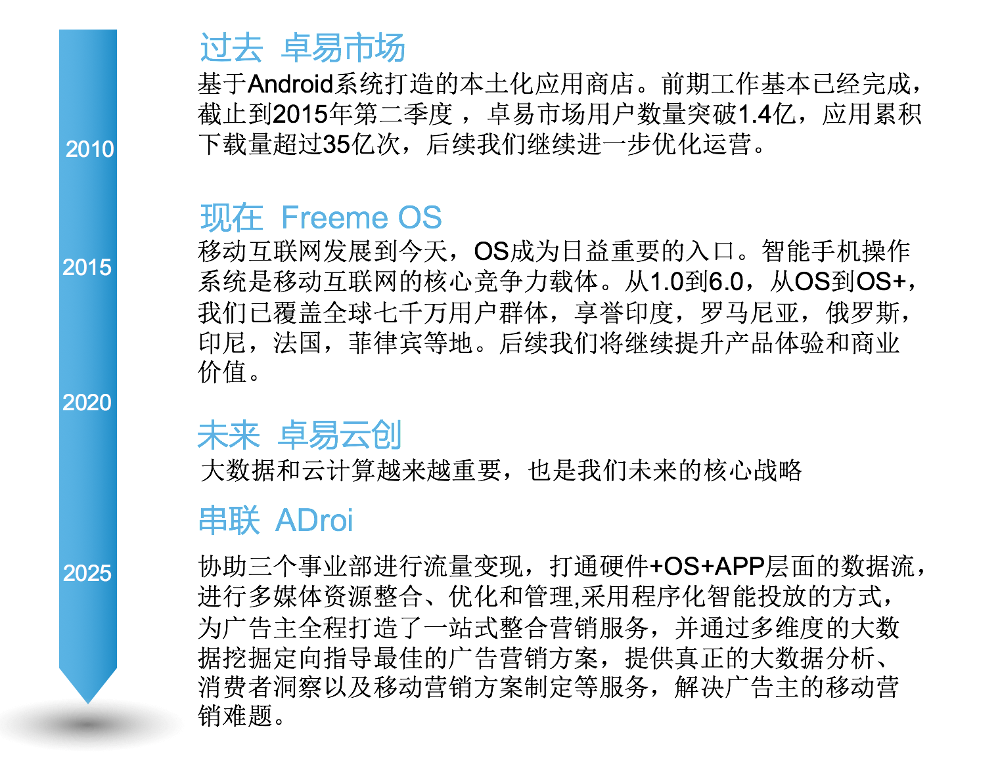

## [Innova Solutions](http://www.innovasolutions.com/) TW branch, bot for Change Health Care
_Global cloud solution provider_
In this branch, it's bot for Change Health Care, U.S.. I'm under CIH (Customer Integration Hub) division of Change Health Care. Working on portal connecting between internal and external applications. 

Taipei Location:
+886-2-8751-8700
9F., No.18, Jihu Rd., Neihu Dist., Taipei City 114, Taiwan (R.O.C.)

## [FreeCodeCamp](http://www.freecodecamp.com/map)
_Online Full-Stack trainning and Full Stack Web Development Certification_  
Computer Software Engineering , Since 2015 ~  

## [Shanghai Droi Market Co Ltd.](http://www.droi.com/) (Taiwan branch)  
_internet company from android device to internet, include PaaS BaaS. 500+ employees_  
Cloud Engineer , Since 2015-07 ~   

Taipei Location:
+886-2-81010896
Taipei 101 32F

Shanghai Location:  
中国上海徐汇区桂平路391号新漕河泾国际商务大厦B座21楼  
21F, Blk B, New CHJ International Business Centre No.391 Gui Ping Road Xuhui District Shanghai China  

[Official introduction PDF](ref/droi_intro.pdf)  

岁月如歌，华光如梦，转眼间，我们公司已经走到第八个年头。从一个十人的小米加步枪的小团队，成长到现在将近千人，拥有独立事业群的大公司，感谢大家一路陪伴！  
  
勿忘初心，方得始终。过去几年里我们一直在转型，而且我们将不断Rediscover自我：  
**我们是一家具有硬件基因的互联网公司**  

2007年9月29日，天奕达成立，为手机厂商设计主板，奠定了其“硬件基因”互联网公司的基础；  

2012年10月，我们开始转型，成立子公司卓悠网络，向手机软件业务进军。2012年10月，Freeme OS1.0版问世，开启了公司软硬件一体化发展之路；

2015年6月，天奕达正式更名“卓易科技”，启动Freeme OS+布局，成为移动互联网时代，首家将硬件、操作系统、应用服务整合在一起的“入口”型公司；

发展至今，我们已壮大成为近千人的集团公司，除上海总部之外，在北京设立分公司，深圳、台北设立研发中心，拥有海外手机和平板的ODM团队。

智能手机的出现让手机从通话的工具变成随身携带的电脑，互联网从桌面向移动化延伸，真正实现了无处无时不在。移动互联网也随着智能手机的普及得到了爆炸式增长，同时也让智能手机成为一个至关重要的强入口，每一个手机都将成为个人生活与服务的中心，幸运的是，我们一再抓住了这个时代赋予我们的机会。

从公司成立开始，我们就树立了明确的目标，以“让更多人通过互联网服务乐享生活”为使命，以“成为最具创新精神的互联开放平台”为愿景，我们披荆斩棘，砥砺前行到现在。兵无常势，水无常形，运用之妙，存乎一心。

很庆幸，在这个瞬息万变的行业里，我们还活着，因为我们相信，只要还活在路上，成功只是早晚的事！

**2.技术驱动型的公司**

## [Gamesofa Inc.](http://www.gamesofa.com)  
_Onlne game company. 200 employees in Taiwan. Famous in Taiwan_   
Game and BI devolper , Since 2012-11 ~ 2015-04  
台北市中正區羅斯福路2段100號10樓, +886-2-66325598

[Official introduction PDF](ref/gamesofa_intro.pdf)  

Online Poker and Mahjong gaming company. The most popular game "Mahjong" is known as "神來也". After 2013, The company started to exxtend game type to shotting game and made a game called "Guns Rush". Steady growing and try to distribute games to world wide.

  
## [Dept. of Civil Servant Development](http://dcsd.gov.taipei/)  
_Place of training govement staff_   
Alternative civillian service , Since 2011-12 - 2012-11  
  
  
## [National Central University](http://www.ncu.edu.tw)  
_College_  
Web developer , Since 2010-03 ~ 2011-06   
