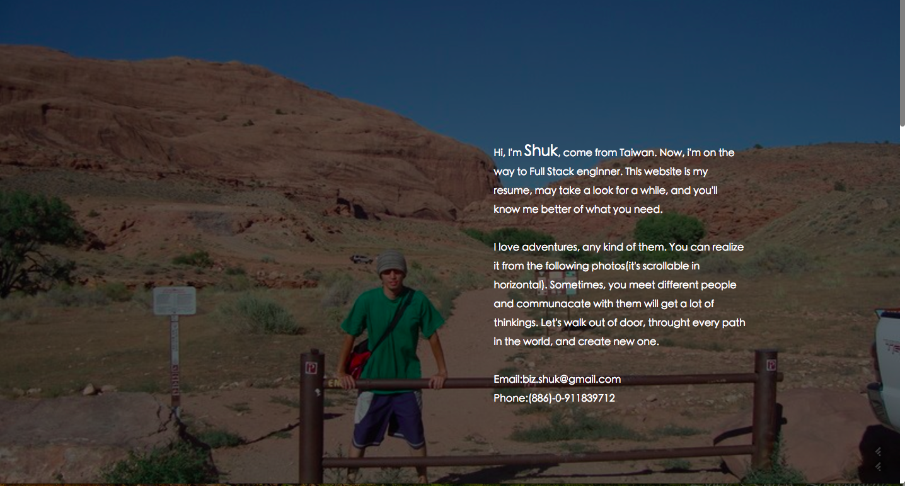
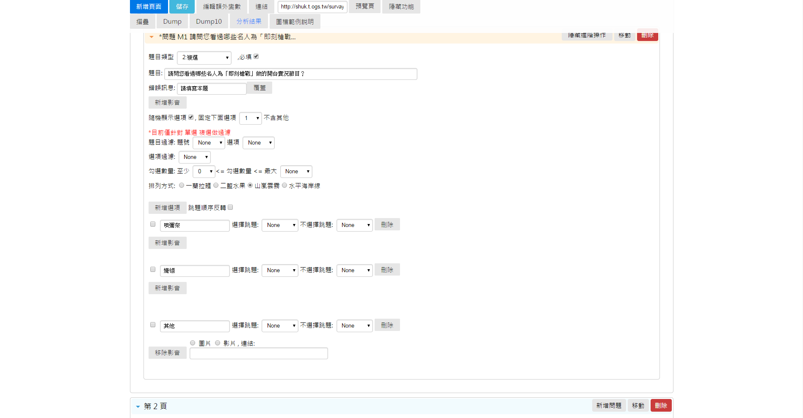
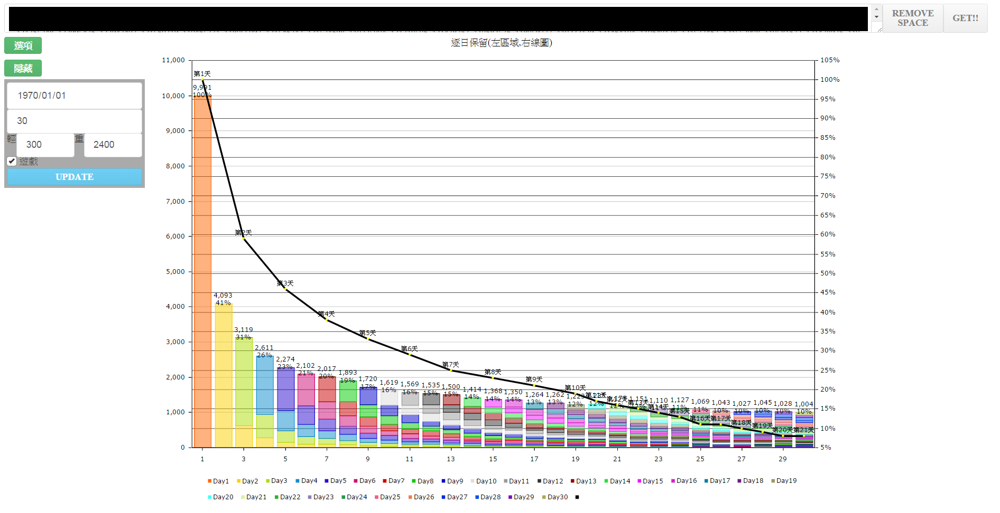
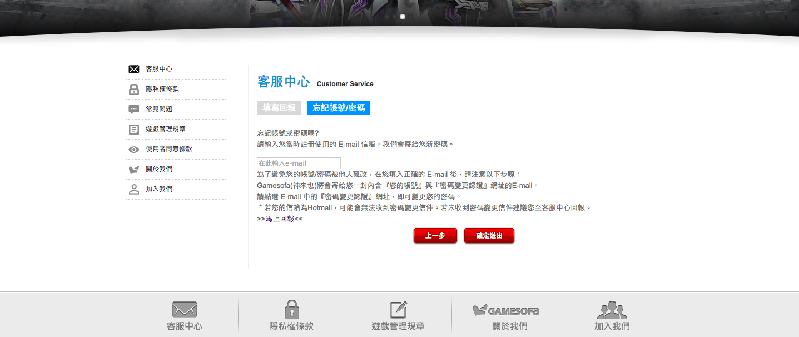

# Shuk's project list 

[Company List](https://github.com/BizShuk/bizshuk.github.io/blob/master/resume/company.md)

### Customer Integration Hub
- Summary: develop features and fix bugs under Custormer Integration Hub team
- Company: Innova Solutions (It's BOT for **Change Health Care** in this branch)
- Date: 2017-02 ~ present
- Role: Full-Stack Engineer
- Co-worker: Enan(Scrum master), Karthik, Subba, Allen, Lucy, Jeffrey, Iris, Jason, Anson
- Link:
- Description: Customer Integration Hub is the connetion between internal and external applications. queue aws scrum 
- Tech list: Java, Javascript, Spring, Scrum.

### Droi command line tool
- Summary: For updating developer code to Droi Bass platform with version control
- Company: Shanghai Droi Tech. Co Ltd.
- Date: 2016-04 ~ 2016-05
- Role: Software developer
- Co-worker: James , Steven
- Link:
- Description: A platform for developer to build back-end service without private server. Model system for multi developer and constructure flexible system.
- Tech list: Go, Lua, Nginx

### Droi user side architecture ###
- Summary: Service of writing back-end code in cloud without seting server
- Company: Shanghai Droi Tech. Co Ltd.
- Date: 2015-10 ~ 2016-04
- Role: System developer
- Co-worker: Owen , James , Tune , Steven
- Link:
- Description: A platform for developer to build back-end service without private server. Model system for multi developer and constructure flexible system.
- Tech list: Openresty, Nginx, Lua, docker, kubernetes, Jenkins, Ansible

### Lua profiler ###
- Summary: evaluate cloud code qualitiy
- Company: Shanghai Droi Market Co Ltd.
- Date: 2015-09 ~ 2015-10
- Role: System developer
- Co-worker: none
- Link:
- Description: pull out system calls and check syntax and performance
- Tech list: Openresty, Nginx, Lua, docker, Jenkins, Ansible

### HTC interview homework with Scala + Play + Mongo CRUD
- Summary: a demo for Scala , Play , and Mongo
- company: HTC
- Date: 2015.04 ~ 2015.04 (about 3 days to 1 week)
- Role: interviewee
- Co-worker: none
- Link:
- Description: show htc smartphone on index page with 3 management page with Mongo (CRUD)
- Tech stack: Scala , Play , html , CSS , js

### Home site ###
- Summary: Personal website
- Company: none
- Date: 2015-04 ~ 2015-07
- Role: developer
- Co-worker: none
- Link: [Website](http://shuk.info/) [Resume site](http://shuk.info/resume.html)
- Description: personal website with some picture for introducing self, use few new tech , like reactjs, SASS , to build up
- Tech list: html, js (reactjs), SASS, RWD, web hosting (GoDaddy),

### survey system ###
- Summary: Online survey system with customized features  
- Company: Gamesofa Inc.
- Date: 2014-11 ~ 2015-04
- Role: System Architect
- Co-worker: Micheal Lin <michael@gamesofa.com>
- Link: private
- Description:  
Get answers from players, do statistic and analyze to undestand what players want and make priority of features, to keep the most important things are on the way. In this project, I learn how to use statistic and make some analysis.
- Tech list: PHP, Perl, Html, CSS, js (angularjs 1.4), Mysql

### Analyzing user system ###
- Summary: Simplify some analyzing way to a SOP and easy to use for product manager.A quick view of some group user characteristics, including subset.
- Company: Gamesofa Inc.
- Date: 2014-11 ~ 2015-04
- Role: system desiger and developer
- Co-worker: Micheal Lin <michael@gamesofa.com>
- Link: private
- Description: analyze end-user behaviours  and show active rate and statistics of selected group by customized parameters. It totoly reduce a lot of time on evalute user behavious, you can see more different group of users. And visulization is one of ths most important things , it make product managers understanded easily. This time is first time cooperate with different pefessional domain knowledge people. 
- Tech list: PHP, CSS, js (angularjs 1.4), Perl, Mysql, Statictis

### Refactor Customer Service ###
- Summary: refactor system
- Company: Gamesofa Inc.
- Date: 2014-11 ~ 2015-04
- Role: software engineer
- Co-worker: Micheal Lin <michael@gamesofa.com>
- Link: [Website](http://www.gamesofa.com/index/?op=report)
- Description: Clean useless code and merge some redundant file. Architecture is important.
- Tech list: PHP, CSS, js, Perl

### Modular game event activity
- Summary: Modular game event. It can be dynamicly change by management page.
- Company: Gamesofa Inc.
- Date: 2013-08 ~ 2013-10
- Role: Game developer
- Co-worker: Taora, Billy, Liam, Jim, Nick , Dios , Lucus , Charlie , Hyder , Kendy , Crystal , QA team , Custom Service team 
- Link: [Web site](http://www.gamesofa.com/texas9/)
- Description: Update new events for game by product manager without server engineer help. If product manager would like to make it looked like new, it just needs change the user interface.
- Tech list: PHP, Perl, HTML, CSS, js (angularjs 1.4), Mysql

### Texas Hold'em ###
- Summary: Online Texas Hold'em 
- Company: Gamesofa Inc.
- Date: 2013-07 ~ 2014-01
- Role: Game developer
- Co-worker: Taora, Billy, Liam, Jim, Nick , Dios , Lucus , Charlie , Hyder , Kendy , Crystal , QA team , Custom Service team 
- Link: [Web site](http://www.gamesofa.com/texas9/)
- Description: Dealing with game events and features. Once to implement Omaha core rules. What's the most interest things for user? That will cause user number to grow quickly.
- Tech list: PHP, Perl, HTML, CSS, js (angularjs 1.4), Mysql

### Windows 8 App "big two" ###
- Summary: Poker game app in win8
- Company: Gamesofa Inc.
- Date: 2012-11 ~ 2013-06
- Role: Game developer
- Co-worker: Robin , Ohaha , Copper
- Link: [App](https://www.microsoft.com/en-us/store/apps/%E7%A5%9E%E4%BE%86%E4%B9%9F%E5%A4%A7%E8%80%812/9wzdncrdpm5w)
- Description: 
- Tech list: HTML5, CSS3, js

### template project ###
- Summary:
- Company: Gamesofa Inc.
- Date: 2014-11 ~ 2015-04
- Role:
- Co-worker: name <mail>
- Link:
- Description:(include what i did , what i learn, experience) 
- Tech list: 
