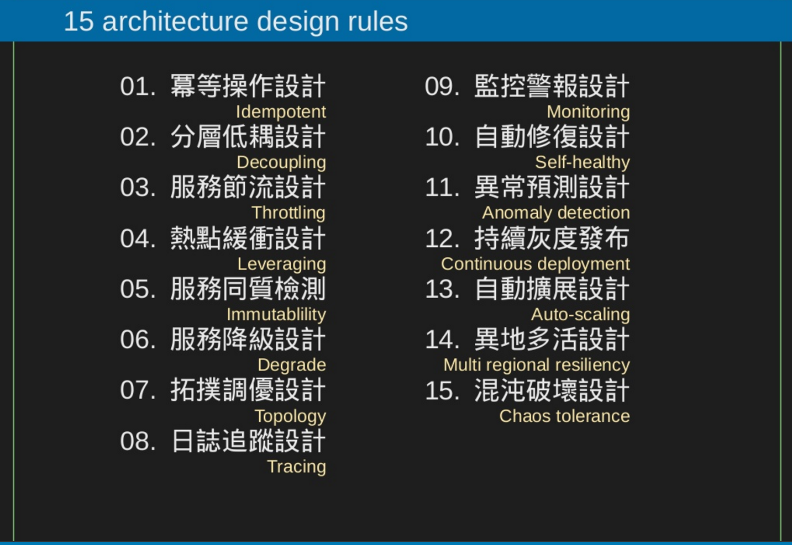

# tech

Language
- [Go study](go/)
- [git2go tutorial](https://blog.gopheracademy.com/advent-2014/git2go-tutorial/)
- [Google CS education](https://www.google.com/edu/cs/index.html)

Algorithm
- [OS scheduling algo.](http://www.tutorialspoint.com/operating_system/os_process_scheduling_algorithms.htm)
- [Scheduling algorithms](https://en.wikipedia.org/wiki/Category:Scheduling_algorithms) , include disk , network , and processor
- [Scheduling disciplines](https://en.wikipedia.org/wiki/Scheduling_(computing))
- [演算法筆記](http://www.csie.ntnu.edu.tw/~u91029/index.html)

Architecture
- 
- [System design interview](https://github.com/checkcheckzz/system-design-interview)

Protocol
- [Https](https_protocol.md)
- [Git Branching - Branches in a Nutshell](https://git-scm.com/book/en/v2/Git-Branching-Branches-in-a-Nutshell)

DevOps
- [GitFlow considered harmful](http://endoflineblog.com/gitflow-considered-harmful)
- [Follow GitFlow considered harmful](http://endoflineblog.com/follow-up-to-gitflow-considered-harmful)
- [Hacknews GitFlow considered harmful](https://news.ycombinator.com/item?id=9744059)
- [cAdvisor](https://github.com/google/cadvisor)  
cAdvisor (Container Advisor) provides container users an understanding of the resource usage and performance characteristics of their running containers.
- [Google Site Reliability Engineering](https://landing.google.com/sre/)

Analysis
- [一文讀懂機器學習](http://iguang.tw/u/4219580/article/459124.html)

Experiences
- [十年一覺程設夢(上)：在華碩10年的職場經驗 / Eee PC 事業處主管 (2008年)](http://mepopedia.com/forum/read.php?22,7232)
- [十年一覺程設夢(下)：在華碩10年的職場經驗 / Eee PC 事業處主管 (2008年)](http://mepopedia.com/forum/read.php?22,7232,7233)
- [製程工程師的甘苦](http://mepopedia.com/forum/read.php?147,6756)
- [You Should Ask Before Accepting a Startup Job Offer](http://www.inc.com/atish-davda/5-questions-you-should-ask-before-taking-a-start-up-job-offer.html)
- [A Dark Room](https://www.reddit.com/r/startups/comments/4f74dv/quit_my_full_time_corporate_job_built_an_ios_game/)
- [How to Start a Startup](https://whodyo.wordpress.com/2015/12/28/how-to-start-a-startups/)
